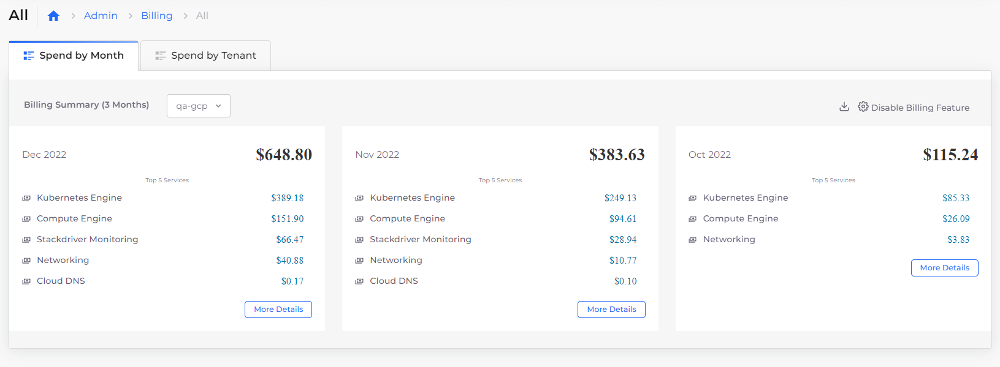
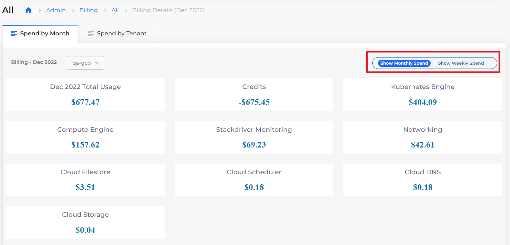

# Cost management for billing

Usage costs for resources can be viewed and managed in the nholuongut Portal, by month or week, and by Tenant. You can also explore historical resource costs.&#x20;

To view the Billing page for GCP in the nholuongut Portal, click **Administrator** -> **Billing**. &#x20;

<figure><figcaption>
<strong>Billing</strong> dashboard for GCP
</figcaption></figure>

You can view usage by:

* Time
  * Select the **Spend by Month** tab and click **More Details** to display monthly and weekly spending options. &#x20;
* Tenant
  * Select the **Spend by Tenant** tab.

<figure><figcaption>
<strong>Spend by Month</strong> tab with monthly and weekly options displayed
</figcaption></figure>

