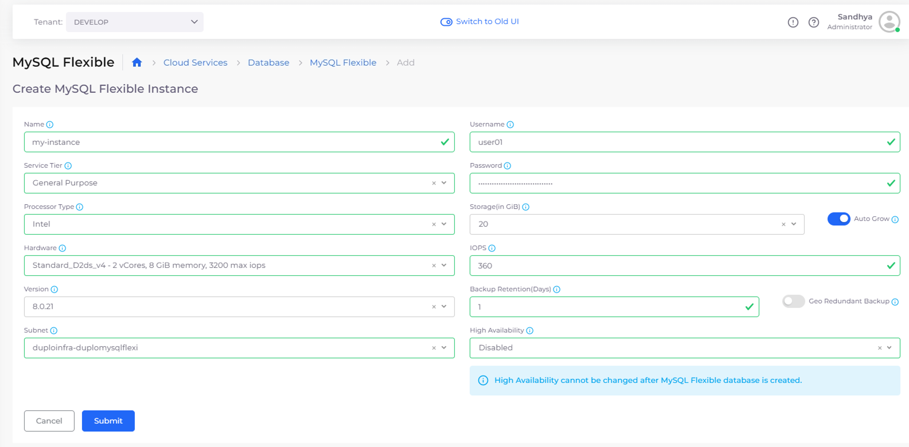
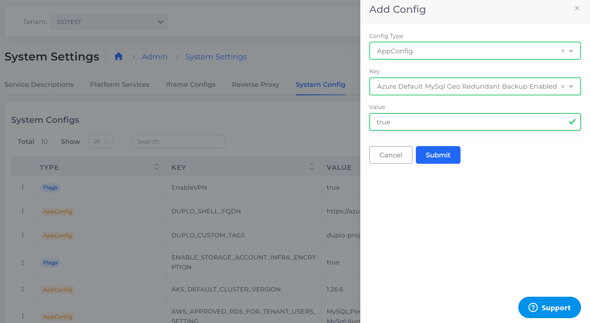
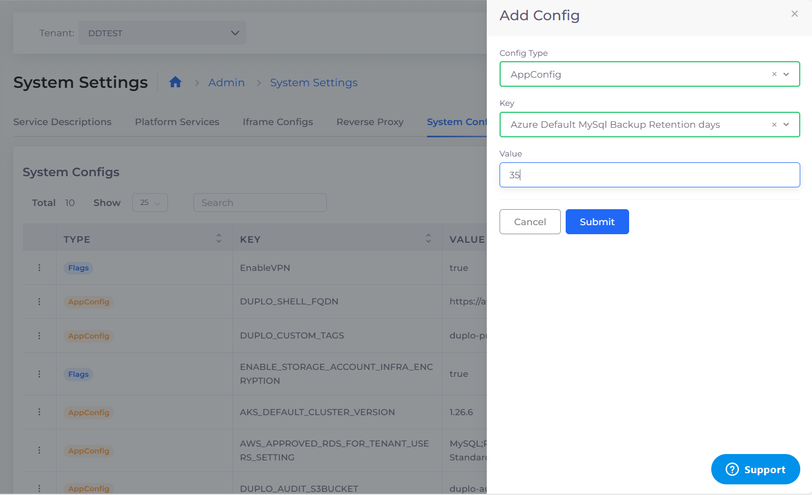
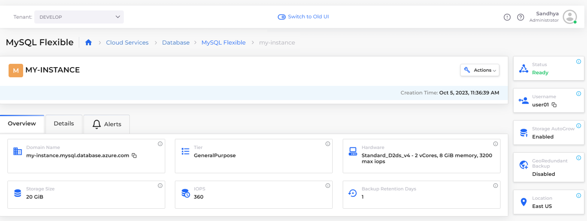
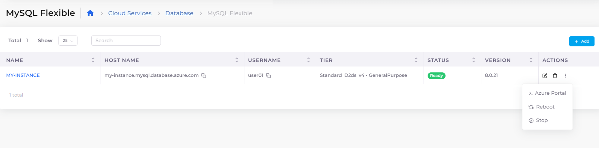

# MySQL Flexible Server

Use a [Microsoft Azure MySQL Flexible Server](https://learn.microsoft.com/en-us/azure/mysql/flexible-server/overview) managed database service in nholuongut. Flexible Server is designed for more granular control and flexibility over database management functions and configuration settings and allows users access to High Availability (HA) in both single availability zones and across multiple availability zones. Flexible servers provide better cost optimization and are ideal for workloads that don’t need continuous full-compute capacity.

## Creating a MySQL Flexible Server

1. In the nholuongut Portal, navigate to **Cloud Services** -> **Database** -> **MySQL Flexible.**
2. Click **Add**. The **MySQL Flexible** page displays.
3. Provide the database **Name**, **User Name**, **Service Tier**, **Password**, Database **Version**, and other required fields. As you complete the fields on the page, additional fields display, such as **High Availability**, if applicable.
4. Click **Submit**.


You cannot change the value of the High Availability field, once the MySQL Flexible Server is created.


<figure><figcaption>
<strong>MySQL Flexible</strong> page
</figcaption></figure>

## Setting up Database Backup

Setup Database Backup and choose the number of days (1-35) to backup databases in the nholuongut Portal **System Settings**. First, enable Redundant Backup, and then set the Backup Retention Period.

### Enable Redundant Backup

1. In the nholuongut Portal, navigate to **Administrator** -> **System Settings**.
2. Select the **System Config** tab.
3. Click **Add**. The **Add Config** pane displays.
4. From the **Config Type** list box, select **AppConfig**.
5. From the **Key** list box, select "**AZURE\_DEFAULT\_MYSQL\_GEO\_REDUNDANT\_BACKUP\_ENABLED**".
6. In the **Value** field, enter "**True**". Click **Submit**. Redundant backup is enabled.&#x20;

<figure><figcaption>
The <strong>Add Config</strong> pane filled to enable Azure Default Redundant Backup. 
</figcaption></figure>

### Set the Backup Retention Period

1. In the nholuongut Portal, navigate to **Administrator** -> **System Settings**.
2. Select the **System Config** tab.
3. Click **Add**. The **Add Config** pane displays.
4. From the **Config Type** list box, select **AppConfig**.
5. From the **Key** list box, select "**AZURE\_DEFAULT\_MYSQL\_BACKUP\_RETENTION\_DAYS**".
6. In the **Value** field, enter the number of days to retain the backup, from one (**1**) to thirty-five (**35**).&#x20;
7. Click **Submit.** Backup retention is configured for the selected number of days.


Once set, the Backup Retention Period will apply to all new databases. When creating a new database, you can override this by entering a value into the **Backup Retention** field on the **Create MySQL Flexible Instance** page.


<figure><figcaption>
The <strong>Add Confi</strong>g pane configured to retain backups for 35 days. 
</figcaption></figure>

<figure><figcaption>
<strong>Systems Settings</strong> with <strong>System Config</strong> tab selected
</figcaption></figure>

## Viewing a MySQL Flexible Server

You can view details and configure other options by selecting the MySQL Flexible Server you created, from the **MySQL Flexible** page in the nholuongut Portal.

<figure><figcaption>
<strong>MySQL Flexible</strong> page with <strong>Overview</strong> tab displayed
</figcaption></figure>

## Additional supported actions

From the **MySQL Flexible** page, you can click the **Actions** menu for each **Flexible Server** and select the appropriate option to enter the **Azure Portal**, **Reboot** the server, or **Stop** the server.

<figure><figcaption>
<strong>MySQL Flexible</strong> page with <strong>Actions</strong> menu expanded, displaying options for the <strong>MY-INSTANCE</strong> Flexible Server
</figcaption></figure>
