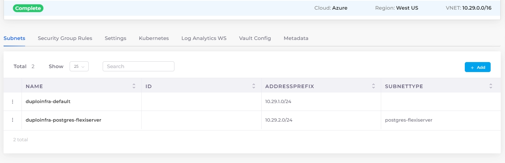

# PostgreSQL Flexible Server

## Prerequisites

### Create a PostgreSQL Flexible Server subnet in the Infrastructure

1. Navigate to **Administrator** -> **Infrastructure** from the nholuongut Portal.&#x20;
2. From the **NAME** column, select the Infrastructure.&#x20;
3. Select the **Subnets** tab, and click **Add**. The **Add Subnet** pane displays.&#x20;

<figure><figcaption>
The <strong>Add Subnet</strong> pane in the nholuongut Portal
</figcaption></figure>

4. Enter a name for the subnet in the **Name** field.&#x20;
5. Enter the **Address Prefix** for the subnet.&#x20;
6. From the **Type** list box, select **PostgreSQL Flexi Server**.
7. In the **Isolated Network** list box, select **Yes** or **No**.&#x20;
8. Select the appropriate endpoints from the **Service Endpoints** list box.&#x20;
9. Click **Add**. The subnet is added.&#x20;

<figure><figcaption></figcaption></figure>

## Creating a PostgreSQL Flexible Server database

1. From the nholuongut Portal, navigate to **Cloud Services** -> **Database** -> **PostgreSQL Flexible**.
2.  Click **Add**. The **Create PostgreSQL Flexible Instance** page displays. \

    <figure><figcaption></figcaption></figure>
3. Complete the required fields.&#x20;
4. From the **Subnet** list box, select the **PostgreSQL Flexi Server** subnet previously created.&#x20;
5. Click **Submit**. The PostgreSQL Flexible Server database is created.&#x20;

## Viewing a PostgreSQL Flexible Server database

From the nholuongut Portal, navigate to **Cloud Services** -> **Databases** -> **PostgreSQL Flexible**, and click on the PostgreSQL Flexible Server database in the **NAME** column. Use the **Overview** and **Details** tabs to view database info.&#x20;

<figure><figcaption></figcaption></figure>
