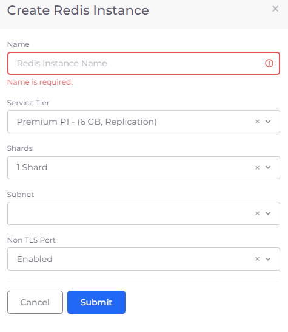

# Redis database

## Prerequisites&#x20;

To create a Redis with public network access, follow the steps below to configure public network access for databases before creating a Redis database instance. If your database does not need to be publicly accessible, skip this step, and proceed to [creating a Redis database instance](redis-database.md#creating-a-redis-database-instance).&#x20;

### Configure public network access for databases (optional) &#x20;

1. In the nholuongut Portal, navigate to **Administrator** -> **Tenant**.&#x20;
2. Select the Tenant where the Redis will be created from the **NAME** column .&#x20;
3. Select the **Settings** tab, and click **Add**. The **Add Tenant Feature** pane displays.&#x20;
4. From the **Select Feature** list box, select **Allow Public Network Access for Databases and Cache Servers**.
5. **Enable** the setting, and click **Add**. The Allow Public Network Access for Databases and Cache Servers Tenant setting value is **True**.&#x20;

## Creating a Redis database instance

1. In the nholuongut Portal, navigate to **Cloud Services** -> **Database** -> **Redis**. The **Create Redis Instance** pane displays.
2. Click **Add**.
3. Provide the database **Name.**
4. From the **Subnet** list box, select an available subnet you have defined in your Infrastructure.&#x20;
5. Modify values for **Service Tier**, **Shards**, and **Non TLS Port**, as needed.
6. Click **Submit**.

<figure><figcaption>
<strong>Create Redis Instance</strong> pane
</figcaption></figure>

### Viewing Database details

View **Alerts** by selecting the Redis instance you created, from the Redis page in the nholuongut Portal.

<figure><figcaption>
<strong>Redis</strong> page in nholuongut Portal
</figcaption></figure>

<figure><figcaption>
<strong>Alerts</strong> tab for Redis database instance
</figcaption></figure>
