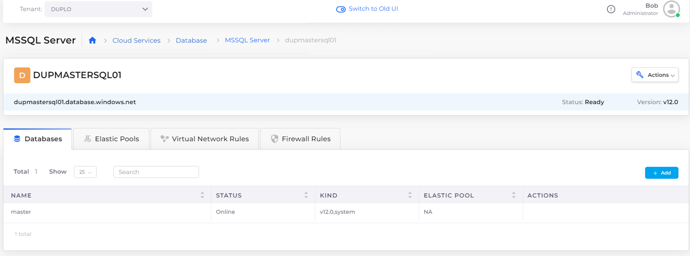

# MSSQL Server database

## Prerequisites

### Enable public access for an MSSQL Server database

To create an MSSQL Server database with public access, configure the following Tenant setting to allow public network access for databases and cache servers. If the database does not need public access, skip this step and [create an MSSQL Server database](sql-database.md#creating-an-mssql-server).&#x20;

1. From the nholuongut Portal, navigate to **Administrator** -> **Tenants**.
2. Select the Tenant from the **NAME** column.&#x20;
3. Select the **Settings** tab, and click **Add**. The **Add Tenant Feature** pane displays.
4. From the **Select Feature** list box, select **Allow Public Network Access for Databases and Cache Servers**.
5. Enable the setting, and click **Add**. Public database access is enabled.&#x20;

## Creating an MSSQL Server database

1. Select the Tenant from the **Tenant** list box.&#x20;
2. In the nholuongut Portal, navigate to **Cloud Services** -> **Database** ->  **MSSQLServer**, and click **Add**.
3. Provide a name for the MSSQL Server database, your username and password, and database version information.&#x20;
4. From the **Public Access** list box, select **Enabled** or **Disabled**. If **Enabled** is not available, complete the steps above under **Prerequisites** to [enable this option](sql-database.md#enable-public-access-for-databases-in-tenant-settings).  &#x20;
5. Click **Submit**. The MSSQL Server database is created.&#x20;

## Adding a private endpoint for an MSSQL Server database (optional)

A private endpoint is a network interface that connects you privately and securely to your MSSQL Server database. This ensures that the traffic between your virtual network and the MSSQL database travels entirely without using the public internet.

1. Select the Tenant from the **Tenant** list box.&#x20;
2. In the nholuongut Portal, navigate to **Cloud Services** -> **Database** ->  **MSSQLServer.**
3. Select the MSSQL Server database from the **NAME** column.&#x20;
4.  Select the **Private Endpoints** tab, and click **Add**. The **Add Private Endpoint** pane displays. \

    

    <figure><figcaption>
The <strong>Add Private Endpoint</strong> pane
</figcaption></figure>

    

5. Add a name and select a subnet for your private endpoint.&#x20;
6. Click **Submit**. The private endpoint is created and accessible via the selected subnet. &#x20;

## Viewing MSSQL Server database details

1. Select the Tenant from the **Tenant** list box.&#x20;
2. In the nholuongut Portal, navigate to **Cloud Services** -> **Database** ->  **MSSQLServer.**
3. Select the MSSQL Server database from the **NAME** column.&#x20;
4. Select the **Databases** tab to view the databases and details. &#x20;

<figure><figcaption>
<strong>MSSQL Server</strong> page
</figcaption></figure>

## **Configuring Azure SQL** Elastic Pools

Azure SQL Database Elastic Pools provide cost-effective database resource management by pooling multiple databases together and sharing resources based on their individual needs.

Configure Azure Elastic Pools for an MSSQL Server in the nholuongut Portal:

1. Select the Tenant from the **Tenant** list box.&#x20;
2. In the nholuongut Portal, navigate to **Cloud Services** -> **Database** ->  **MSSQLServer.**
3. Select the MSSQL Server database from the **NAME** column.&#x20;
4.  Select the **Elastic Pools** tab, and click **Add**. The **Add SQL Elastic Pool** pane displays. \

    

    <figure><figcaption>
The <strong>Add SQL Elastic Pool</strong> pane
</figcaption></figure>

    

5. Enter a name for the elastic pool, select your service tier, and select the correct SKU.&#x20;
6.  Click **Submit**. The elastic pool is created. \

    

    <figure><figcaption></figcaption></figure>

    

## Setting virtual network rules

Virtual network rules restrict access to your Azure SQL Database server to specific subnets within a virtual network to enhance security and network isolation. Public access must be disabled to add virtual network rules.&#x20;

1. Select the Tenant from the **Tenant** list box.&#x20;
2. In the nholuongut Portal, navigate to **Cloud Services** -> **Database** ->  **MSSQLServer.**
3. Select the MSSQL Server database from the **NAME** column.&#x20;
4. Select the **Virtual Network Rules** tab, and click **Add**. The **Add New Virtual Network Rule** pane displays.&#x20;
5. Add a name for the virtual network rule, and select the subnet for your MSSQL database. Click **Create**. The virtual network rule is created.

<figure><figcaption>
The <strong>Virtual Network Rule</strong> tab on the <strong>MSSQL Server</strong> page. 
</figcaption></figure>

## Setting firewall rules

Firewall rules for an MSSQL Server help control access to your database server by allowing or denying traffic based on IP addresses. These rules secure your database by restricting access to only trusted sources. Public access must be disabled to add firewall rules.&#x20;

1. Select the Tenant from the **Tenant** list box.&#x20;
2. In the nholuongut Portal, navigate to **Cloud Services** -> **Database** ->  **MSSQLServer.**
3. Select the MSSQL Server database from the **NAME** column.&#x20;
4.  Select the **Firewall Rules** tab, and click **Add**. The **Add New SQL Server Firewall Rule** pane displays. \

    

    <figure><figcaption>
The <strong>Add New SQL Server Firewall Rule</strong> pane
</figcaption></figure>

    

5.  Add a name for the firewall rule, and select the starting and ending IP addresses for your MSSQL database. Click **Create**. The firewall rule is created.\

    <figure><figcaption>
The <strong>Firewall Rule</strong> tab on the <strong>MSSQL Server</strong> page. 
</figcaption></figure>

