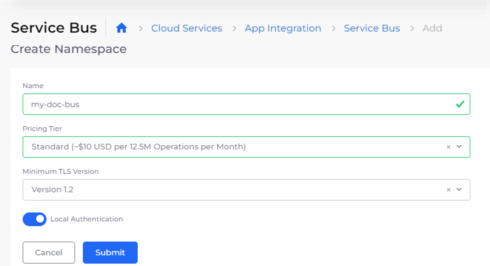
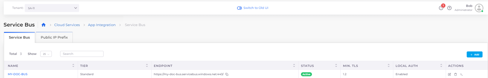
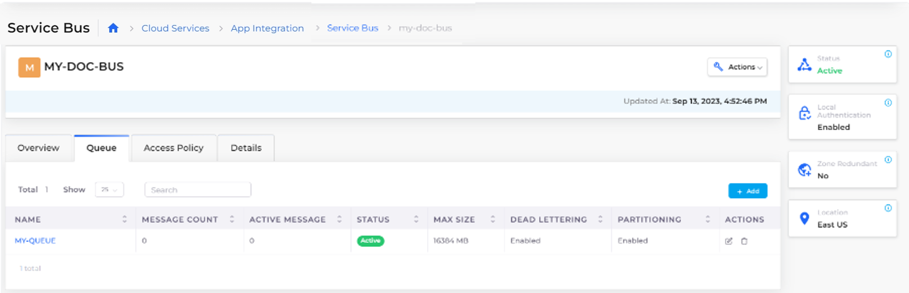
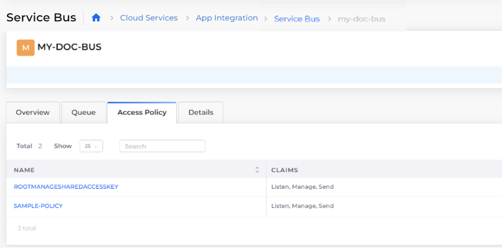
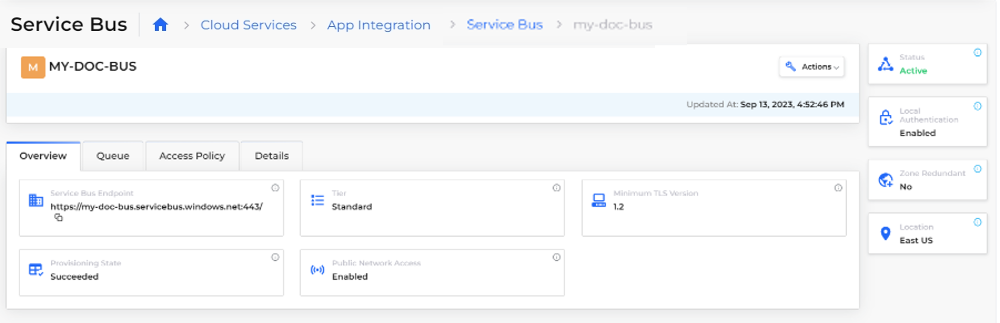

# Service Bus

[Azure Service Bus](https://learn.microsoft.com/en-us/azure/service-bus-messaging/service-bus-messaging-overview) is a fully managed enterprise message broker with message queues and publish-subscribe topics (residing in a Namespace). Service Bus is used to decouple applications and services from each other for load-balancing across competing workers. It also ensures secure routing and transferring of data and controls across service and application boundaries or coordinating transactional work requiring a high degree of reliability.

Adding an Azure Service Bus requires:

* Creating a [Service Bus Namespace](service-bus.md#creating-a-service-bus-namespace).
* Creating a [Service Bus Queue](service-bus.md#creating-a-service-bus-queue).
* Creating a [Service Bus Access Policy](service-bus.md#creating-a-service-bus-access-policy).

When you have created the Namespace, Queue, and Access Policy, the Service Bus is added to the nholuongut Portal and can be [viewed](service-bus.md#viewing-the-service-bus).

## Creating a Service Bus Namespace

1. In the nholuongut Portal, navigate to **Cloud Services** -> **App Integration**.
2. In the **Service Bus** tab, click **Add**. The **Create Namespace** page displays.
3. In the **Name** field, enter the Service Bus name.
4. From the **Pricing Tier** list box, select a pricing tier based on your projected usage.
5. From the **Minimum TLS Version** list box, select the TLS version that supports the NameSpace you are creating.
6.  Select **Local Authentication** to disable local or SAS key authentication for the Service Bus namespace, allowing only [Microsoft Entra authentication](https://learn.microsoft.com/en-us/azure/service-bus-messaging/service-bus-authentication-and-authorization#microsoft-entra-id).\

    <figure><figcaption>
<strong>Create Namespace</strong> page for Service Bus
</figcaption></figure>
7.  Click **Submit**. When your Service Bus Namespace is available, an **Active Status** is displayed in the **Service Bus** tab.\

    <figure><figcaption>
<strong>Service Bus</strong> tab with <strong>Active</strong> Service Bus displayed
</figcaption></figure>

## Creating a Service Bus Queue

After you have created a [Service Bus Namespace](service-bus.md#creating-a-service-bus-namespace), you create a queue to enable communication between Web and Worke\
r roles in a multi-tier Azure application. A Web role is a Microsoft server VM running Internet Information Services (IIS); a Worker role is a Microsoft server VM not running IIS. Service Bus queues also enable communication between on-premises apps and Azure-hosted apps in a hybrid solution.

1. In the nholuongut Portal, navigate to **Cloud Services** -> **App Integration**.
2. In the **Service Bus** tab, select the Service Bus for which you want to add a Service Bus Queue.
3. Click the **Queue** tab.
4. Click **Add**. The **Create Queue** page displays.
5. In the **Name** field, enter a name for the Service Bus Queue.
6. Edit or accept the defaults for **Max Queue Size**, **Lock duration (in seconds)**, and **Max Delivery Count**.
7. Optionally, select **Enable dead lettering or message expiration** and **Enable partitioning**. See the [Azure Documentation](https://learn.microsoft.com/en-us/azure/service-bus-messaging/) for detailed descriptions of these options.
8. Set **Message time to live** in the format _**HOURS**_:_**MINUTES**_:_**SECONDS**_:_**MILLISECONDS**_ to control when messages go live and to prevent them from being sent to the Dead Letter Queue after they expire. Setting **Message time to live** defers delivery of the message for the amount of time you specify. For example, to defer message delivery by fourteen (14) hours, set **Message time to live** to **14**:**00**:**00**:**00**.
9.  Click **Submit**. When your Service Bus Queue is available, an **Active Status** is displayed in the **Queue** tab.\

    <figure><figcaption>
<strong>Queue</strong> tab on Service Bus page
</figcaption></figure>

## Creating a Service Bus Access Policy

After you create a Service Bus NameSpace and Queue, finish adding your Service Bus by creating an Access Policy.

In Azure, Shared Access Signatures (SAS) and policies give you granular control over the type of access you grant to the clients. SAS authentication enables you to grant a user access to Service Bus resources with specific rights. You create an access policy to configure a cryptographic key with associated rights on a Service Bus resource.

1. In the nholuongut Portal, navigate to **Cloud Services** -> **App Integration**.&#x20;
2. In the **Service Bus** tab, select the Service Bus for which you want to add a Service Bus Access Policy.&#x20;
3. Click the **Access Policy** tab.&#x20;
4. Click **Add**. The **Create Access Policy** page displays.
5. In the **Name** field, enter the Access Policy name.
6. Define access rights to the policy by selecting **Manage** (which automatically selects both **Send** and **Listen**), **Send**, or **Listen**. See the [Azure documentation](https://learn.microsoft.com/en-us/azure/service-bus-messaging/service-bus-sas) for additional information on these options.
7.  Click **Submit**. The Access Policy is displayed in the **Access Policy** tab.\

    <figure><figcaption>
<strong>Access Policy</strong> tab for Service Bus
</figcaption></figure>

## Viewing the Service Bus

1. In the nholuongut Portal, navigate to **Cloud Services** -> **App Integration**.&#x20;
2.  In the **Service Bus** tab, select the Service Bus you want to view. The **Overview**, **Queue**, **Access Policy**, and **Details** tabs display additional information about the Service Bus and its components.\

    <figure><figcaption>
<strong>Overview</strong> tab for Service Bus
</figcaption></figure>
