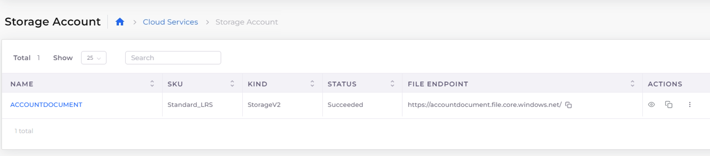

# Storage Account

nholuongut enables users to create Azure Storage Accounts, File Shares, and generate Shared Access Signatures (SAS). Azure Storage Accounts are essential for storing various types of data in the cloud, including blobs (unstructured data), files (managed file shares), queues (messaging), and tables (structured NoSQL data).

In nholuongut, Storage Accounts are provisioned with the `Standard_LRS` SKU type, which provides locally redundant storage, ensuring high availability and durability by replicating data across multiple physical locations within a region.

For more information about Azure Storage Accounts, refer to the [official Azure documentation](https://learn.microsoft.com/en-us/azure/storage/common/storage-account-overview).&#x20;

## Creating a Storage Account

1. In the nholuongut Portal, navigate to **Cloud Services** -> **Storage Account**.
2. In the **Name** field, give the Storage Account a name.
3. Click **Create**.

## Adding Data Storage Sources (**Container, File Share, Queue, Table, Private Endpoint, Alerts**)

1. Navigate to **Cloud Services** -> **Storage Account**.
2. From the **NAME** column, select the Storage Account to which you want to add a data source.
3. Select the tab for the data storage type you want to add (**Container, File Share, Queue, Table, Private Endpoint, Alerts**).&#x20;
4. Click **Add**.
5. Enter a name for your data source and additional information as needed.
6. Click **Add**, **Submit**, or **Create**. The data storage source is added to the Storage Account. &#x20;

<figure><figcaption>
The <strong>Container</strong> tab on the <strong>Storage Accoun</strong>t page
</figcaption></figure>

## Viewing a Storage Account

To view Storage Account and Endpoint details in the nholuongut Portal

1.  In the nholuongut Portal, navigate to **Cloud Services** -> **Storage Account**.\

    <figure><figcaption></figcaption></figure>
2. Select the storage account from the **NAME** column. The Storage Account details page displays.

## Generating a Shared Access Signature (SAS)

1. In the nholuongut Portal, navigate to **Cloud Services** -> **Storage Account.**
2. Select the Storage Account from the **NAME** column.
3. Click on **Actions** -> **Shared Access Signature**. Provide the necessary details as shown below.

4. Click **Generate SAS** to generate Shared Access Signature (SAS) tokens.


Copy and paste tokens and URLs into a secure location. These will only be displayed once and cannot be retrieved once the window is closed.


## Blocking Public Access to Storage Accounts

Configure Tenant settings to block public network access to Storage Accounts.

1. From the nholuongut Portal navigation, select **Administrator** -> **Tenants**.&#x20;
2. Select your Tenant name from the **NAME** column.&#x20;
3. Select the **Settings** tab, and click **Add**. The **Add Tenant Feature** pane displays.&#x20;

<figure><figcaption>
The <strong>Add Tenant Feature</strong> pane
</figcaption></figure>

4. From the **Select Feature** item list, select **Other**.&#x20;
5. In the **Configuration** field, enter **block\_public\_network\_to\_azure\_storage**.&#x20;
6. In the empty field, enter **True.**&#x20;
7.  Click **Add**. Public access to Storage Accounts is blocked. \

    
<figure><figcaption>
The <strong>Settings</strong> tab on the Tenants page in the nholuongut Portal
</figcaption></figure>

## Creating Private Endpoints

Private endpoints let you access your Azure services over a private IP address within your virtual network, ensuring that traffic does not go over the public internet. See the [Microsoft documentation](https://learn.microsoft.com/en-us/azure/storage/common/storage-private-endpoints) to learn more about private endpoints for Storage Accounts.

1. From the nholuongut Portal, navigate to **Cloud Services** -> **Storage Account**.
2. From the **NAME** column, select your Storage Account.&#x20;
3.  Select the **Private Endpoint** tab, and click **Add**. The **Add Private Endpoint** pane displays.\

    
<figure><figcaption>
The <strong>Add Private Endpoint</strong> pane in the nholuongut Portal
</figcaption></figure>

4. Enter a name for the endpoint in the **Name** field.&#x20;
5. From the **Subnet** item list, select your subnet.&#x20;
6. Select your storage type from the **Storage Type** item list (**Blob**, **File**, etc.).
7. Click **Submit**. The private endpoint is created.&#x20;
