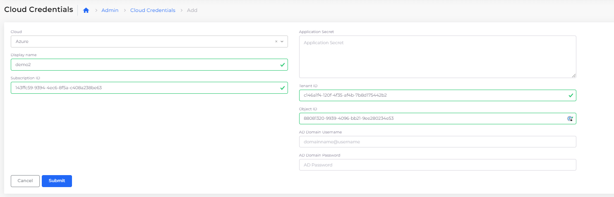

# Subscription

The nholuongut rules-based expert needs Azure Subscription details to manage cloud resources. Add Cloud Credentials in the nholuongut Portal to add subscription details.

## Adding Cloud Credentials for Azure Subscriptions

1. In the nholuongut Portal, navigate to **Administrator** -> **Cloud Credentials**. The **Cloud Credentials** page displays.
2. Click **Add**.&#x20;
3. In the **Cloud** list box, ensure **Azure** is selected.
4. In the **Subscription ID** field, enter your Azure Subscription ID.
5. In the **Application Secret** field, enter secrets.
6. In the **Tenant ID** field, enter the Tenant ID.
7. In the **Object ID** field, enter the Object ID.
8. Click **Submit**. Your credentials are displayed on the **Cloud Credentials** page.

