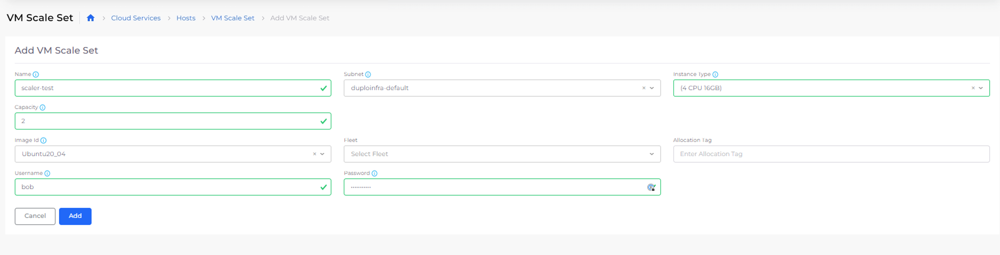
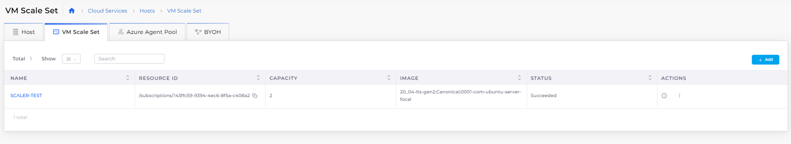

# VM Scale Sets

Azure Virtual Machine (VM) Scale Sets let you create and manage a group of load-balanced VMs. VM Scale Sets provide you with redundancy and improved performance for applications that are typically distributed across multiple instances. This enables access to your application through a load balancer that distributes requests to one of the application instances.&#x20;

If you need to perform maintenance or update an application instance, your customers have access to another available application instance. To keep up with customer demand, increase the number of application instances that run your application.

For more information about VM Scale Sets, see the [Azure Documentation](https://learn.microsoft.com/en-us/azure/virtual-machine-scale-sets/overview).

## Creating a VM Scale Set

1. In the nholuongut Portal, navigate to **Cloud Services** -> **Hosts**.
2. Click the **VM Scale Set** tab.
3. Click **Add**. The **Add VM Scale Set** page displays.
4. In the **Name** field, enter a name for the VM Scale Set.
5. From the **Subnet** list box, select the subnet to be used by the VM Scale Set.
6. From the **Instance Type** list box, select the size of the VM in the VM Scale Set.
7. In the **Capacity** field, enter the number of VMs in the VM Scale Set.
8. From the **Image ID** list box, select the image name. The image you select must be compatible with the Agent platform. Select **Other** if the image is not listed in order to specify your own.&#x20;
9. Specify a **Username** and **Password**.
10. Click **Add**. The VM Scale Set is created.

<figure><figcaption>
Azure <strong>Add VM Scale Set</strong> page
</figcaption></figure>

<figure><figcaption>
<strong>VM Scale Set</strong> tab with <strong>scaler-test</strong> set displaying <strong>Status</strong> of <strong>Succeeded</strong>
</figcaption></figure>
