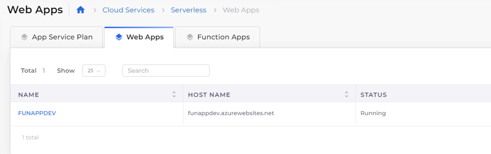

# Serverless Web Applications

### Create App Service Plan

For configuring a Web App in Azure, first we need to create an App Service Plan.

App Service Plan can be created by navigating to **Cloud Services** -> **Serverless**, and clicking on the **App Service Plan** tab.

Refer below for the sample App Service Plan.

### Create Web App

Once we have App Service Plan, Create a Web App Resource. App Service Plan can be created with Publish option as Code or Docker.

A list of the platform (NodeJs, python, etc) is available when Publish value as Code is selected.  If Publish as Docker is selected, the User needs to enter the Docker Image to configure for creating a web app.

<figure><figcaption></figcaption></figure>
