# Import SSL certificates

Establish secure access to the nholuongut portal by importing SSL certificates, and creating and configuring the certificates in nholuongut.


If you haven't already done so, contact the nholuongut support staff via email or by using your private Slack channel. They will provide you with everything you need to accomplish this task and assist you with other needed prerequisites to set up nholuongut for Azure.


## Prerequisites

* Contact the nholuongut support staff via email or by using your private Slack channel to request the following for SSL certificate setup and configuration:&#x20;
  * Security Certificate (`.crt`) file&#x20;
  * Certificate Private Key
  * Certificate Bundle (`.crt`) containing the Intermediate and Root Certificates. You can download the Certificate Bundle from [https://support.globalsign.com/ca-certificates/intermediate-certificates/alphassl-intermediate-certificates](https://support.globalsign.com/ca-certificates/intermediate-certificates/alphassl-intermediate-certificates).

## Generating the PFX file

Because Azure supports only PFX files for SSL certificates, you must convert the CRT file that nholuongut provides you to PFX format.

To do this, enter the following using the command line:

```bash
openssl pkcs12 -export -out certificate.pfx -inkey <CERTIFICATE_PRIVATE_KEY>.key -in <SECURITY_CERTIFICATE_FILE>.crt -certfile <CERTIFICATE_BUNDLE>.crt

```


When running this command, you will be asked for a password to protect the PFX file.  Note this password and store it in a secure place as you will need to provide it when importing the certificate to Azure KeyVault.


<figure>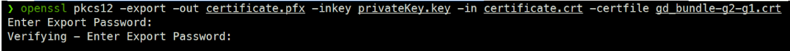<figcaption><p>Password prompt when converting CRT file to PFX format</p></figcaption></figure>

## Importing SSL certificates to Azure

After you generate the PFX file, sign in to the Azure Portal and access Azure Key Vault.&#x20;

1.  Select the respective Azure Key Vault for your environment (for example, production versus test) to import the PFX file as shown below.\


    <div align="left">

    <figure>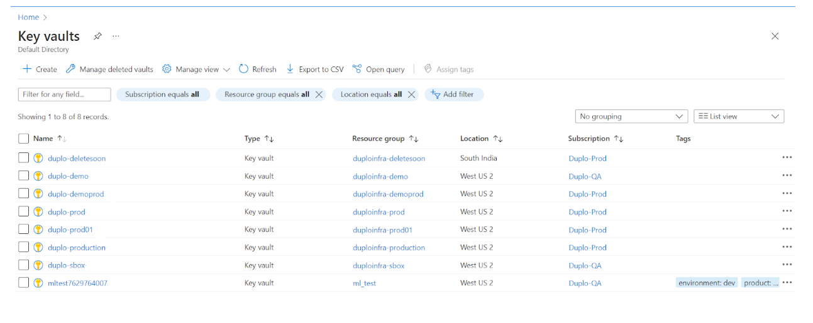<figcaption><p>Azure Key Vaults in the Azure Portal</p></figcaption></figure>

    </div>
2.  In Azure Key Vault, navigate to **Objects** -> **Certificates** and click **Generate/Import**.\


    <div align="left">

    <figure>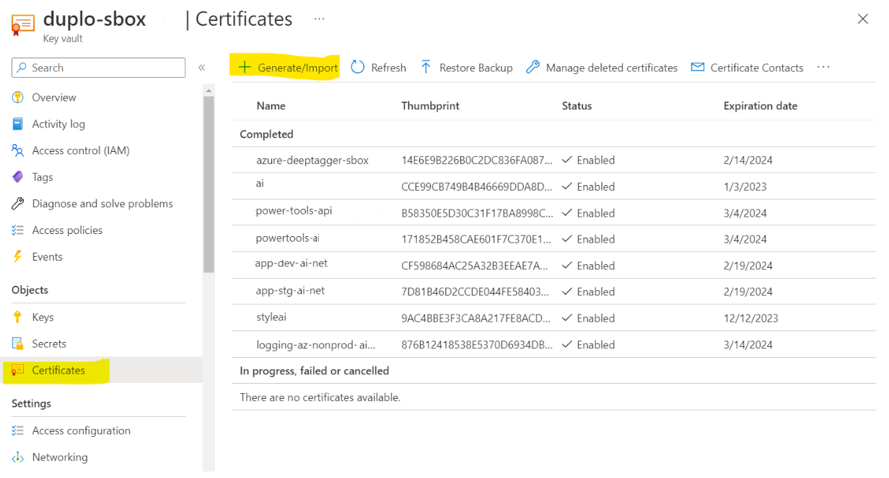<figcaption><p><strong>Generate/Import</strong> option in Azure Key Vault</p></figcaption></figure>

    </div>
3. When you click **Generate/Import**, the **Create a Certificate** form displays. In the **Method of Certificate Creation** field, select **Import**.
4. Name the Certificate, using the **Certificate Name** field.
5. Browse for a file to upload, using the **Upload Certificate File** field.
6.  In the **Password** field, enter the password you set when you [generated the PFX file](import-ssl-certificates.md#generating-the-pfx-file).\


    <div align="left">

    <figure>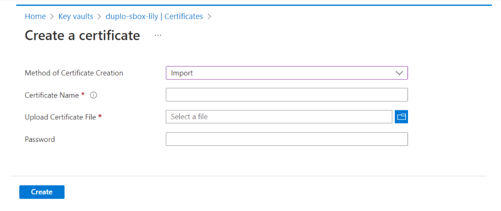<figcaption><p><strong>Create a Certificate</strong> form in Azure Key Vault</p></figcaption></figure>

    </div>
7.  Click **Create**. Even though the certificate is created, notice that the certificate is _not yet_ successfully imported into the vault, as indicated by the **No certificates available** message, as shown below. To import the certificate, you must obtain the Secret Identifier ARN of this certificate and then [configure it in nholuongut](import-ssl-certificates.md#configuring-the-certificate-in-nholuongut).\


    <div align="left">

    <figure>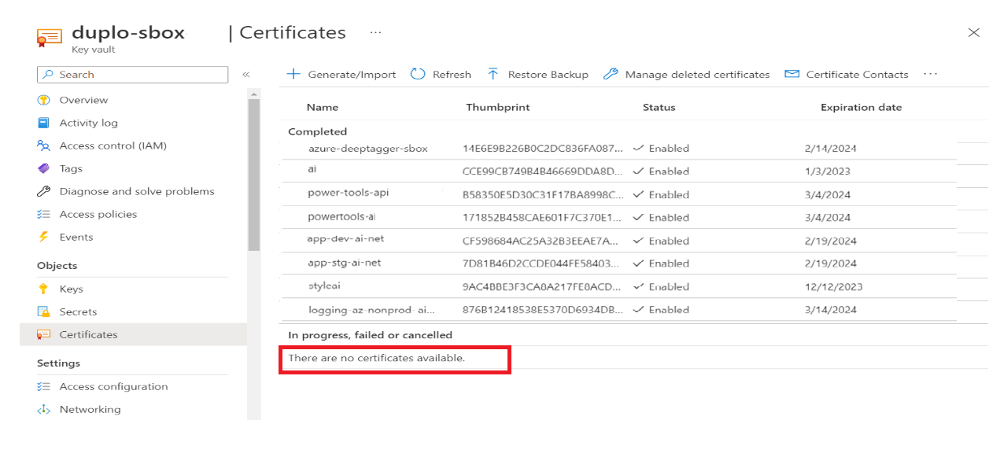<figcaption><p><strong>No certificates available</strong> message in Azure Key Vault</p></figcaption></figure>

    </div>
8.  On the **Certificates** page, select the certificate from the list, and open the **CURRENT VERSION** of the certificate, as shown below, to obtain the Secret Identifier. \


    <div align="left">

    <figure><figcaption><p>CURRENT VERSION of certificate </p></figcaption></figure>

    </div>
9. In the **Certificate Version** form, copy the **Secret Identifier** using the Copy Icon (.png>)).&#x20;


You will paste the ARN when you [configure the certificate in nholuongut](import-ssl-certificates.md#configuring-the-certificate-in-nholuongut).


<figure>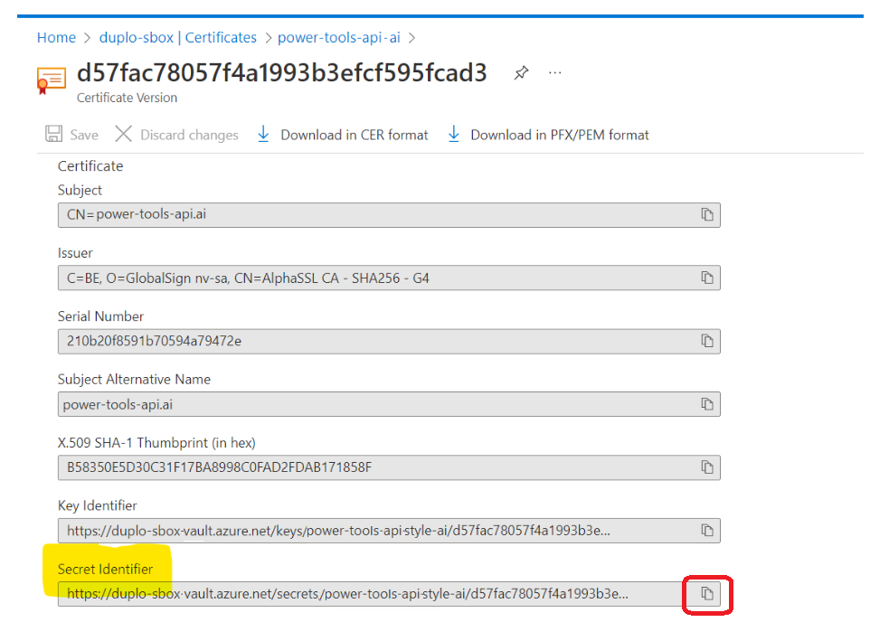<figcaption><p><strong>Certificate Version</strong> form with <strong>Secret Identifier</strong> field</p></figcaption></figure>

## Configuring the SSL Certificate in nholuongut

With the Secret Identifier in your Clipboard, you are now ready to configure the certificate in the nholuongut Portal and&#x20;

1. In the nholuongut Portal, navigate to **Administrator** -> **Plans**.
2.  Select the Plan to which you want to add the certificate from the **Name** column. The **Plans** page displays.\


    <div align="left">

    <figure>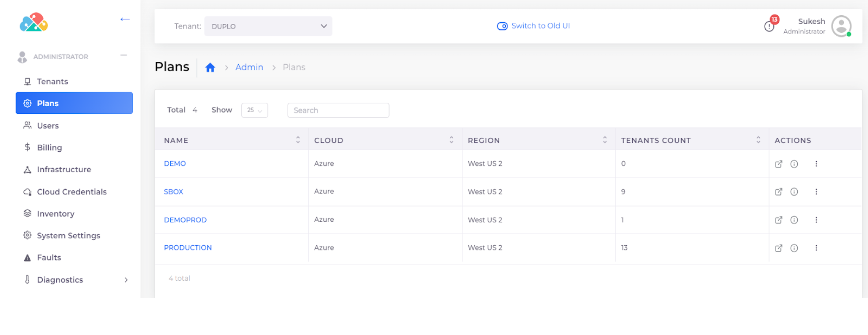<figcaption><p><strong>Plans</strong> page in nholuongut Portal </p></figcaption></figure>

    </div>
3.  Click the **Certificates** tab.\


    <div align="left">

    <figure>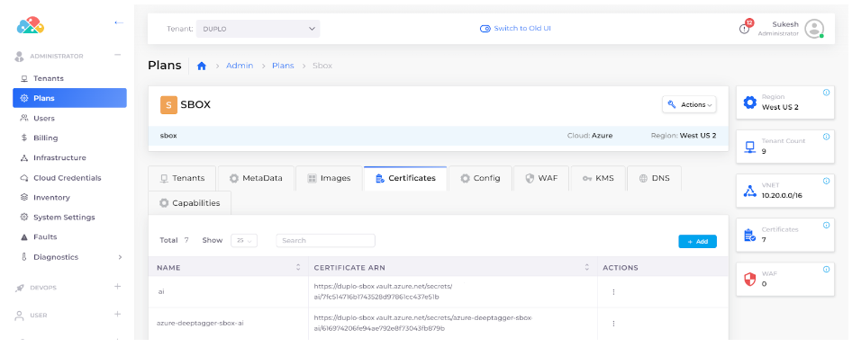<figcaption><p><strong>Certificates</strong> tab on the <strong>Plan</strong> page</p></figcaption></figure>

    </div>
4.  Click **Add**. The **Add a Certificate** pane displays.\


    <div align="left">

    <figure>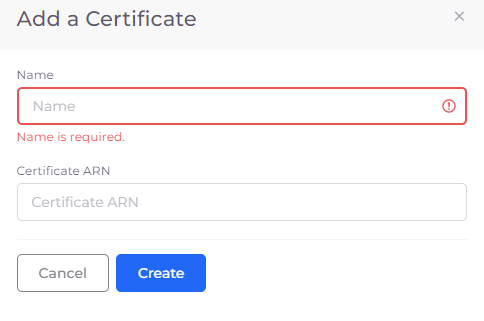<figcaption><p><strong>Add a Certificate</strong> pane</p></figcaption></figure>

    </div>
5. Enter a **Name** for the certificate.
6. Paste the **Secret Identifier** that you [obtained from the Azure Portal](import-ssl-certificates.md#importing-ssl-certificates-to-azure) (it should be in your Clipboard) into the **Certificate ARN** field.
7. Click **Create**.&#x20;

## Using the SSL Certificate for Ingress in nholuongut


Before attaching certificates with K8S Ingress in the nholuongut Portal, [create and configure an **azure-application-gateway**](../../kubernetes-overview/ingress-loadbalancer/adding-ingress.md).


If you use Kubernetes Ingress, you can attach the certificate to the appropriate nholuongut service in the nholuongut portal by using the **Kubernetes** -> **Ingress** option.

1. In the nholuongut Portal, navigate to **Kubernetes** -> **Ingress**.
2. On the **Ingress** page, select the Ingress instance for the **azure- application-gateway**.
3. Click the **Ingress Rules** tab.
4.  From the **Actions** menu, select **Edit**.\


    <figure>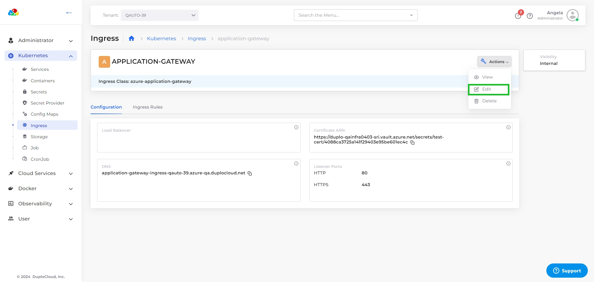<figcaption></figcaption></figure>
5.  On the **Edit Kubernetes Ingress** page, select the certificate that you want to attach from the **Certificate ARN** list box.\


    <figure>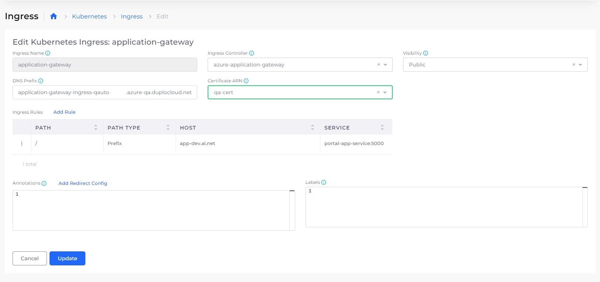<figcaption></figcaption></figure>
6. Click **Update**.

The certificate is attached to the Ingress application gateway and is available to the service.
