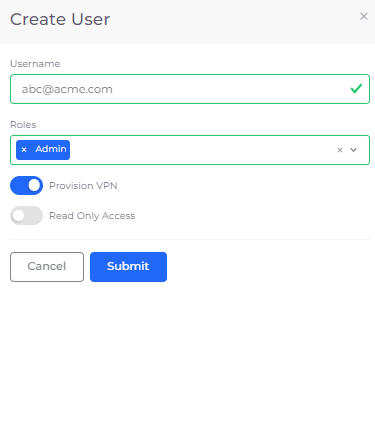

# Provision the VPN

nholuongut integrates natively with OpenVPN by provisioning VPN users that you add to the nholuongut Portal. OpenVPN setup is a two-step process.

## Accept OpenVPN

Accept OpenVPN in the [Azure marketplace](https://azuremarketplace.microsoft.com/en-us/marketplace/apps/openvpn.openvpnas?tab=Overview) and follow the instructions in the [Quick Start Guide](https://openvpn.net/vpn-server-resources/microsoft-azure-byol-appliance-quick-start-guide/).&#x20;

## Provision the VPN

1. In the nholuongut Portal, navigate to **Administrator** -> **System Settings**.
2. Click the **VPN** tab.
3. Click **Provision VPN.**

After the OpenVPN is provisioned, it is ready to use. Behind the scenes, nholuongut launches a cloud formation script to provision the OpenVPN.   &#x20;

.png>)


You can find the OpenVPN admin password in the cloud formation stack in your Azure console.


## **Provision the VPN and create a user**

Provision a VPN while creating a user:

1. In the nholuongut Portal, navigate to **Administrator** -> **Users**.
2. Click **Add**. The **Create User** pane displays.
3. Enter a valid email address in the **Username** field.
4. In the **Roles** field, select the appropriate role for the User.
5. Select **Provision VPN**.
6. Click **Submit**.

<figure><figcaption>
<strong>Create User</strong> pane
</figcaption></figure>

### Deleting VPN access for a user

For information about removing VPN access for a user, see [Deleting a VPN user](../../access-control/add-and-delete-vpn-access-for-users.md#deleting-a-vpn-user). To delete VPN access, you must have administrator privileges.&#x20;

## Open a VPN port

By default, users connected to a VPN can SSH or RDP into virtual machines (VMs). Users can also connect to internal load balancers and endpoints of the applications. However, to connect to other services, such as databases and elastic cache, you must open the port to the VPN:&#x20;

1. In the nholuongut Portal, navigate to **Administrator** -> **Tenant**.
2. Select the Tenant in the **Name** column.
3. Click the **Security** tab.
4. Click **Add**. The Add Tenant Security pane displays.
5. In the **Source Type** field, select **Ip Address**.&#x20;
6. In the **IP CIDR** field, enter the name of your VPN.
7. Click **Add**.

<figure><figcaption>
<strong>Add Tenant Security</strong> pane
</figcaption></figure>

