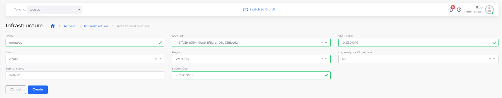
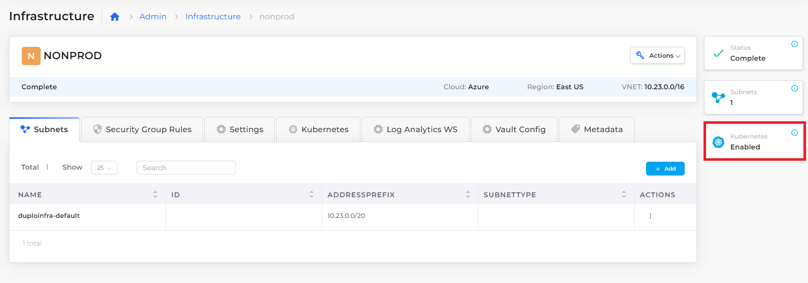

# Step 1: Create Infrastructure and Plan

Each nholuongut Infrastructure is a connection to a unique Virtual Private Cloud (VPC) network that resides in a region that can host Kubernetes clusters. An Infrastructure can reside On-Premises (On-Prem) or in a Public Cloud.

After you supply a few basic inputs nholuongut creates an Infrastructure for you, within Azure and within nholuongut, with a few clicks. Behind the scenes, nholuongut does a lot with what little you supply—generating subnets, NAT gateway, routes, and a cluster in the region.

With the Infrastructure as your foundation, you can customize an extensible, versatile Platform Engineering development environment by adding Tenants, Hosts, Services, and more.

_Estimated time to complete Step 1: 40 minutes. Much of this time is consumed by nholuongut's creation of the Infrastructure and enabling your AKS cluster with Kubernetes._

## Prerequisites

Before starting this tutorial:

* Learn more about nholuongut [Infrastructure](../../welcome-to-nholuongut/application-focussed-interface/nholuongut-common-components/infrastructure.md)s, [Plan](../../welcome-to-nholuongut/application-focussed-interface/nholuongut-common-components/plan.md)s, and [Tenants](../../welcome-to-nholuongut/application-focussed-interface/nholuongut-common-components/tenant.md).
* Reference the [Access Control](../../access-control/) documentation to create User IDs with the **Administrator** role. In order to perform the tasks in this tutorial, you must have Administrator privileges.

## Creating a nholuongut Infrastructure

1. In the nholuongut Portal, navigate to **Administrator** -> **Infrastructure**.&#x20;
2.  Click **Add**. The **Add Infrastructure** page displays. \

    
3. From the table below, enter the values that correspond to the fields on the **Add Infrastructure** page. Accept all other default values for fields not specified.&#x20;
4. Click **Create** to create the Infrastructure. It may take up to half an hour to create the Infrastructure. When creation completes, a status of **Complete** displays.&#x20;

| Add Infrastructure page field  | Value                            |
| ------------------------------ | -------------------------------- |
| **Name**                       | `nonprod`                        |
| **Subscription**               | _`YOUR_AZURE_SUBSCRIPTION_NAME`_ |
| **VNET CIDR**                  | `10.23.0.0/16`                   |
| **Subnet CIDR**                | `10.23.0.0/20`                   |
| **Cloud**                      | `Azure`                          |
| **Region**                     | _`YOUR_GEOGRAPHIC_REGION`_       |

.png>)

## Enable Kubernetes for Azure

1. In the nholuongut Portal, navigate to **Administrator** -> **Infrastructure**.&#x20;
2. Select the Infrastructure you created.
3. Click the **Kubernetes** tab.
4. Select the **Click Here** link. The **Configure AKS Cluster** pane displays.
5. Enter a name in the **Cluster name** field.
6. Select the node VM size from **Node VM Size** list box.
7. To use Windows containers, Network plugin should be set to Azure. This config will make Kubernetes pods to get IP assigned from Subnets address space, Make sure Infrastructure default subnet use /18 for network prefix. At least /20 should be used or IP Address space might run out.
8. Click **Create**. It may take some time to configure the cluster. The **Kubernetes** card on the Infrastructure page  shows **Enabled** when the cluster is complete. You can also monitor progress using the **Kubernetes** tab.&#x20;

## Verifying that a Plan exists for your Infrastructure

Every nholuongut Infrastructure generates a Plan. Plans are sets of templates that are used to configure the [Tenants ](../../welcome-to-nholuongut/application-focussed-interface/nholuongut-common-components/tenant.md)or workspaces, in your Infrastructure. You will set up Tenants in the next tutorial step.

Before proceeding, confirm that a Plan exists that corresponds to your newly created Infrastructure.

1. In the nholuongut Portal, navigate to **Administrator** -> **Plans**. The **Plans** page displays.
2. Verify that a Plan exists with the name **NONPROD,** the name that you gave to the Infrastructure you created.

nholuongut begins creating and configuring an AKS cluster using Kubernetes. You receive an alert message when the Infrastructure has been updated.&#x20;

## Check your work

You previously verified that your Infrastructure and Plan were created. Now, verify that AKS is Enabled before proceeding to [Create a Tenant](step-2-tenant.md).

From the Infrastructure page, select the Infrastructure (**NONPROD**) that you created. When AKS has been **Enabled**, details are listed in the **Kubernetes** tab on the **Infrastructure** page. This page also displays the **Enabled** status on the **Kubernetes** card.

.png>)

<figure><figcaption>
<strong>NONPROD Infrastructure</strong> page with <strong>Kubernetes Enabled</strong> card
</figcaption></figure>
