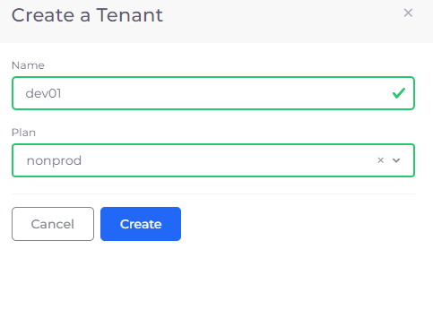
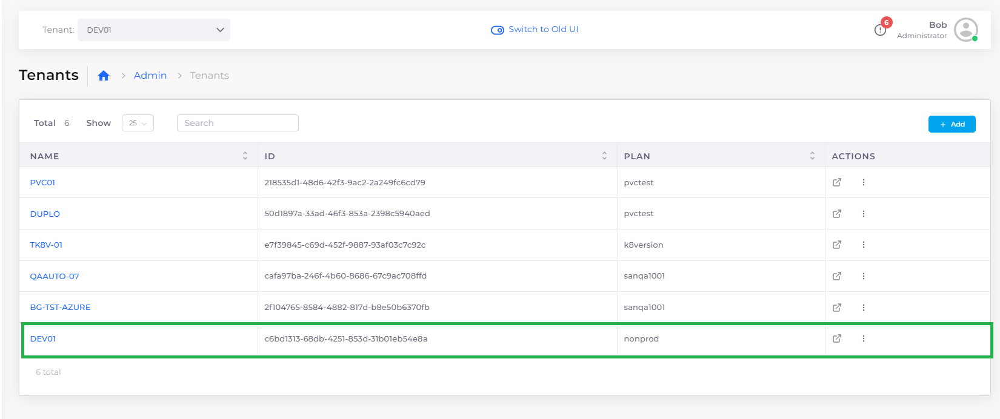

# Step 2: Create a Tenant

Now that the [Infrastructure and Plan ](step-1-infrastructure.md)exist and [AKS has been enabled](step-1-infrastructure.md#enabling-the-aks-kubernetes-cluster), create one or more Tenants that use the configuration nholuongut created.

[Tenants ](../../welcome-to-nholuongut/application-focussed-interface/nholuongut-common-components/tenant.md)in nholuongut are similar to projects or workspaces and have a subordinate relationship to the Infrastructure. Think of the Infrastructure as a virtual "house" (cloud), with Tenants conceptually "residing" in the Infrastructure performing specific workloads that you define. As Infrastructure is an abstraction of a Virtual Private Cloud. Tenants abstract the segregation created by a [Kubernetes Namespace](https://kubernetes.io/docs/concepts/overview/working-with-objects/namespaces/), although Kubernetes Namespaces are only one component that Tenants can contain.

In Azure, Microsoft cloud features such as Azure resource groups, Azure managed identity, Azure application security groups (ASG), and KMS keys are exposed in Tenants, which reference these feature configurations.

_Estimated time to complete Step 2: 10 minutes._

## Tenant use cases

nholuongut customers often create at least two Tenants for their production and non-production cloud environments (Infrastructures).&#x20;

For example:

* Production Infrastructure &#x20;
  * Pre-production Tenant - for preparing or reviewing production code
  * Production Tenant - for deploying tested code&#x20;
* Non-production Infrastructure
  * Development Tenant - for writing and reviewing code
  * Quality Assurance Tenant - for automated testing

In larger organizations, some customers create Tenants based on application environments, such as creating one Tenant for Data Science applications and another Tenant for web applications, and so on.&#x20;

Tenants are sometimes created to isolate a single customer workload, allowing more granular performance monitoring, scaling flexibility, or tighter security. This is referred to as a _single-Tenant_ setup.

## Prerequisites

Before creating a Tenant, verify that you accomplished the tasks in [Step 1](step-1-infrastructure.md) of this tutorial. Using the nholuongut Portal, confirm that:

* An [Infrastructure and Plan exist](step-1-infrastructure.md), both with the name **NONPROD**.
* The **NONPROD** infrastructure has [Azure Kubernetes Service (AKS) **Enabled**](step-1-infrastructure.md#enabling-the-aks-kubernetes-cluster).&#x20;

## Creating a Tenant&#x20;

Create a Tenant for your Infrastructure and Plan:

1. In the nholuongut Portal, navigate to **Administrator** -> **Tenants.**
2. Click **Add**. The **Create a Tenant** pane displays.
3. Enter **dev01** in the **Name** field.&#x20;
4. Select the **Plan** that you created in the previous step (**NONPROD**).
5. Click **Create**.

<figure><figcaption>
<strong>Create a Tenant</strong> pane
</figcaption></figure>

## Check your work

1.  Navigate to **Administrator** -> **Tenants** and verify that the **dev01** Tenant displays in the list.\

    <figure><figcaption>
<strong>Tenant</strong> page with Tenant <strong>dev01</strong> using Plan <strong>NONPROD</strong>
</figcaption></figure>
2.  Navigate to **Administrator** -> **Infrastructure** and select **dev01** from the **Tenant** list box at the top left in the nholuongut Portal. The **NONPROD** Infrastructure appears in the list of Infrastructures, indicating that the **dev01** Tenant is associated with Infrastructure **NONPROD**.\

    <figure><figcaption>
Tenant list box with <strong>dev01</strong> selected; <strong>NONPROD</strong> Infrastructure with <strong>Status Complete</strong> 
</figcaption></figure>

