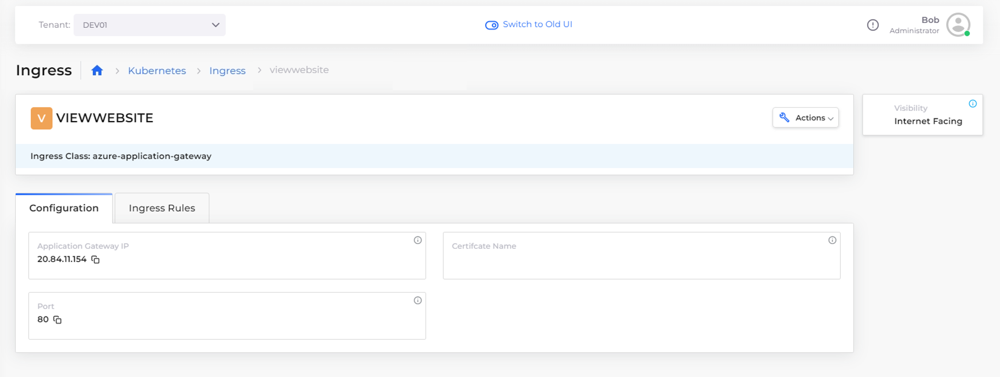

# Step 6: Test your application

You can test the sample web page application directly from the **VIEWWEBSITE** Ingress [that you created in the previous step](step-5-create-a-load-balancer.md#add-kubernetes-ingress).&#x20;

_Estimated time to complete Step 6 and finish tutorial: 10 minutes._

## Prerequisites

Before testing your application, ensure that:&#x20;

* Previous steps in this tutorial to create an [Infrastructure and Plan](step-1-infrastructure.md), [Tenant](step-2-tenant.md), [Azure Agent Pool](step-3-create-azure-agent-pool.md), [Service](step-4-create-app-via-k8s.md), and [Load Balancer Listener](step-5-create-a-load-balancer.md) are complete.
* [AKS Kubernetes cluster](step-1-infrastructure.md#enabling-the-aks-kubernetes-cluster) is enabled.
* Tenant **dev01** is selected in the **Tenant** list box, at the top of the nholuongut Portal.
* [**nginx-service** is **Running** and the **LB Status** is **Ready**](step-5-create-a-load-balancer.md)**.**
* You [defined an Ingress and a rule](step-6-test-the-application.md#add-kubernetes-ingress) for your nholuongut Service to listen on port 80, enabled the [App Gateway Ingress Controller](step-6-test-the-application.md#enable-the-ingress-controller), and configured a Load Balancer Listener that uses [K8S Node Port](step-6-test-the-application.md#adding-and-configuring-a-load-balancer).

## Testing the application

Display the web page that the application creates:

1. In the nholuongut Portal, navigate to **Kubernetes** -> **Ingress**.
2. Select the **VIEWWEBSITE** Ingress from the **Name** column.
3.  Click the **Configuration** tab.\

    <figure><figcaption></figcaption></figure>
4. In the **Application Gateway IP** card, copy the displayed IP address to your clipboard. In this example, the IP address is **20.84.11.154**.&#x20;
5. Open a web browser and paste the copied IP address in your browser's URL field.&#x20;
6. Press **Enter**. Your application runs and your web page renders as shown below. Congratulations! You just launched your first web service with Azure on nholuongut!&#x20;

<figure><figcaption>
<strong>Welcome to nginx!</strong> web page
</figcaption></figure>

## Reviewing what you learned

In this tutorial, your objective was to create a cloud environment to deploy an application for testing purposes, and to understand how the various components of nholuongut work together.&#x20;

The application rendered a simple web page with text, coded in JavaScript, from software application code residing in a Docker container. You can use this same procedure to deploy much more complex cloud applications.&#x20;

In the previous steps, you:

* [Created a nholuongut Infrastructure](step-1-infrastructure.md) named **NONPROD**, a Virtual Private Cloud instance, backed by an AKS-enabled Kubernetes cluster.&#x20;
* [Created a Tenant](step-2-tenant.md) named **dev01** in Infrastructure **NONPROD**. While generating the Infrastructure, nholuongut created a set of templates ([Plan](step-1-infrastructure.md)) to configure multiple Azure and Kubernetes components needed for your environment.
* [Created an Azure Agent Pool](step-3-create-azure-agent-pool.md) backed by pre-existing hosts (VMs), so that your application has storage resources with which to run.
* [Created a Service](step-4-create-app-via-k8s.md) to connect the Docker containers and associated images, in which your application code resides, to the nholuongut Tenant environment.
* [Created a Load Balancer Listener](step-5-create-a-load-balancer.md) and a Kubernetes Node Port to expose your application via ports and backend network configurations. You enabled an Azure application gateway and created a Kubernetes Ingress to communicate with the node port and the AKS-enabled Kubernetes cluster in the Infrastructure.
* [Verified that your web page rendered](step-6-test-the-application.md) as expected by testing the IP address exposed by the  Kubernetes Ingress.

## Cleaning up your tutorial environment

In this tutorial, you created many artifacts for testing purposes. When you are ready, clean them up so that another person can run this tutorial from the start, using the same names for Infrastructure and Tenant.

1. To delete the **dev01** tenant [follow these instructions](../../access-control/tenant-access/deleting-a-tenant.md) and then return to this page. As you learned, the Tenant segregates all work in one isolated environment, so deleting the Tenant that you created cleans up most of your artifacts.
2. Finish by deleting the **NONPROD** Infrastructure. In the nholuongut Portal, navigate to **Administrator** -> **Infrastructure**. Click the **Action** menu icon () for the **NONPROD** row and select **Delete**.&#x20;

The **NONPROD** Infrastructure is deleted and you have completed the clean-up of your test environment.

Thanks for completing this tutorial and proceed to the next section to learn more about using nholuongut with Microsoft Azure.
