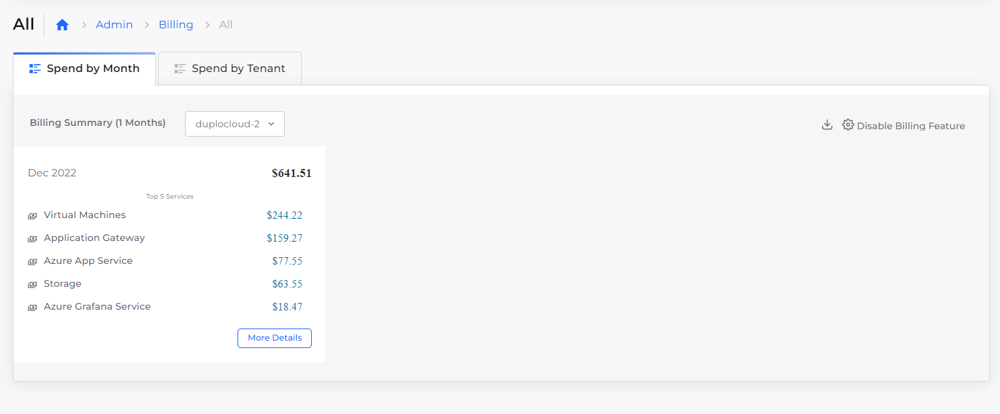
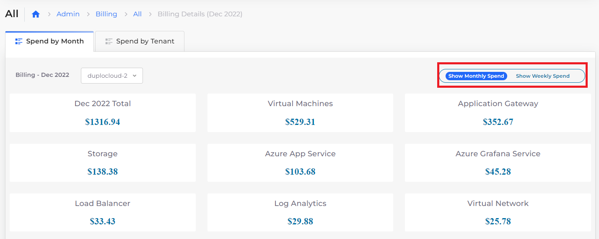

# Viewing billing data

Usage costs for resources can be viewed and managed in the nholuongut Portal, by month or week, and by Tenant. You can also explore historical resource costs.&#x20;

To view the Billing page for Azure in the nholuongut Portal, click **Administrator** -> **Billing**. &#x20;

<figure><figcaption>
<strong>Billing</strong> page for Azure
</figcaption></figure>

You can view usage by:

* Time
  * Select the **Spend by Month** tab and click **More Details** to display monthly and weekly spending options. &#x20;
* Tenant
  * Select the **Spend by Tenant** tab.

<figure><figcaption>
<strong>Spend by Month</strong> tab with monthly and weekly options displayed
</figcaption></figure>
