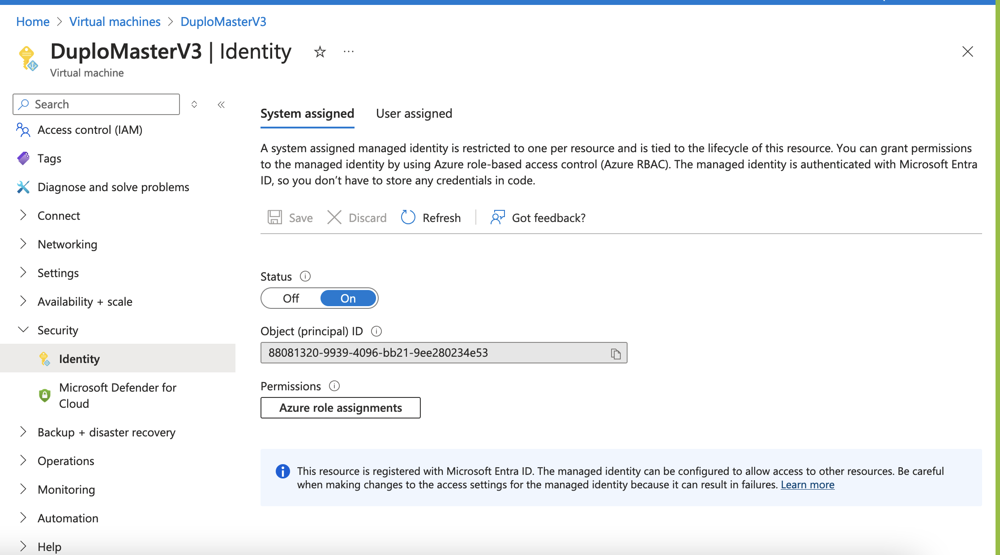
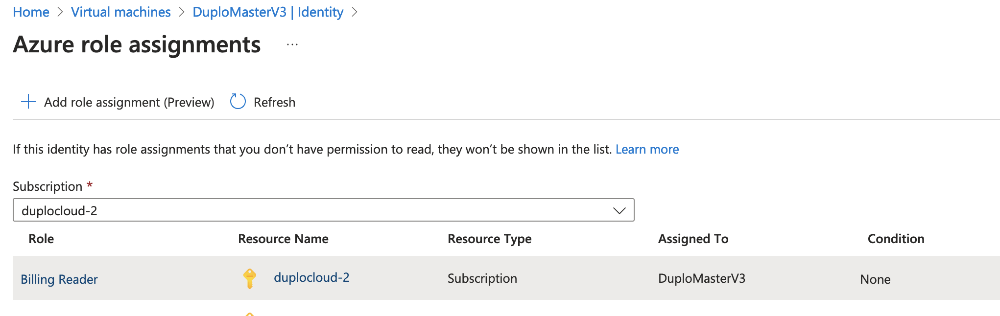

# Enable billing data

## Enabling the billing feature

To enable the billing feature in the Azure Console:

1.  In the Azure Console, select the host (VM) beginning with **DuploMaster**.\

    <figure><figcaption>
<strong>DuploMaster</strong> VM in the Azure Console 
</figcaption></figure>
2. In the Azure Console, navigate to **Security** -> **Identity**.&#x20;
3. Click **Azure role assignments**. The **Azure role assignments** page displays.
4.  Click **Add role assignment (Preview)** to add the **Billing Reader** role.\

    <figure><figcaption>
<strong>Azure role assignments</strong> page in the Azure Console 
</figcaption></figure>
5. Restart the **DuploMaster** VM to make the **Billing Reader** role available.
6. Verify that **Duplo.BillingService** is running. If it is, the billing feature is enabled.
