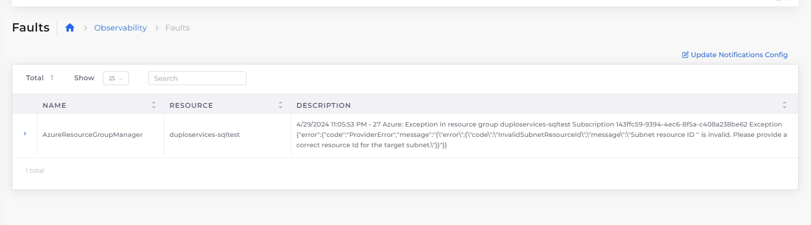
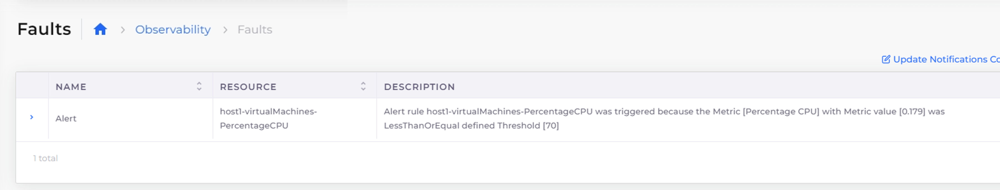

# Faults and alerts

## Introduction 

Faults that happen in the system be it Infrastructure creation, Container deployments, or Application health checks can be tracked in the nholuongut portal under Faults Menu.

## Viewing faults 

You can look at Tenant specific faults under **Observability** -> **Faults** or all the faults in the system under **Administrator** -> **Faults**. In addition to notifying you about the faults, nholuongut integrates with Sentry, which will send an Email alert for the fault and act as a single place to look at all the events.

<figure><figcaption></figcaption></figure>

## Creating alerts

You can create Azure alerts for the resources from the nholuongut portal. The supported resource has Alerts Tab. Click on Add. Metrics are listed as per the resource. Select the required Threshold and configure the Alerts.

Alerts can also be configured from the **Observability** -> **Alerts** option.

When the alert Threshold is crossed, a Fault is generated in the nholuongut portal.

<figure><figcaption></figcaption></figure>
