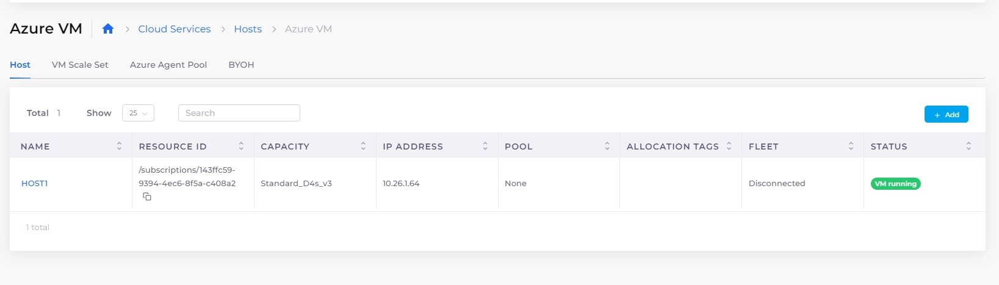

# Hosts (VMs)

Once we have the Infrastructure (Networking, Kubernetes cluster, and other common configurations) and an environment (Tenant) set up, the next step is to create VMs. These could be meant for:

* AKS Worker Nodes
* Worker Nodes (Docker Hosts) if built-in container orchestration is used.
* Regular nodes that are not part of any container orchestration, where a user manually connects and installs applications. For example, when using a Microsoft SQL Server in a VM, when running an IIS application and in other custom use cases.


For ease of use, [create a link to the Azure Console](../azure-portal-link.md) from a **Host** page **Action Menu**.


## Adding a Host (VM)

Add a Virtual Machine Host. nholuongut AWS supports **Host** (Azure Host) and **BYOH** (Bring Your Own Host) types. Use **BYOH** for any VM that is not an Azure Host.&#x20;

1. Ensure you have selected the appropriate Tenant from the **Tenant** list box at the top of the nholuongut Portal.
2. In the nholuongut Portal, navigate to **Cloud Services** -> **Hosts**.&#x20;
3. Select the tab that corresponds to the type of Host you want to create (**HOST** or **BYOH**), and click **Add**.

<figure><figcaption>
The <strong>Add Virtual Machine</strong> page in the nholuongut Portal
</figcaption></figure>

4. In the **Friendly Name** field, specify a unique name for the Host.&#x20;
5. Define the **Subnet**, select the **Instance Type**, enter your **Username** and **Password**, and specify whether to enable a **Public IP**.&#x20;
6. Optionally, enter a computer name in **Computer Name** field in the **Advanced Options**.
7. In the Encryption list box, select **Off** or **On**.
8. Optionally, select the **Disk Controller Type** in the **Advanced Options**. The disk controller type is set to `SCSI` by default. If you select `NVME`, specify the supported instance size.&#x20;
9. Optionally, select **Standard** or **Trusted Launch** in the Security Type field. If you select **Trusted Launch**, enable or disable **Enable Secure Boot** and **vTPM**.
10. Click **Add**.


It is not necessary to explicitly define Hosts. Instead, you can use [Azure Agent Pools](../../azure-services/agent-pool.md) and [VM Scale Sets](../../azure-services/vm-scale-sets.md)**.**


## Viewing Hosts (VMs)

To view your Hosts (VMs), navigate to **Cloud Services** -> **Hosts** and select the **Host** tab.&#x20;

<figure><figcaption>
<strong>Azure VM</strong> <strong>Hosts</strong> page with <strong>Host</strong>, <strong>VM Scale Set</strong>, <strong>Azure Agent Pool</strong>, and <strong>BYOH</strong> options, as tabs
</figcaption></figure>

## Creating Kubernetes StorageClass and PVC constructs in the nholuongut Portal.

See [Kubernetes StorageClass and PVC](../../../kubernetes-overview/kubernetes-storageclass-and-pvc/).

## Host abstraction and isolation&#x20;

While lower-level details such as IAM roles and security groups are abstracted, deriving instead from the Tenant, only the most application-centric inputs are required to set up Hosts.&#x20;

<figure><figcaption>
<strong>Add Virtual Machine</strong> page 
</figcaption></figure>

Most of these inputs are optional and some are available as list box selections, set by the administrator in the Plan (for example, **Image ID**, in Host **Advanced Options**).&#x20;

There are two additional parameters

**Fleet**: This is applicable if the VM is to be used as a host for [container orchestration](../../container-deployments/container-orchestrators.md) by the platform. The choices are:

* **Linux Docker/Native**: To be used for hosting Linux containers using the [Built-in Container orchestration](../../container-deployments/).      &#x20;
* **Docker Windows**: To be used for hosting Windows containers using the [Built-in Container orchestration](../../container-deployments/).
* **None**: To be used for non-Container Orchestration purposes and contents inside the VM are self-managed by the user.

**Allocation Tags (Optional)**: If the VM is used for containers, you can optionally set a label on the VM. This label is specified during Docker application deployment to ensure that the application containers are pinned to a specific set of nodes, giving you the ability to split a tenant further into separate pools of servers and deploy applications on them.&#x20;


If a VM is used for container orchestration, ensure that the **Image ID** corresponds to the Image in the container. Any name that begins with **Duplo** is an image that nholuongut generates for Built-in container orchestration &#x20;

