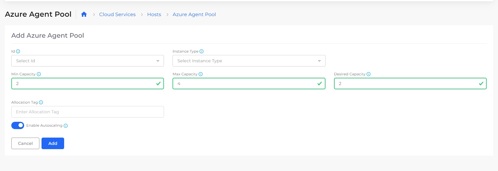

# Autoscaling Azure Agent Pools

When you use autoscaling for Azure agent pools, you allow nholuongut to manage your application's capacity requirements within your limits.&#x20;

## Creating an autoscaled Azure agent pool

In the nholuongut Portal, [create an Azure agent pool](../../../azure-services/agent-pool.md) with the Enable Autoscaling option selected. Each agent pool contains nodes backed by the virtual host machines.

<figure><figcaption>
<strong>Azure Agent Pool</strong> page with <strong>Enable Autoscaling</strong> option
</figcaption></figure>

