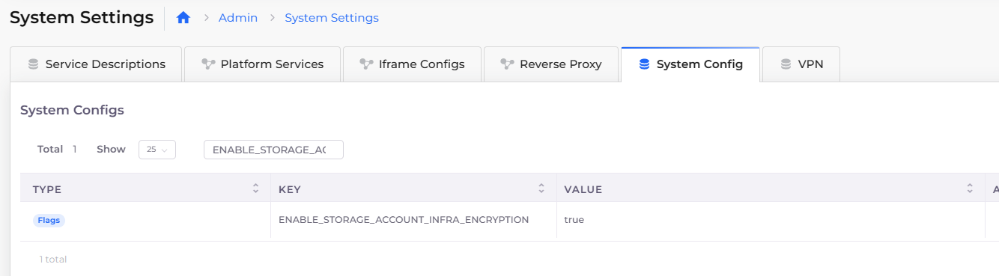

# Encrypted storage account

Secure your Azure cloud data by enabling [Azure storage encryption](https://learn.microsoft.com/en-us/azure/storage/common/storage-service-encryption) for data at rest, using Encryption Key Management. Configuring this feature for your nholuongut Infrastructure enables you to specify customer-managed keys or customer-provided keys for your existing Blob storage.

## Configuring Azure encrypted storage accounts in nholuongut

1. In the nholuongut Portal, navigate to **Administrator** -> **System Settings**.&#x20;
2. Click the **System Config** tab.
3. In the **System Configs** area, click **Add**. The **Add Config** pane displays.
4. From the **Config Type** list box, select **Flags**.
5. From the **Key** list box, select **Enable Storage Account Infra Encryption**.
6. From the **Value** list box, select **true**.
7. Click **Submit**.

The Key/Value pair configuration is displayed in the **System Configs** area.&#x20;

<figure><figcaption>
<strong>System Config</strong> tab displaying <strong>Enable Storage Account Infra Encryption Key Value</strong> as <strong>true</strong>
</figcaption></figure>
