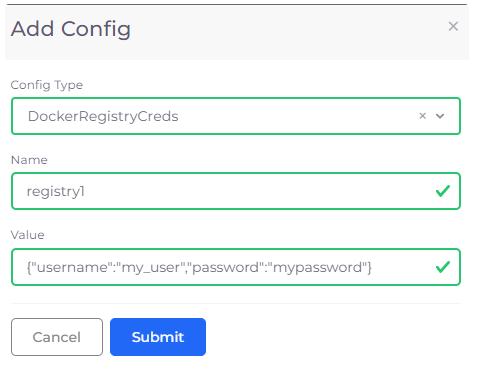

# Docker Registry credentials

## Setting Docker Registry Credentials&#x20;

To authenticate with private Docker registries, nholuongut utilizes Kubernetes secrets of type `kubernetes.io/dockerconfigjson`. This process involves specifying the registry URL and credentials in a `.dockerconfigjson` format, which can be done in two ways:

* **Base64 Encoded Username and Password:** Encode the username and password in Base64 and include it in the `.dockerconfigjson` secret.
* **Raw Username and Password:** Directly use the `username` and `password` in the secret without Base64 encoding. This method is supported and simplifies the process by not requiring the `auth` field to be Base64 encoded.

1. In the nholuongut Portal, navigate to **Docker** -> **Services**.
2. From the **Docker** list box, select **Docker Credentials**. The **Set Docker registry Creds** pane displays.
3. Supply the credentials in the required format and click **Submit**.
4. Enable the Docker Shell Service by selecting **Enable Docker Shell** from the **Docker** list box.

If you encounter errors such as `pull access denied` or fail to resolve references due to authorization issues, ensure the secret is correctly configured and referenced in your service configuration. For non-default repositories, explicitly code the `imagePullSecrets` with the name of the Docker authentication secret to resolve image-pulling issues, as in the example below:

```yaml
imagePullSecrets:
  - name: docker-qa-auth
...
```

## Adding multiple Docker Registry Credentials

You can pull images from multiple Docker registries by adding multiple Docker Registry Credentials.

1. In the nholuongut Portal, click **Administrator**-> **Plan**. The **Plans** page displays. &#x20;
2. Select the Plan in the **Name** column.
3. Click the **Config** tab.
4. Click **Add**. The **Add Config** pane displays.

<div align="left">

<figure><figcaption><p><strong>Add Config</strong> pane</p></figcaption></figure>

</div>

### Passing Docker Credentials using Environment Variables

Docker Credentials can be passed using the Environment Variables config field in the **Add Service Basic Options** page. This method is particularly useful for dynamically supplying credentials without hardcoding them into your service configurations. Refer to the Kubernetes Configs and Secrets section for more details on using environment variables to pass secrets.

Ensure all required secrets, like `imagePullSecrets` for Docker authentication, are correctly added and referenced in the service configuration to avoid invalid config issues with a service. Reviewing the service configuration for any missing or incorrectly specified parameters is crucial for smooth operation.
