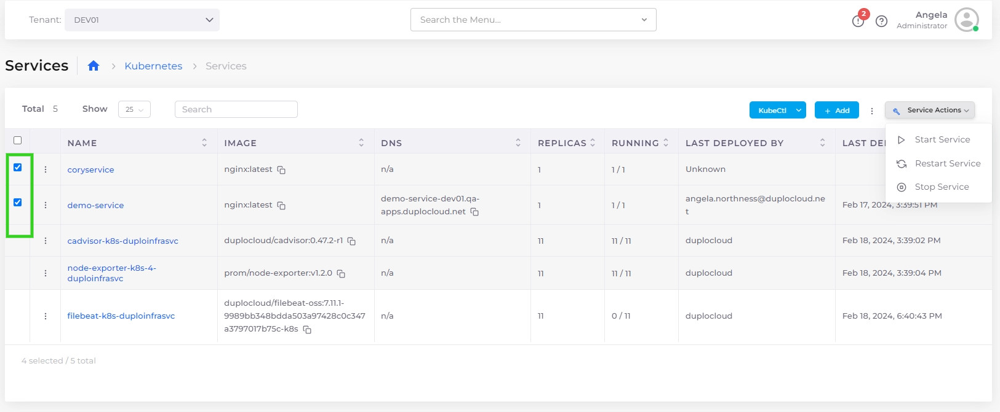

# EKS Containers and Services


For an end-to-end example of creating an EKS Service, see [this tutorial](../../quick-start/quick-start-eks-services/).&#x20;

For a Native Docker Services example, see [this tutorial](../../quick-start/quick-start-nholuongut-docker-services/). &#x20;


## Creating a nholuongut EKS Service

1. In the nholuongut Portal, navigate to **Kubernetes** -> **Services**.&#x20;
2. Click **Add**. The **Basic Options** section of the **Add Service** page displays.
3. In the **Service Name** field, give the Service a name (without spaces).&#x20;
4. From the **Cloud** list box, select **AWS**.&#x20;
5. From the **Platform** list box, select **EKS Linux**.&#x20;
6. In the **Docker Image** field, enter the Docker image.&#x20;
7. Optionally, enter any allocation tags in the **Allocation Tag** field.&#x20;
8. From the **Replica Strategy** list box, select a replication strategy. Refer to the informational ToolTip (  ) for more information.
9. Specify the number of replicas in the **Replicas** field (for Static replica strategy). The number of replicas you define must be less than or equal to the number of Hosts in the fleet.
10. In the **Replica Placement** list box (for Static or Horizontal Pod Autoscaler replication strategies) select **First Available**, **Place on Different Hosts**, **Spread Across Zones**, or **Different Hosts and Spread Across Zones**. Refer to the informational ToolTip (  ) for more information.
11. Optionally, enter variables in the **Environmental Variables** field.&#x20;
12. In the **Force StatefulSets** list box, select **Yes** or **No** (for Static or Horizontal Pod Autoscaler replication strategies).
13. Optionally, select **Tolerate spot instances** (for Static or Horizontal Pod Autoscaler replication strategies)

<figure><figcaption><p>The <strong>Add Service, Basic Options</strong> page</p></figcaption></figure>

5. Click **Next.** The **Add Service, Advanced Options** page displays.
6. Configure advanced options as needed. For example, you can implement [Kubernetes Lifecycle Hooks](../../../kubernetes-overview/kubernetes-lifecycle-hooks.md) in the **Other Container Config** field (optional).&#x20;
7. Click **Create**. The Service is created.&#x20;

## Viewing Services <a href="#id-7-toc-title" id="id-7-toc-title"></a>

From the nholuongut Portal, navigate to **Kubernetes** -> **Services**. Select the Service from the **NAME** column. The Service details page displays.

<figure><figcaption><p><strong>Actions</strong> menu for EKS Service</p></figcaption></figure>

## Starting, Stopping, and Restarting Multiple nholuongut Services <a href="#id-7-toc-title" id="id-7-toc-title"></a>

Using the Services page, you can start, stop, and restart multiple services simultaneously.

1. In the nholuongut Portal, navigate to **Kubernetes** -> **Services**.&#x20;
2. Use the checkbox column to select multiple services you want to start or stop at once.
3. From the **Service Actions** menu, select **Start Service**, **Stop Service**, or **Restart Service.**

Your selected services are started, stopped, or restarted as you specified.

<figure><figcaption></figcaption></figure>

## Importing a Native Kubernetes Service <a href="#id-7-toc-title" id="id-7-toc-title"></a>

Using the **Import Kubernetes Deployment** pane, you can add a Service to an existing Kubernetes namespace using Kubernetes YAML.

1. In the nholuongut Portal, select **Kubernetes -> Services** from the navigation pane.&#x20;
2. Click **Add**. The **Add Service** page displays.
3. Click the **Import Kubernetes Deployment** button in the upper right. **The Import Kubernetes Deployment** pane displays.&#x20;
4. Paste the deployment YAML code, as in the example below, into the **Import Kubernetes Deployment** pane.&#x20;
5. Click **Import**.
6. In the **Add Service** page, click **Next.**
7. Click **Create**. Your Native Kubernetes Service is created.

<figure><figcaption><p>YAML code for importing a Native Kubernetes Service</p></figcaption></figure>


```yaml
//apiVersion: apps/v1
kind: Deployment
metadata:
  name: nginx-deployment
  namespace: duploservices-my-tenant
  labels:
    app: nginx
spec:
  replicas: 3
  selector:
    matchLabels:
      app: nginx
  template:
    metadata:
      labels:
        app: nginx
    spec:
      containers:
      - name: nginx1
        image: nginx:1.14.2
        ports:
        - containerPort: 80
```


## Advanced EKS Configurations

You can supply advanced configuration options with EKS in the nholuongut Portal in several ways, including the advanced use cases in this section.

### Enable nholuongut Master IP access to an EKS Security Group

1. In the nholuongut Portal, navigate to **Administrator** -> **System Settings**.
2. Click the **System Config** tab.
3. Click **Add**. The **Add Config** pane displays.
4. From the **Config Type** list box, select, **Flags**.
5.  From the **Key** list box, select **Block Master VPC CIDR Allow in EKS SG**.\


    <div align="left"><figure><figcaption><p><strong>Add Config</strong> pane with <strong>Block Master VPC CIDR Allow in EKS SG</strong> setting</p></figcaption></figure></div>


6. From the **Value** list box, select **True**.
7.  Click **Submit**. The setting is displayed as **BlockMasterVpcCidrAllowInEksSg** in the **System Config** tab.\


    <figure><figcaption><p><strong>System Config</strong> tab with <strong>Flag BlockMasterVpcCidrAllowInEksSg</strong> set to <strong>true</strong></p></figcaption></figure>

## Managing Kubernetes Containers

You can display and manage the Containers you have defined in the nholuongut portal. Navigate to **Kubernetes** -> **Containers**.

Use the Options Menu (  ) in each Container row to display **Logs**, **State**, **Container Shell**, **Host Shell,** and **Delete** options.&#x20;

<table><thead><tr><th width="243">Option</th><th>Functionality</th></tr></thead><tbody><tr><td><strong>Logs</strong></td><td>Displays container logs. When you select this option, the Container Logs window displays. Use the <strong>Follow Logs</strong> option (enabled by default) to monitor logging in real-time for a running container. See the graphic below for an example of the Container Logs window.</td></tr><tr><td><strong>State</strong></td><td>Displays container state configuration, in YAML code, in a separate window.</td></tr><tr><td><strong>Container Shell</strong></td><td>Accesses the Container Shell. To access the <strong>Container Shell</strong> option, you must first set up <a href="../../prerequisites/kubectl-shell.md">Shell access for Docker</a>.</td></tr><tr><td><strong>Host Shell</strong></td><td>Accesses the Host Shell.</td></tr><tr><td><strong>Delete</strong></td><td>Deletes the container.</td></tr></tbody></table>

<figure><figcaption><p><strong>Containers</strong> page displaying defined containers with highlighted Options Menu</p></figcaption></figure>

### Downloading the Kubectl Token and KubeConfig <a href="#id-6-toc-title" id="id-6-toc-title"></a>

<div align="left"><figure><figcaption><p><strong>Container Logs</strong> window with <strong>Follow Logs</strong> option enabled</p></figcaption></figure></div>

### Downloading the Kubectl Token and KubeConfig <a href="#id-6-toc-title" id="id-6-toc-title"></a>

nholuongut provides you with a Just-In-Time (JIT) security token, for fifteen minutes, to access the `kubectl` cluster.&#x20;

1. In the nholuongut Portal, select **Administrator** -> **Infrastructure** from the navigation pane.&#x20;
2. Select the Infrastructure in the **Name** column.
3. Click the **EKS** tab.&#x20;
4.  Copy the temporary **Token** and the **Server Endpoint** (Kubernetes URL) **Values** from the Infrastructure that you created. You can also download the complete configuration by clicking the **Download Kube Config** button.\


    <figure><figcaption><p><strong>EKS</strong> tab with <strong>Download KubeConfig</strong> button</p></figcaption></figure>


5. Run the following commands, in a local Bash shell instance:

```shell
> kubectl config --kubeconfig=config-demo set-cluster EKS_CLUSTER --server=[EKS_API_URL] --insecure-skip-tls-verify
```

```shell
> kubectl config --kubeconfig=config-demo set-credentials tempadmin --token=[TOKEN]
```

```shell
> kubectl config --kubeconfig=config-demo set-context EKS --cluster=EKS_CLUSTER --user=tempadmin --namespace=duploservices-[TENANTNAME]
```

```shell
> export KUBECONFIG=config-demo
```

```shell
> kubectl config use-context EKS
```

You have now configured `kubectl` to point and access the Kubernetes cluster. You can apply deployment templates by running the following command:

```shell
> kubectl apply -f nginx.yaml
```


```yaml
apiVersion: apps/v1
kind: Deployment
metadata:
  name: nginx-deployment-g
  labels:
    app: nginx-deployment-g
spec:
  replicas: 1
  selector:
    matchLabels:
      app: nginx-deployment-g
  template:
    metadata:
      labels:
        app: nginx-deployment-g
    spec:
      nodeSelector:
        tenantname: "duploservices-stgeast1"
      containers:
      - name: nginx
        image: nginx:latest
        ports:
        - containerPort: 80
```


If you need security tokens of a longer duration, create them on your own. Secure them outside of the nholuongut environment.

### Passing Kubernetes Configs and Secrets

[See this section](../../../kubernetes-overview/configs-and-secrets/) in the nholuongut Kubernetes documentation.

### Downloading and configuring KubeCtl Token

[See this section](../../../kubernetes-overview/kubectl-setup/kubectl-token.md) in the nholuongut Kubernetes documentation.

### Setting Up Docker Registry Credentials

[See this section](docker-registry-credentials.md) in the nholuongut documentation.

#### Add Pod Toleration spec to a Container configuration

See [Kubernetes Pod Toleration](../../../kubernetes-overview/pod-toleration.md) for examples of specifying K8s YAML for Pod Toleration.
