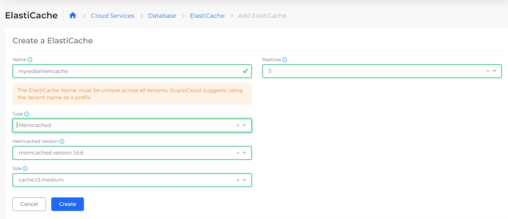

# Amazon ElastiCache

[Amazon ElastiCache](https://aws.amazon.com/elasticache/features/) is a serverless, Redis- and Memcached-compatible caching service delivering real-time, cost-optimized performance for modern applications.

## Creating a **Memcached ElastiCache** instance

1. In the nholuongut Portal, navigate to **Cloud Services** -> **Database.**
2. Select the **ElastiCache** tab, and click **Add**. The **Create a ElastiCache** page displays.
3. Provide the database **Name**.
4. Select the number of replicas in the **Replicas** field.&#x20;
5. In the **Type** list box, select **Memcached.**
6. Select the Memcache Version.&#x20;
7. Select the node size in the **Size** list box.
8. Click **Create**. The Memcached ElastiCache instance is created.

<figure><figcaption>
The <strong>Create an ElastiCache</strong> page in the nholuongut Portal
</figcaption></figure>


Pass the cache endpoint to your application through the [Environment Variables](../containers/passing-config-and-secrets.md) via the AWS Service.


## Creating a **Redis ElastiCache** instance

1. In the nholuongut Portal, navigate to **Cloud Services** -> **Database**.
2. Select the **ElastiCache** tab, and click **Add**. The **Create an ElastiCache** page displays.

<figure><figcaption>
The <strong>Create an ElastiCache</strong> page in the nholuongut Portal
</figcaption></figure>

3. Provide the database **Name**.
4. Select the number of **Replicas**.
5. Optionally, if you selected more than 2 replicas, enable **Automatic Failover**. When automatic failover is enabled and the primary Redis node in the cluster fails, one of the read replicas is automatically promoted to become the new primary node.
6. Optionally, enable **Cluster Mode**.
7. In the **Type** field, select **Redis**.
8. In the **Size** list box, select the node size.
9. Optionally, complete the **Redis Version**, **Parameter Group Name**, **KMS (Optional)**, **Encryption At Transit**, **Snapshot Name**, **Snapshot ARNs**, and **Snapshot Retention Limit** fields.
10. Optionally, click the **CloudWatch** link above the **Log Delivery Configuration** field to configure the Redis instance to deliver its engine logs to Amazon CloudWatch Logs. The **Add CloudWatch Logs: Log Delivery Configuration** pane displays. Complete the **Log Format**, **Log Type**, and **Log Group** fields. Click **Add Config**. The configuration is added to the **Log Delivery Configuration** field.

<figure><figcaption>
The <strong>Add CloudWatch Logs: Log Delivery Configuration</strong> pane
</figcaption></figure>

11. Click **Create**. The Redis database instance is created

## Troubleshooting Redis Connection Issues in AWS

When a Redis instance in an AWS environment is experiencing connection issues, ensure the Security Group (SG) configuration allows VPN traffic to port `6379`. Then, using the `nc` command, verify the Redis instance's accessibility.

If you encounter local DNS resolution problems, consider changing your DNS provider or connecting directly using the Redis instance's IP address, which can be obtained via the `dig` command.&#x20;

For persistent DNS issues, resetting your router or using external DNS query tools may help. If other troubleshooting steps fail, exploring [AWS network interfaces](https://docs.aws.amazon.com/AWSEC2/latest/UserGuide/using-eni.html) can offer additional insights.
