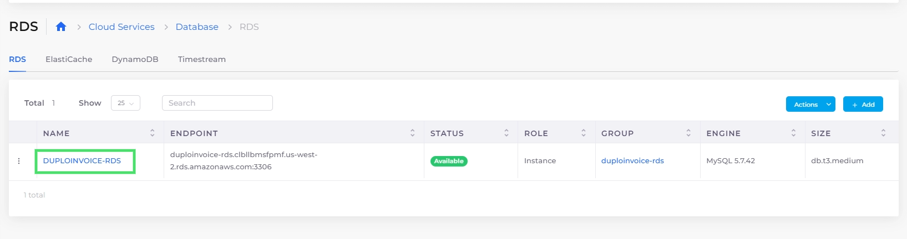
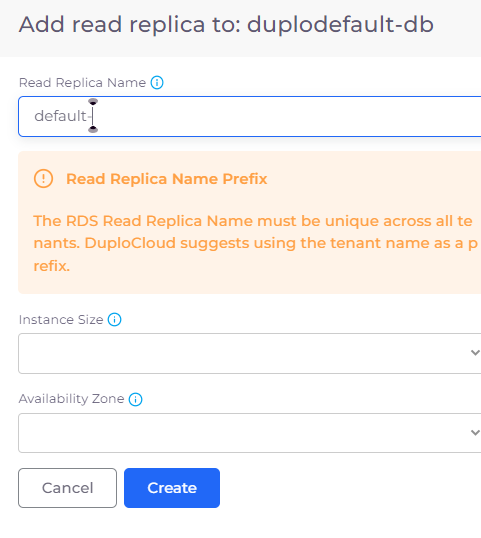
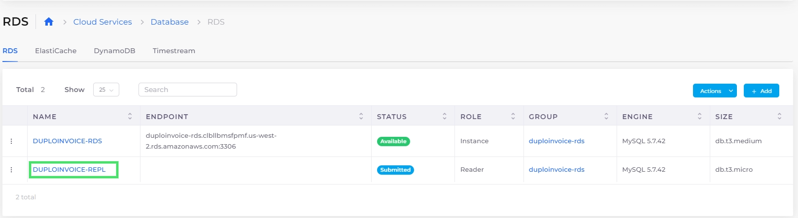

# Add and manage RDS read replicas

Creating AWS RDS read replicas of your database helps you elastically scale your capacity to handle read-heavy workloads and ensure that your application can efficiently serve growing requests. Read replicas distribute read traffic across multiple instances, boosting performance by increasing aggregate read throughput and reducing the load on the primary database. Additionally, should the need arise, you can promote a read replica to a standalone database instance, enabling seamless failover and enhancing your overall database availability and resilience.

## Adding a read replica

1. In the nholuongut Portal, navigate to **Cloud Services** -> **Database.**
2. Click the **RDS** tab.
3.  Click on the name of the database you want to replicate in the **NAME** column.\

    <figure><figcaption>
The <strong>RDS</strong> tab on the <strong>Database</strong> page with the RDS database highlighted
</figcaption></figure>
4.  From the **Actions** menu, select **RDS Settings**, and then **Add Replica**. The **Add read replica to: DATABASE** pane displays.\

    

    <figure><figcaption>
The <strong>Add read replica to: duplodefault-db</strong> pane
</figcaption></figure>

    

5. In the **Read Replica Name** field, provide a name for the replica (the Tenant name is prefixed automatically).
6. From the **Instance Size** list box, choose a size that meets or exceeds the specifications of the database you are replicating.
7. Click **Create**. Your replica displays on the **RDS** tab with a status of **Submitted**. When the replica is ready for use, the status changes to **Available**.

<figure><figcaption>
The <strong>RDS</strong> tab on the <strong>Database</strong> page with the read replica highlighted. 
</figcaption></figure>

## Promoting read replicas

Transforming a read replica into a standalone primary instance allows it to accept write operations and maintain data integrity without relying on the original primary. This enhances database availability and efficient scaling. nholuongut supports promoting read replicas for PostgreSQL, MySQL, and MariaDB databases.&#x20;

1. In the nholuongut Portal, navigate to **Cloud Services** -> **Database.**
2. Select the **RDS** tab.
3. Click on the name of the database you want to promote from the **NAME** column.
4. In the **Actions** menu, select **RDS Settings**, and then **Promote Replica**.

<figure><figcaption>
The <strong>Actions</strong> menu with the <strong>Promote Replica</strong> option highlighted
</figcaption></figure>

5. Click **Confirm** in the confirmation dialog box. The promoted replica stops replicating from the primary instance and becomes a standalone database that can accept write operations.

