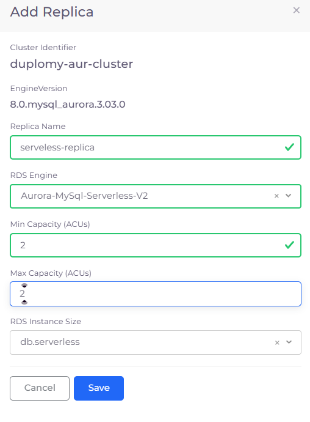
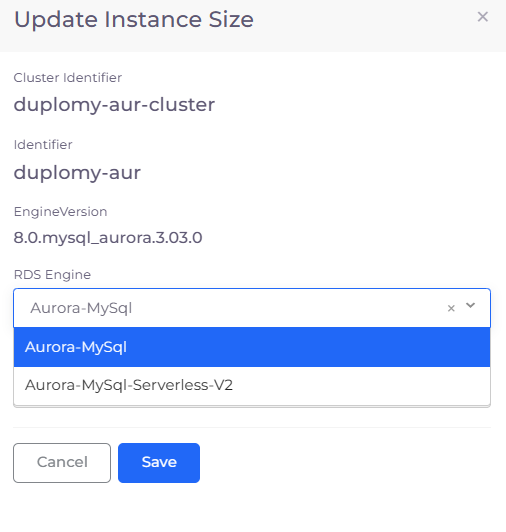
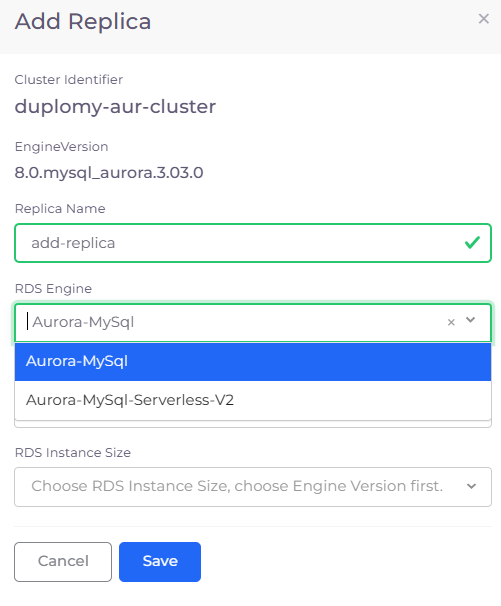

# Add Aurora RDS replicas

Aurora database replica setup is slightly different from [adding an RDS read replica](./).

## Adding an Aurora read replica&#x20;

1. [Create an Aurora RDS database](../../../../../aws-user-guide/aws-services/database/rds-database/).
2. In the nholuongut Portal, navigate to **Cloud Services** -> **Database**.
3. In the row of the RDS for which you want to add an Aurora read replica, click the (  ) icon, select **RDS Settings**, and then **Add Replica**. The **Add Replica** pane displays.

Follow one of these procedures to complete the serverless and MySQL replicas setup.

### Adding an Aurora Serverless read replica&#x20;

1. In the **Add Replica** pane, enter a name for the Serverless replica in the Replica Name field.
2. In the **RDS Engine** field, select the **Aurora** RDS Serverless engine you want the replica to use.
3. Specify **Min Capacity (ACUs)** and **Max Capacity (ACUs)**.
4. From the **RDS Instance Size** list box, select the appropriate instance size.
5. Click **Save**. The replica is created with a **Reader** role and displayed in the **RDS** tab.

<figure><figcaption>
<strong>Add Replica</strong> pane for Aurora Serverless replica creation
</figcaption></figure>

#### Updating instance sizes for Aurora Serverless read replicas

To modify instance sizes for an existing Aurora Serverless replica:

1. In the nholuongut Portal, navigate to **Cloud Services** -> **Database** and, in the **RDS** tab, locate the read replica you want to update in the **Name** column.&#x20;
2.  Click the (  ) icon in the **Actions** column and select **Update Instance Size**. The **Update Instance Size** pane displays.\

    

    <figure><figcaption></figcaption></figure>

    

3. From the **RDS Instance Size** list box, select the appropriate instance size.
4. Click **Save**.

### Adding an Aurora MySQL read replica&#x20;

1. In the **Add Replica** pane, enter a name for the MySQL replica in the **Replica Name** field.
2. From the **RDS Instance Size** list box, select the appropriate instance size.
3. From the **Availability Zone** list box, select an availability zone
4. Click **Save**. The replica is created with a **Reader** role and displayed in the **RDS** tab.

<figure><figcaption>
<strong>Add Replica</strong> pane for Aurora MySQL replica creation
</figcaption></figure>

