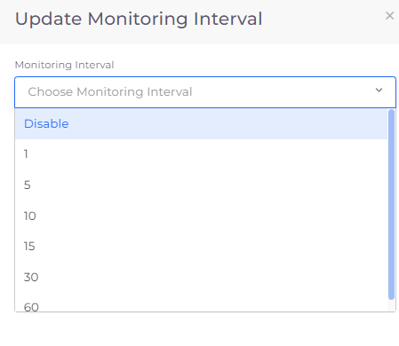

# Add monitoring interval

Add or update a monitoring interval for an RDS database configuration.

## Configuring an RDS database monitoring interval

1. In the nholuongut Portal, navigate to **Cloud Services** -> **Database**.
2. Click the **RDS** tab.
3. In the row for the RDS database that you want to update, click the (  ) icon in the **Actions** column, and select **Update Monitoring Interval**. The **Update Monitoring Interval** pane displays.
4. From the **Monitoring Internal** list box, select an interval, in seconds. To remove a previously set interval, select **Disable**.
5. Click **Submit**.

<figure><figcaption>
<strong>Update Monitoring Interval</strong> pane
</figcaption></figure>

