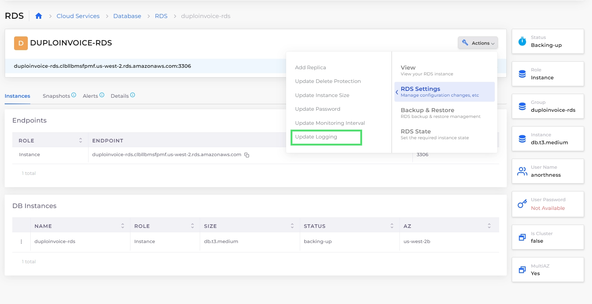
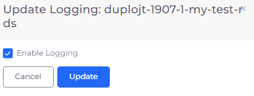
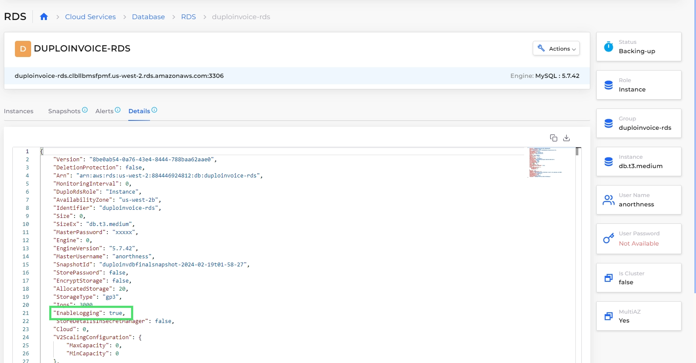

# Enable or disable RDS logging

You can enable or disable logging for an RDS database at any time, using the nholuongut Portal.

## Prerequisites

To update logging for an RDS, you must select the **Enable Logging** option when you [create the RDS](../../../../aws-user-guide/aws-services/database/rds-database/).

## Update RDS logging&#x20;

1. In the nholuongut Portal, navigate to **Cloud Services** -> **Databases**.
2. In the **RDS** tab, from the **Name** column, select the database for which you want to enable or disable logging.
3.  Click the **Actions** menu, select **RDS Settings**, and then **Update Logging**. The **Update Logging** pane displays.\

    <figure><figcaption>
<strong>Actions</strong> menu with <strong>Update Logging</strong> option
</figcaption></figure>
4.  Select or deselect **Enable Logging** to turn logging on or off, respectively.\

    

    <figure><figcaption>
<strong>Update logging</strong> pane
</figcaption></figure>

    

5. Click **Update**.

View the status of the **EnableLogging** attribute in the **Details** tab.

<figure><figcaption>
<strong>Details</strong> tab with <strong>EnableLogging</strong> attribute
</figcaption></figure>
