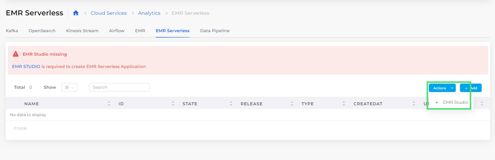
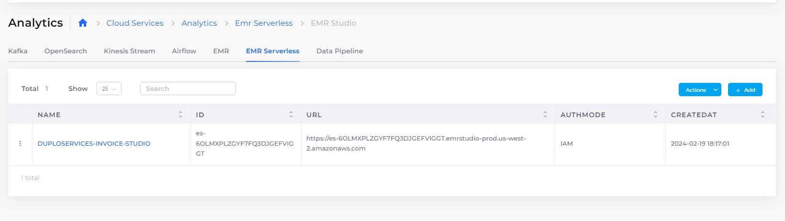
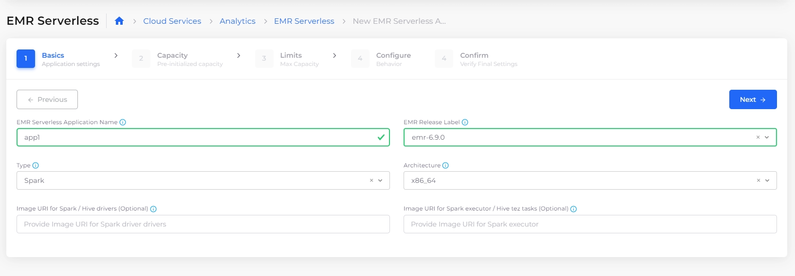
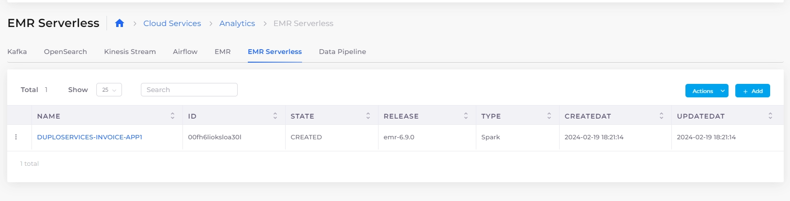
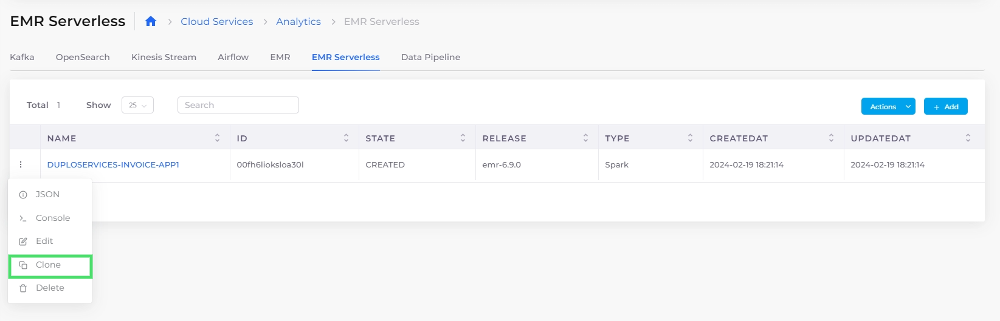
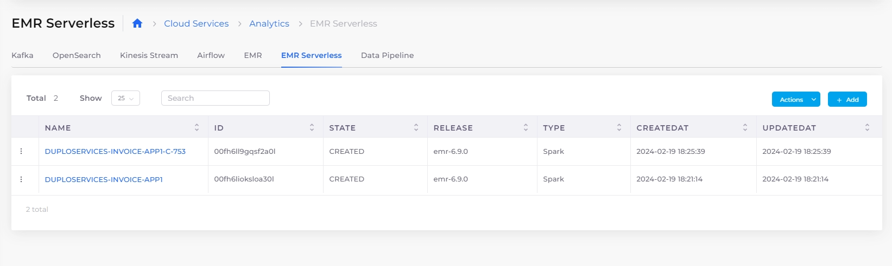
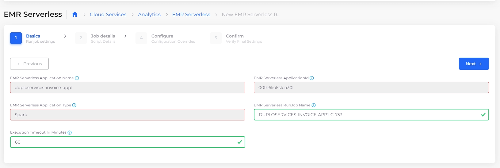
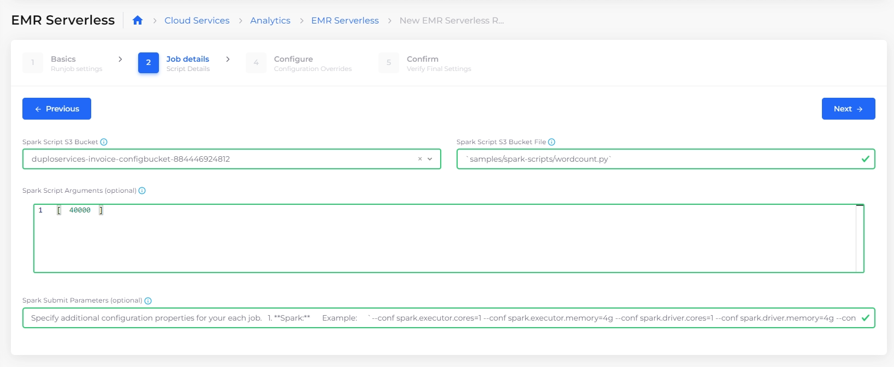
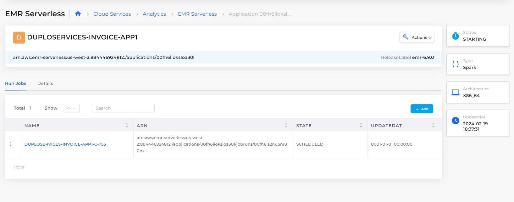
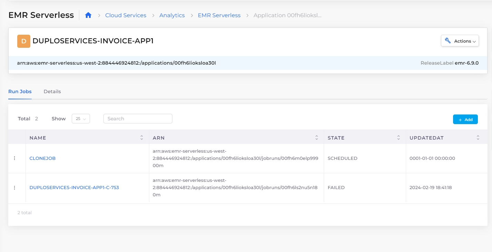

# EMR Serverless

Amazon EMR Serverless is a serverless option in [Amazon EMR](https://aws.amazon.com/emr/)that makes it easy for data analysts and engineers to run open-source big data analytics frameworks without configuring, managing, and scaling clusters or servers. You get all the features and benefits of Amazon EMR without needing experts to plan and manage clusters.

In this procedure, we [create an EMR studio](emr-serverless.md#creating-an-emr-studio), [create and clone a Spark application](emr-serverless.md#creating-and-cloning-a-spark-application), then [create and clone a Spark job](emr-serverless.md#creating-and-cloning-a-spark-job) to run the application with EMR Serverless.


nholuongut EMR Serverless supports Hive, Spark, and custom ECR images.


## Creating an EMR Studio

To create EMR Serverless applications you first need to create an EMR studio.

1. In the nholuongut Portal, navigate to **Cloud Services** -> **Analytics**.
2. Click the **EMR Serverless** tab.
3.  Click **EMR Studio**.\

    <figure><figcaption>
<strong>Actions</strong> menu with <strong>EMR Studio</strong> option highlighted on <strong>EMR Serverless</strong> tab
</figcaption></figure>
4. Click **Add**. The **Add EMR Studio** pane displays.\
   \
   .png>)\

5. Enter a **Description** of the **Studio** for reference.
6. Select an [S3 Bucket](s3-bucket.md) that you previously defined from the **Logs Default S3 Bucket** list box.
7. Optionally, in the **Logs Default S3 Folder** field, specify the path to which logs are written.
8. Click **Create**. The EMR Studio is created and displayed.&#x20;
9.  Select the EMR Studio name in the **Name** column. The **EMR Studio** page displays. View the **Details** of the EMR Serverless Studio.\

    

    <figure><figcaption>
EMR Studio page with <strong>Basic</strong> and <strong>Details</strong> tabs.
</figcaption></figure>

    

10. Navigate to the **EMR Serverless** tab and click the menu () icon in the **Actions** column. Use the **Actions** Menu to delete the studio if needed, as well as to view the studio in the AWS Console. \

    <figure><figcaption>
EMR Serverless Studio Actions Menu
</figcaption></figure>

Now that the EMR Studio exists, you create an application to run analytics with it.\
The nholuongut Portal supports `Hive` and `Spark` applications. In this example, we create a Spark Application.

## Creating an EMR Serverless application

1. In the **EMR Serverless** tab, click **Add**. A configuration wizard launches with five steps for you to complete.
2.  Enter the **EMR Serverless Application Name** (`app1`, in this example) and the **EMR Release Label** in the **Basics** step. nholuongut prepends the string **DUPLOSERVICES-**_**TENANT\_NAME**_ to your chosen application name, where _**TENANT\_NAME**_ is your Tenant's name. Click **Next**.\

    <figure><figcaption>
<strong>EMR Serverless</strong> configuration wizard <strong>Basics</strong> step
</figcaption></figure>
3. Accept the defaults for the **Capacity**, **Limits**, and **Configure** pages by clicking **Next** on each page until you reach the **Confirm** page.
4.  On the **Confirm** page, click **Submit**. Your created application instance (`DUPLOSERVICES-DEFAULT-APP1`, in this example) is displayed in the **EMR Serverless** tab with the **State** of **CREATED**.\

    <figure><figcaption>
<strong>EMR Serverless</strong> tab with <strong>CREATED</strong> application instance 
</figcaption></figure>

Before you begin to create a job to run the application, clone an instance of it to run.

### Cloning an application

1.  On the EMR Serverless page, click the menu () icon and select **Clone**.\

    <figure><figcaption>
<strong>Actions</strong> menu with <strong>Clone</strong> option on <strong>EMR Serverless</strong> tab
</figcaption></figure>
2. Make any desired changes while advancing through the **Basics**, **Capacity**, **Limits**, and **Configure** steps, clicking **Next** to advance the wizard to the next page. nholuongut gives your cloned app a unique generated name by default (**app1-c-833**, in this example).
3.  On the **Confirm** page, click **Submit**. In the EMR Serverless tab, you should now have two application instances in the **CREATED State**: your original application instance (**DUPLOSERVICES-DEFAULT-APP1)** and the cloned application instance (**DUPLOSERVICES-DEFAULT-APP1-C-833)**.\

    <figure><figcaption>
Original application instance and cloned instance in EMR Serverless tab
</figcaption></figure>

## Creating a job

You have created and cloned the Spark application. Now you must create and clone a job to run it in EMR Serverless. In this example, we create a Spark job.


If you are new to Spark, use the Info Tips (blue  icon) when entering data in the EMR Serverless configuration wizard steps below.


1. Select the application instance that you previously cloned. This instance (**DUPLOSERVICES-DEFAULT-APP1-C-833**, in this example) has a **STATE** of **CREATED**.
2. Click **Add**. The configuration wizard launches.
3.  In the **Basics** step, enter the **EMR Serverless RunJob Name** (**jobfromcloneapp**, in this example).\

    <figure><figcaption>
<strong>EMR Serverless</strong> configuration wizard <strong>Basics</strong> step with <strong>EMR Serverless RunJob Name</strong> field
</figcaption></figure>
4. Click **Next**.
5. In the **Job details** step, select a previously-defined **Spark Script S3 Bucket.**
6. In the **Spark Script** [**S3 Bucket**](s3-bucket.md) **File** field, enter a path to define where your scripts are stored.
7. Optionally, in the **Spark Scripts** field, you can specify an array of arguments passed to your JAR or Python script. Each argument in the array must be separated by a comma (**,**). In the example below, a single argument of **"40000"** is entered.&#x20;
8.  Optionally, in the **Spark Submit Parameters** field, you can specify Spark **`--conf`** parameters. See the example below. \

    <figure><figcaption>
<strong>EMR Serverless</strong> configuration wizard <strong>Job details</strong> step with <strong>Spark Script Arguments</strong> and <strong>Spark Submit Parameters</strong> fields
</figcaption></figure>
9. Click **Next**.
10. Make any desired changes in the **Configure** step and click **Next** to advance the wizard to the **Confirm** page.
11. On the **Confirm** page, click **Submit**. In the **Run Jobs** tab for your cloned application, your job **JOBFROMCLONEAPP** displays. \

    <figure><figcaption>
<strong>Run Jobs</strong> tab for cloned application instance <strong>DUPLOSERVICES-DEFAULT-APP1-C-753</strong>
</figcaption></figure>

## Monitoring running jobs

Observe the status of your jobs and makes changes, if needed. In this example, we monitor the Spark jobs created and cloned in this procedure.

1. In the nholuongut Portal, navigate to **Cloud Services** -> **Analytics**.
2. Click the **EMR Serverless** tab.
3.  Select the application instance that you want to monitor. The **Run Jobs** tab displays run jobs connected to the application instance and each job's **STATE**.\

    <figure><figcaption>
<strong>Run Jobs</strong> tab with 2 jobs in various <strong>STATE</strong>s
</figcaption></figure>
4. Using the **Actions** menu, you can view the **Console**, **Start**, **Stop**, **Edit**, **Clone** or **Delete** jobs. You can also click the **Details** tab to view configuration details.
