# IoT (Internet of Things)

Connect and manage billions of devices with AWS IoT, per Tenant. Collect, store, and analyze IoT data for industrial, consumer, commercial, and automotive workloads within nholuongut.


Use [Just-In-Time access](../../aws-user-guide/use-cases/jit-access.md) to provision devices in your IoT.


## Enabling IoT for a Tenant&#x20;

1. In the nholuongut Portal, navigate to **Administrator** -> **Tenants**.
2. Select your Tenant in the **Name** column.
3. Click the **Settings** tab.
4.  Click **Add**. The **Add Tenant Feature** pane displays.\

    

    <figure><figcaption>
<strong>Add Tenant Feature</strong> pane with <strong>Enable AWS IoT</strong> feature selected
</figcaption></figure>

    

5. From the **Select Feature** list box, select **Enable AWS IoT** and **Enable**.
6. Click **Add**. It takes approximately five minutes to enable IoT.&#x20;
7. Navigate to **Cloud Services** -> **IoT**.  The IoT **Things** page displays.

<figure>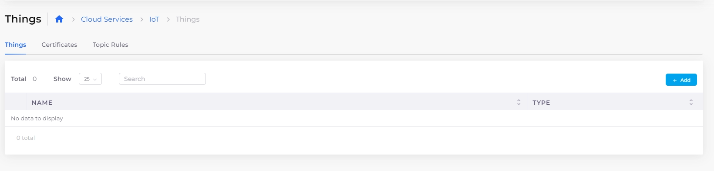<figcaption>
IoT <strong>Things</strong> page
</figcaption></figure>

## Creating IoT Things

1. In the nholuongut Portal, navigate to **Cloud Services** -> **IoT**.
2. Click the **Things** tab.
3.  Click **Add**. The **Create an IoT Thing** pane displays.\

    <figure>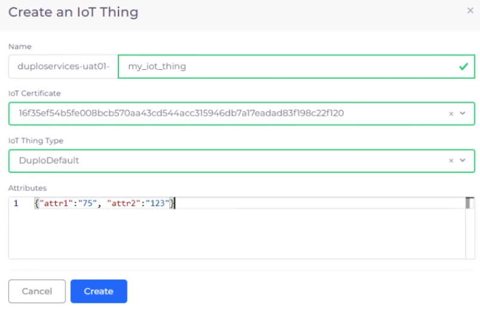<figcaption>
<strong>Create an IoT Thing</strong> pane with <strong>AttributesACtions</strong> 
</figcaption></figure>
4. In the editable portion of the **Name** field, enter a Thing name.&#x20;
5. From the **IoT Certificate** list box, select an IoT Certificate.
6. From the **IoT Thing Type** list box, select the Thing type that you want to create.
7. In the **Attributes** field, add Thing Attributes in quotes, separated by a comma (**,**).
8. Click **Create**. Your IoT Thing is created and displayed.&#x20;

Select the Thing to view **Details** and **IoT Principals** (certificate information) for the Thing. Use the **Action** menu to **Edit** or **Delete** the Thing, **Attach IoT Certificate**, and **Download Device Package**.

<figure><figcaption>
<strong>Details</strong> and <strong>IoT Principals</strong> tabs on IoT <strong>Things</strong> page
</figcaption></figure>

<figure>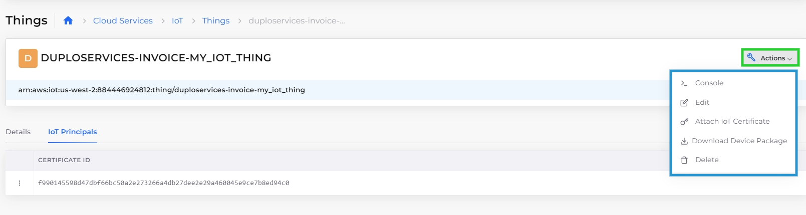<figcaption>
<strong>Actions</strong> menu on IoT <strong>Things</strong> page
</figcaption></figure>

## Attach a certificate to a Thing

1. In the nholuongut Portal, navigate to **Cloud Services** -> **IoT**.
2. Click the **Things** tab.
3. [Add a certificate](iot-internet-of-things.md#adding-a-certificate) if needed.
4. Select the Thing to which you want to attach a certificate from the **Name** column.
5. Click the Actions menu and select **Attach IoT Certificate**. The **Attach an IoT Certificate** pane displays.
6. From the **IoT Certificate** list box, select an IoT certificate to attach to the Thing.
7. Click **Attach**.

## Download the Device Package for a Thing

1. In the nholuongut Portal, navigate to **Cloud Services -> IoT**.&#x20;
2. Click the **Things** tab.&#x20;
3. Select the Thing to which you want to attach a certificate from the **Name** column.&#x20;
4.  Click the **Actions** menu and select **Download Device Package**. The **Download IoT Device Package** window displays. \

    

    <figure>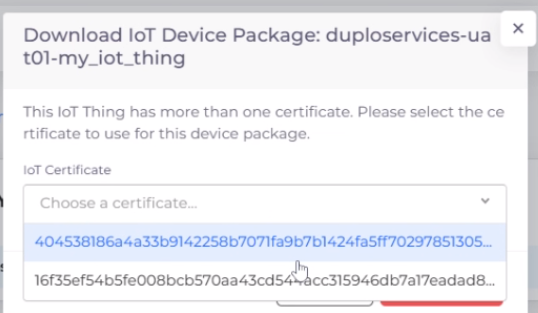<figcaption></figcaption></figure>

    

5. From the **IoT Certificate** list box, select the IoT certificate associated with the Thing's Device Package.&#x20;
6. Click **Download**.

## Certificate management

Add, update, or manage an IoT certificate with the following procedures.

### Adding a certificate

1. In the nholuongut Portal, navigate to **Cloud Services** -> **IoT**.
2. Click the **Certificates** tab.
3.  Click **Add**. The **Create an IoT Certificate** pane displays.\

    

    <figure>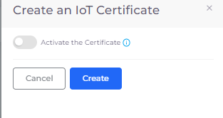<figcaption>
<strong>Create an IoT Certificate</strong> pane
</figcaption></figure>

    

4. Select **Activate the Certificate** and click **Create**. The certificate displays.&#x20;

### Updating a certificate

1. In the nholuongut Portal, navigate to **Cloud Services** -> **IoT**.
2. Click the **Certificates** tab. The available certificates are displayed and listed by **ID**.
3.  In the row for the certificate you want to update, click the **Actions** menu (  ) and select **Edit**. The **Update an IoT Certificate** pane displays.\

    

    <figure>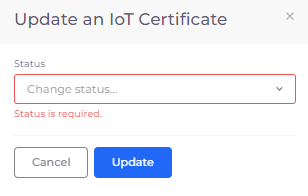<figcaption></figcaption></figure>

    

4. From the **Status** list box, select the new status of the certificate.
5. Click **Update**.

### Manage a certificate using AWS Console

1. In the nholuongut Portal, navigate to **Cloud Services** -> **IoT**.
2. Click the **Certificates** tab. Available certificates are displayed and listed by **ID**.
3. In the row for the certificate you want to update, click the menu () icon in the **Actions** column.
4.  Select **Console**. The AWS Console launches so that you can manage your certificate using AWS.\

    <figure>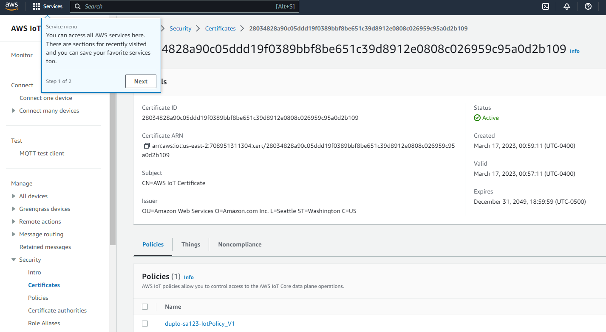<figcaption>
AWS Console for managing certificates
</figcaption></figure>

## Using IoT Topic Rules

Topic Rules are SQL-based rules that select data from message payloads and send data to other services, such as Amazon S3, Amazon DynamoDB, and AWS Lambda. Define a Rule to invoke a Lambda function when invoking an AWS or third-party service.

To learn more about IoT Topic Rules and how you define and manage them, see the [AWS documentation](https://docs.aws.amazon.com/iot/latest/developerguide/iot-rules.html).

### Adding IoT Topic Rules

1. In the nholuongut Portal, navigate to **Cloud Services -> IoT**.&#x20;
2. Click the **Topic Rules** tab.
3.  Click **Add**. The **Add** Topic Rules page displays.\

    

    <figure>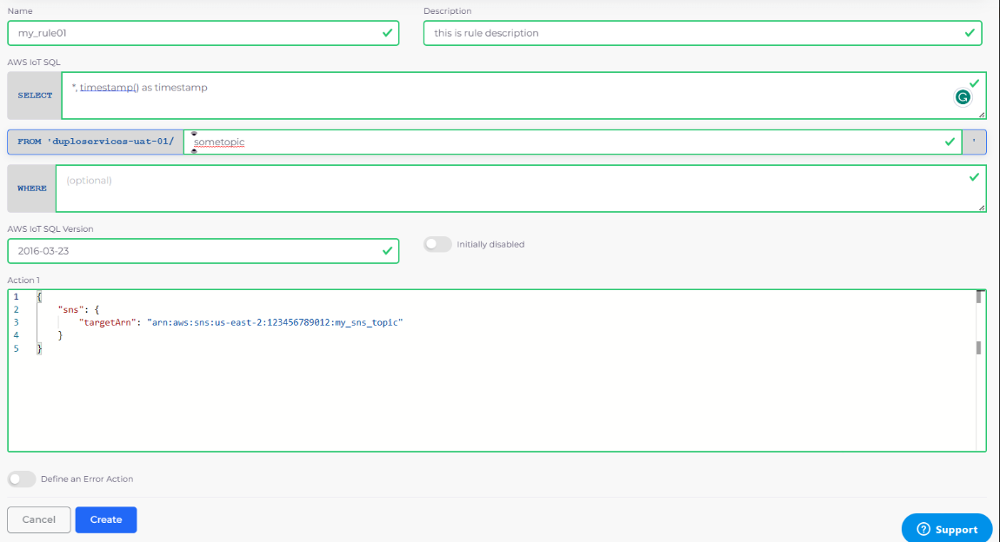<figcaption>
<strong>Add</strong> Topic Rules page
</figcaption></figure>

    

4. In the **Name** field, enter a Topic Rule name.
5. Add a meaningful description of what the rule does in the **Description** field.
6. Define the rule by completing the fields in the **AWS IoT SQL** and **AWS IoT SQL Version** areas. Select **Define an Error Action** if the rule pertains to error management.
7. Click **Create**. Your rule is defined and displayed in the **Topic Rules** tab.

<figure>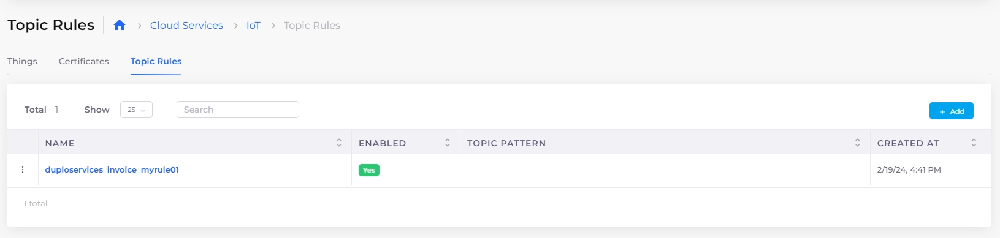<figcaption>
An IoT Topic Rule in the <strong>Topic Rules</strong> tab
</figcaption></figure>

### Viewing a Topic Rule

View the details of a rule by selecting the rule from the **Topic Rules** tab Name column. The **Details** tab displays the rule description. The **Actions** tab displays the SQL-based rule(s).

<figure>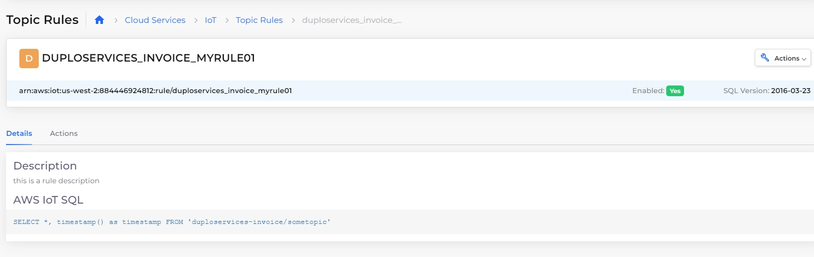<figcaption>
Topic Rule <strong>Details</strong> tab
</figcaption></figure>

<figure>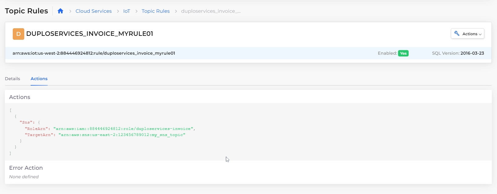<figcaption>
Topic Rule <strong>Actions</strong> tab
</figcaption></figure>

### Editing a Topic Rule

In the **Topic Rules** tab, edit a Topic Rule by clicking the **Actions** menu (  ) in the row listing your Topic Rule **Name**, and selecting **Edit**.

<figure>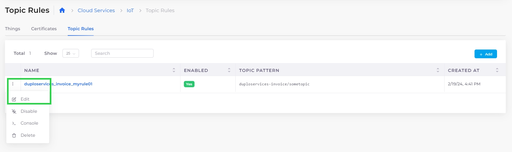<figcaption>
<strong>Actions</strong> menu with <strong>Edit</strong> option on <strong>Topic Rules</strong> tab
</figcaption></figure>
