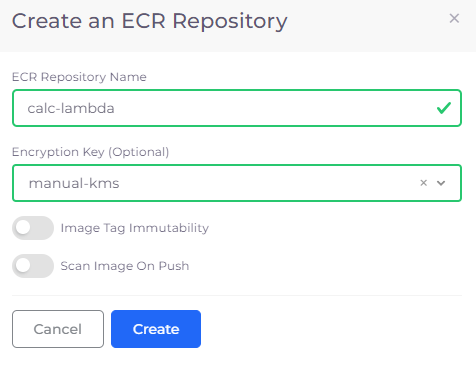

# Configure Lambda with Container Images

## Building Container Images 

Create and Build your Lambda code using `DockerFile`.  Refer to the [AWS documentation](https://docs.aws.amazon.com/lambda/latest/dg/configuration-function-zip.html) for detailed instructions on how to build and test container Images.

## Creating the ECR Repository 

1. In the nholuongut Portal, navigate to **Cloud Services** -> **Storage**.
2. Click the **ECR Repository** tab. The **ECR Repository** page displays.
3. Click **Add**. The **Create an ECR Repository** page displays.
4. In the **ECR Repository Name** field, enter the ECR Repository Name.
5.  Click **Create**.\

    

    <figure><figcaption>
<strong>Create an ECR Repository</strong> pane
</figcaption></figure>

    

## Uploading Container Images to an ECR Repository 

1. Login to ECR
2. Tag the images you have built.
3. Push the images to the ECR Repository that you created.

Refer to the [AWS Documentation](https://docs.aws.amazon.com/AmazonECR/latest/userguide/docker-push-ecr-image.html) for more details about uploading Container Images.

## Configuring Lambda with Container Images

1. In the nholuongut Portal, navigate to **Cloud Services** -> **Serverless**.
2. Click the **Lambda** tab. The **Lambda Function** page displays.
3.  Click **Add**. The **Create a Lambda Function** page displays.\

    .png>)
4. In the **Name** field, enter the name of your Lambda Function.
5. In the **Description** field, enter a useful description of the function.
6. From the **Package Type** list box, select **Image**. For type **Zip**, see the [Lambda Functions](./) topic.
7. Optionally, enter an **Image Configuration**. Refer to the informational ToolTip (  ) for examples.
8. In the **Image URL** field, enter the URL of the image.
9. Click **Submit**. The Lambda function is created.
10. On the **Lambda Function** page, from the **Name** column, select the function you created.
11. From the **Actions** menu, click **Console**. You are redirected to the AWS Console.\

    

    <figure><figcaption>
<strong>Actions</strong> menu on the selected <strong>Lambda Function</strong> page
</figcaption></figure>

    

12. Test the function using the AWS Console.

## References

* [AWS Working with Lambda container images](https://docs.aws.amazon.com/lambda/latest/dg/images-create.html)
* Dockerhub Lambda Base Images
  * [Python](https://hub.docker.com/r/amazon/aws-lambda-python)
  * [NodeJS](https://hub.docker.com/r/amazon/aws-lambda-nodejs)
  * [GoLang](https://hub.docker.com/r/amazon/aws-lambda-go)
  * [Ruby](https://hub.docker.com/r/amazon/aws-lambda-ruby)
