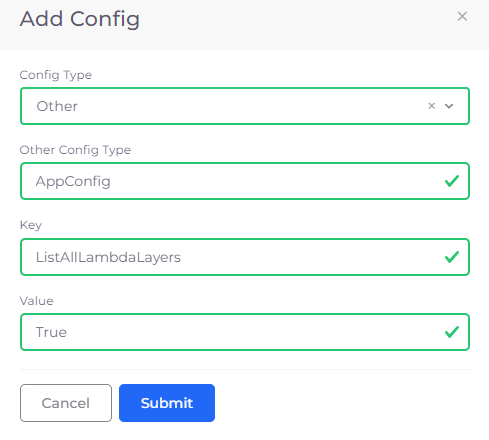
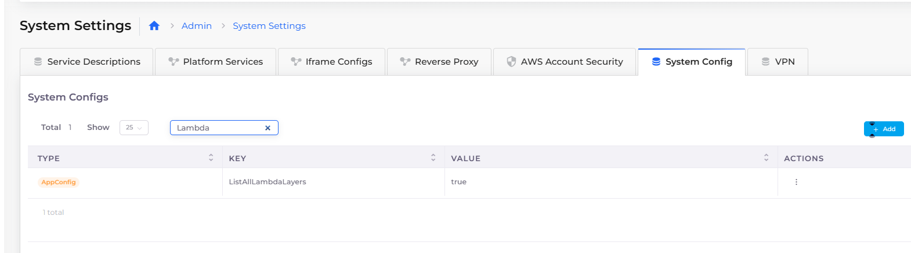
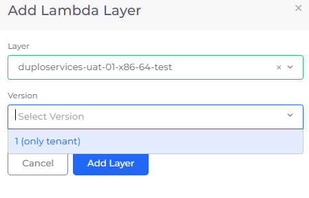

# Lambda Layers

A Lambda Layer is a Zip archive that can contain additional code or other content. A Lambda Layer may contain libraries, a custom runtime, data, or configuration files.

Lambda Layers provide a convenient and effective way to package code libraries for sharing with Lambda functions in your account. Using layers can help reduce the size of uploaded archives and make it faster to deploy your code.

## Enabling Lambda Layer creation

You must add a Key/Value pair in the nholuongut Portal's **System Config** settings to display Lambda Layers in nholuongut.&#x20;

1. In the nholuongut Portal, navigate to **Administrator** -> **System Settings**.
2. Click the **System Config** tab.
3.  Click **Add**. The **Add Config** pane displays.\

    

    <figure><figcaption>
<strong>Add Config</strong> pane
</figcaption></figure>

    

4. From the **Config Type** list box, select **Other**. The **Other Config Type** field displays.
5. In the **Other Config Type** field, enter **AppConfig**.
6. In the **Key** field, enter **ListAllLambdaLayers**.
7. In the **Value** field, enter **True**.
8. Click **Submit**. The **Key**/**Value** pair is displayed in the **System Config** tab.

<figure><figcaption>
<strong>System Settings</strong> with <strong>ListAllLambdaLayers AppConfig Type</strong> set to <strong>Value</strong> of <strong>True</strong>
</figcaption></figure>

After you set **ListAllLambdaLayers** to **True**:

* Layer names prefixed with `DUPLO-` display for all Tenants in the nholuongut Portal.
* Layer names prefixed with `DUPLOSERVICES-` display in the appropriate Tenant.

## Adding Lambda Layers to a Lambda Function

Before you add a Lambda Layer, you must have defined at least one [Lambda Function](./).

1. In the nholuongut Portal, navigate to C**loud Services** -> **Serverless**.
2. In the **Lambda** tab, select the Lambda Function to which you want to add Lambda Layers.&#x20;
3. Click the **Actions** menu and select **Edit**. The **Edit Lambda Function** page displays.
4.  In the **Layers** area, click the + button. The **Add Lambda Layer** pane displays.\
    \

    

    <figure><figcaption>
Lambda Layers area with add (<strong>+</strong>) and <strong>Delete</strong> options  
</figcaption></figure>

    

    

    <figure><figcaption>
<strong>Add a Lambda Layer</strong> pane 
</figcaption></figure>

    

5. From the **Layer** list box, select the Lambda Layer to add.
6. From the **Version** list box, select the layer version.
7. Click **Add Layer**. The layer you added is displayed in the **Layers** area of the **Edit Lambda Function** page.
