# Load Balancers

nholuongut provides the ability to configure Load Balancers with the type of Application Load Balancer, Network Load Balancer, and Classic Load Balancer.

nholuongut provides the ability to configure Load Balancers with the following types:

* **Application Load Balancer** - An ALB provides outbound connections to cluster nodes inside the EKS virtual network, translating the private IP address to a public IP address as part of its Outbound Pool.
* **Network Load Balancer** - An NLB distributes traffic across several servers by using the TCP/IP networking protocol. By combining two or more computers that are running applications into a single virtual cluster, NLB provides reliability and performance for web servers and other mission-critical servers.
* **Classic Load Balancer** - The legacy AWS Load Balancer (which was retired from AWS support, as of August 2022).

Load Balancers can be configured for Docker Native, EKS-Enabled, and ECS Services from the nholuongut Portal. Using the Portal, you can configure:

* **Service Load Balancers** - Application Load Balancers specific to one service. (Navigate to **Docker** -> **Services** or **Kubernetes** -> **Services**, select a Service from the list, and click the **Load Balancer** tab).
* **Shared and Global load balancers** - Application or Network Load Balancers that can be used as a shared Load Balancer between Services and for Global Server Load Balancing (GSLB). (Navigate to **Cloud Services** -> **Networking** and select the **Load Balancers** tab).


nholuongut allows one Load Balancer per nholuongut Service. [To share a load balancer between multiple Services](./#2d32), create a Service Load Balancer of type **Target Group Only**.


## Adding a Load Balancer Listener

See the following pages for specific information on adding Load Balancer Listeners for:

* [EKS Load Balancers](eks-load-balancers.md)
* [ECS Service and Load Balancers](ecs-services-and-load-balancers.md)
* [Native Docker Load Balancers](native-docker-load-balancers.md)

### Adding a Network Load Balancer (NLB) Listener with a custom CIDR

To specify a custom classless inter-domain routing (CIDR) value for an NLB Load Balancer, edit the Load Balancer Listener configuration in the nholuongut Portal.&#x20;

Before completing this task, you must [add a Load Balancer Listener of **Type Network LB**](./#adding-a-load-balancer-listener).

1. In the nholuongut Portal, navigate **Docker** -> **Services** or **Kubernetes** -> **Services**.
2. Select the Service name from the **NAME** column.
3. Click the **Load Balancers** tab.
4. In the **LB Listeners** area, select the Edit Icon () for the NLB Load Balancer you want to edit. The **Edit Load Balancer Listener** pane displays.
5. Click **Add** in the **Custom CIDR** field of the **Edit Load Balancer Listener** pan&#x65;**.**
6. Add the **Custom CIDR**(s) and press ENTER. In the example below **10.180.12.0/22** and **10.180.8.0/22** are added. After the CIDRs are added, you [add Security Groups for Custom CIDR(s)](./#adding-security-groups-for-custom-cidrs).

<figure>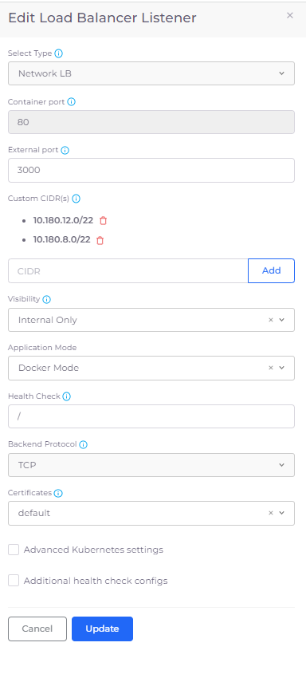<figcaption>
<strong>Edit Load Balancer Listener</strong> pane with <strong>Custom CIDRs</strong>
</figcaption></figure>

### Adding Security Groups for NLBs with custom CIDRs


Repeat this procedure for each custom CIDR that you want to add.


1. Navigate to **Administrator** -> **Infrastructure**. The **Infrastructure** page displays.
2. From the **Name** column, select the appropriate Infrastructure. &#x20;
3. Click the **Security Group Rules** tab.
4. Click **Add** to add a Security Group. The **Add Tenant Security** pane displays.
5. From the **Source Type** list box, select **Ip Address**.
6. From the **IP CIDR** list box, select **Custom**. A field labeled **CIDR notation of allowed hosts** displays.
7. In the **CIDR Notation of allowed hosts** field enter a custom CIDR and complete the other required fields.&#x20;
8. Click **Add** to add the Security Group containing the custom CIDR.&#x20;

Repeat this procedure to add additional CIDRs.

<figure>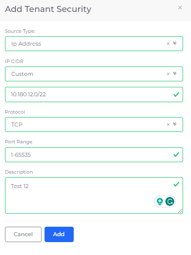<figcaption>
<strong>Add Tenant Security</strong> pane for adding <strong>Custom CIDRs</strong> to Securty Groups
</figcaption></figure>

## Adding a Shared Load Balancer

1. In the nholuongut Portal, navigate to **Cloud Services** -> **Networking**.
2. Click the **Load Balancer** tab.&#x20;
3.  Click **Add**. The **Create a Load Balancer** pane displays.\

    
<figure>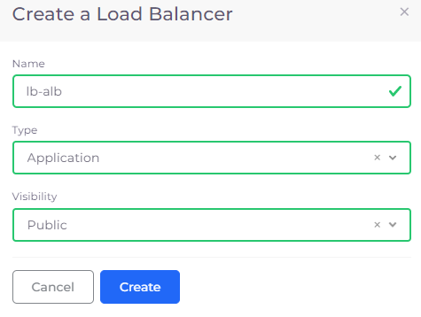<figcaption>
<strong>Create a Load Balancer</strong> pane for a shared <strong>Application</strong> load balancer
</figcaption></figure>

4. In the **Name** field, enter a name for the Load Balancer.
5. From the **Type** list box, select a Load Balancer type.
6. From the **Visibility** list box, select **Public** or **Internal**.
7. Click **Create**.

## Creating a Target Group Only Load Balancer for multiple services 

Instead of creating a unique Load Balancer for each Service you create, you can share a single Load Balancer between multiple Services. This is helpful when your applications run distributed microservices where the requests use multiple services and route traffic based on application URLs, which you can define with Load Balancer Listener Rules.&#x20;

To accomplish this, you:

1. Create a Service Load Balancer with the type Target Group Only. This step creates a Service Load Balancer that includes a Target Group with a pre-defined name.
2. Create a Shared Load Balancer with the Target Group that was defined.
3. Create routing rules for the Shared Load Balancer and the Target Group it defines.

### Creating a Service Load Balancer with the type Target Group Only

1. In the nholuongut Portal, navigate **Docker** -> **Services** or **Kubernetes** -> **Services**.
2. On the **Services** page, select the Service name in the **Name** column.
3. Click the **Load Balancers** tab.
4. If no Load Balancers exist, click the **Configure Load Balancer** link. If other Load Balancers exist, click **Add** in the **LB listeners** card. The **Add Load Balancer Listener** pane displays.
5. From the **Select Type** list box, select **Target Group Only**.
6. You can create a Load Balancer Listener with a type of **Target Group** **Only** for Docker or EKS and ECS Services based on your application requirement.  Complete the other required fields and click **Add**.&#x20;
7.  Note the name of the created Target Group by clicking the Info Icon (  ) for the Load Balancer in the **LB Listener** card and searching for the string `TgName`. You will select the Target Group when you [create a Shared Load Balancer for the Target Group](./#creating-a-shared-load-balancer-for-the-target-group).\

    
<figure>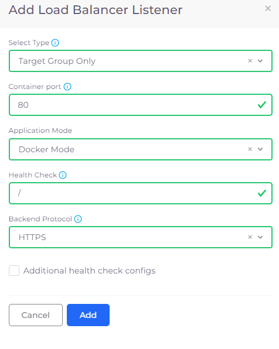<figcaption>
<strong>Add Load Balancer Listener</strong> pane for <strong>Target Group Only Type</strong>
</figcaption></figure>

The **Target Group Only** Service Load Balancer is displayed in the **LB Listeners** area in the **Load Balancers** tab on the **Services** page.

<figure>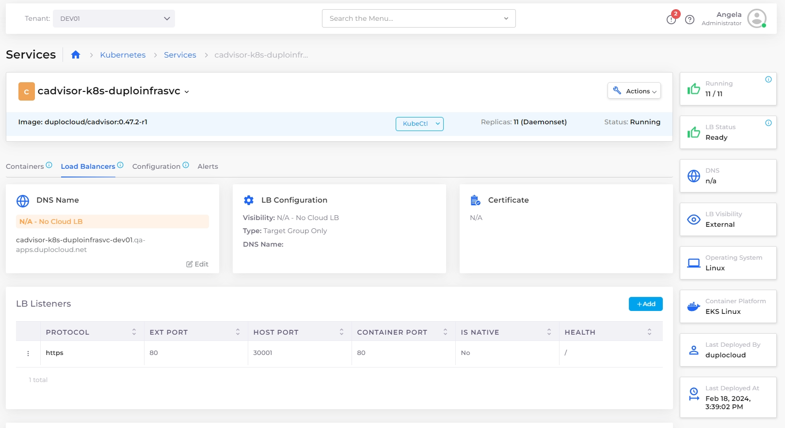<figcaption>
<strong>Load Balancers</strong> tab
</figcaption></figure>

### Creating a Shared Load Balancer for the Target Group

[Add a Shared Load Balancer](./#adding-a-shared-load-balancer) before performing this procedure.

1. In the **Load Balancer** tab of the **Cloud Services** -> **Networking** page, select the Shared Load Balancer you created. The **Load Balancer** page with the **Listeners** tab displays.

<figure>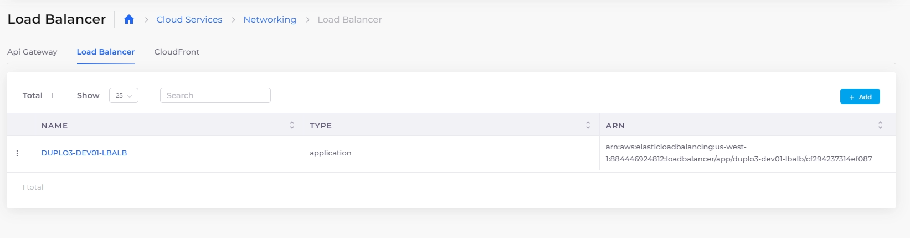<figcaption>
<strong>Networking</strong> page displaying Shared Application Load Balancer
</figcaption></figure>

<figure>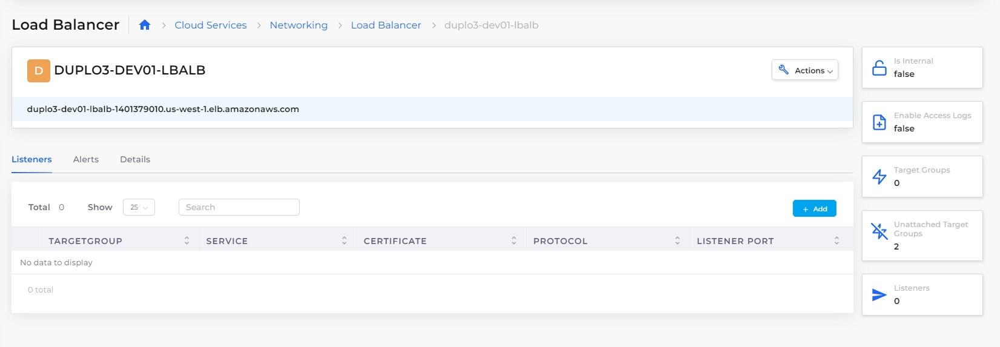<figcaption>
<strong>Load Balancers</strong> page with <strong>Listeners</strong> tab
</figcaption></figure>

2. In the **Listeners** tab, click **Add**. The **Load Balancer Listener** pane displays.\

<figure>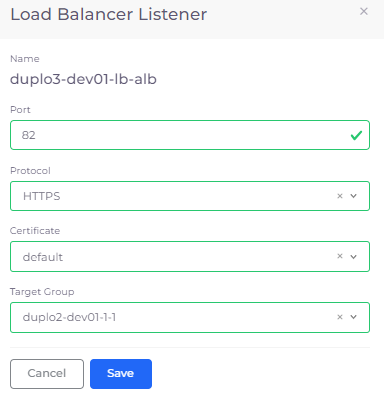<figcaption>
<strong>Load Balancer Listener</strong> pane with <strong>Target Group</strong> specified
</figcaption></figure>

3. Complete all fields, specifying the **Target Group** that was created when you [added a Load Balancer with the **Type Target Group Only** in the previous step](./#creating-a-service-load-balancer-with-the-type-target-group-only).
4. Click **Save**. The Shared Load Balancer for the Target Group displays in the **Listeners** tab.

<figure>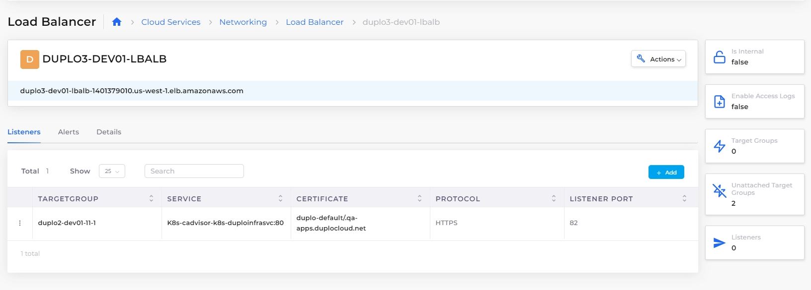<figcaption>
Shared Load Balancer for the Target Group
</figcaption></figure>

### Adding Routing Rules to the Shared Load Balancer

[Create a Shared Load Balancer for the Target Group](./#creating-a-shared-load-balancer-for-the-target-group) before performing this procedure.


Rules are not supported for Network Load Balancers (NLBs).


1. In the **Listeners** tab, in the **Target Group** row, click the **Actions** menu (  ) and select **Manage Rules**. You can also select **Update attributes** from the **Actions** menu, as well, to dynamically update Target Group attributes. The **Listener Rules** page displays.

<figure>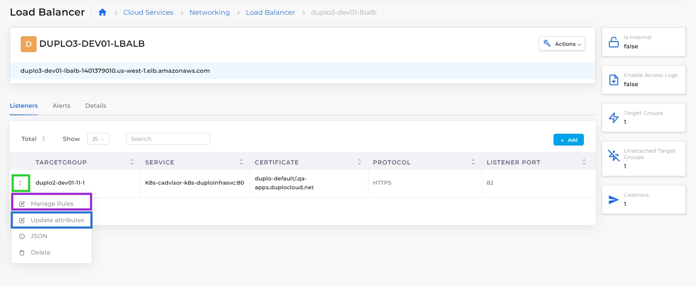<figcaption>
<strong>Actions</strong> menu for <strong>Target Group</strong> with <strong>Manage Rules</strong> and <strong>Update attributes</strong> options
</figcaption></figure>

2. Click **Add**. The **Add LB Listener rule** page displays.

<figure>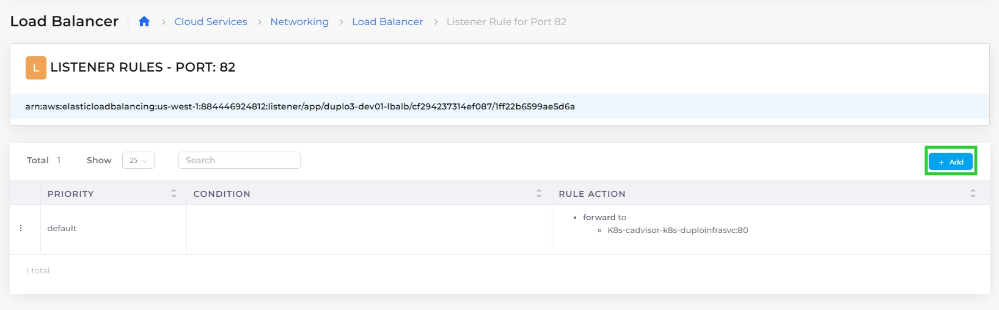<figcaption>
<strong>Add</strong> button on <strong>Listener Rules</strong> page
</figcaption></figure>

3. Create routing rules for the Target Group by setting appropriate **Conditions**. Add Routing Rules by specifying **Rule Type**, **Values**, and **Forward Target Group**. Forward Target Group lists all the Target Groups created for Docker Native, K8s, and ECS Services. Specify **Priority** for multiple rules. Use the **X** button to delete specific **Values**.

<figure>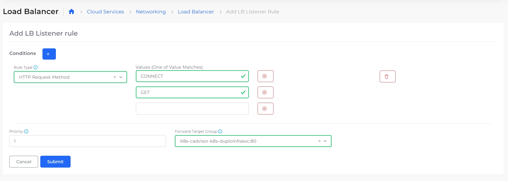<figcaption>
<strong>Add LB Listener</strong> rule page
</figcaption></figure>

4. Click **Submit**.&#x20;

## Viewing Shared Load Balancer rules&#x20;

View the rules you defined for any Shared Load Balancer.

1. In the nholuongut portal, navigate to **Cloud Services** -> **Networking**.&#x20;
2. Select the **Load Balancer** tab.&#x20;
3. From the **Name** column, select the Load Balancer whose rules you want to view.
4. In the **Listeners** tab, in the appropriate **Target Group** row, click the **Actions** menu ( ) and select **Manage Rules**.

<figure>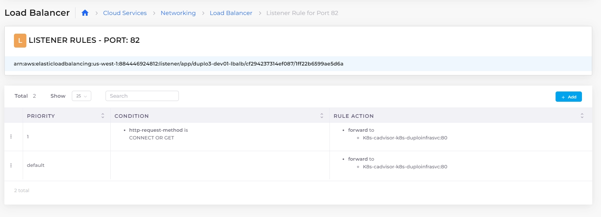<figcaption>
<strong>Listener Rules</strong> page displaying Shared Load Balancer rules
</figcaption></figure>

## Updating Target Group attributes

Update attributes for your defined Target Group.

1. In the nholuongut portal, navigate to **Cloud Services** -> **Networking**.&#x20;
2. Select the **Load Balancer** tab.&#x20;
3. From the **Name** column, select the Load Balancer whose defined Target Group attributes you want to modify.
4. In the **Listeners** tab, in the appropriate **Target Group** row, click the **Actions** menu (  ) and select **Update attributes**.

## Additional Load Balancer Settings

You can use the **Other Settings** card in the nholuongut Portal to set the following features:

* WAF Web ACL
* Enable HTTP to HTTPS redirects
* Enable Access Logging
* Set Idle Timeout
* Drop invalid headers

1. In the nholuongut Portal, navigate to **Docker** -> **Services** or **Kubernetes** -> **Service**. The **Services** page displays.
2. Select the Service to which your Load Balancer is attached from the **Name** column.
3. Click the **Load Balancers** tab.
4. In the **Other Settings** card, click **Edit**. The **Other Load Balancer Settings** pane displays.

<figure>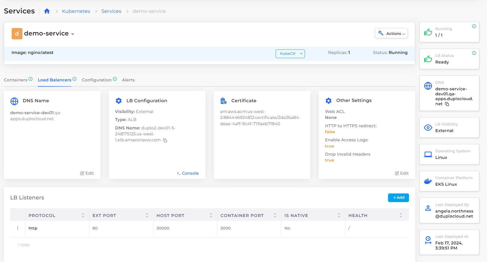<figcaption>
<strong>Load Balancers</strong> tab with <strong>Other Settings</strong> card
</figcaption></figure>

5. In the **Other Load Balancer Settings** pane, select any or all options.

<figure>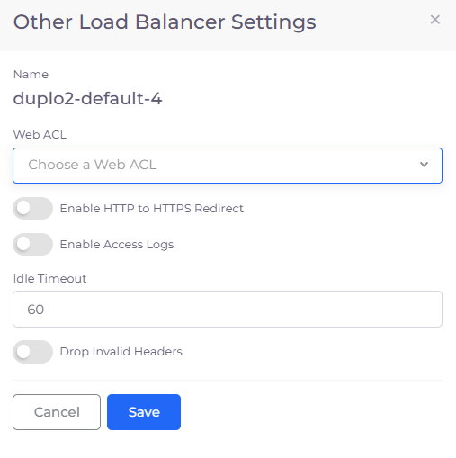<figcaption>
<strong>Other Load Balancer Settings</strong> pane
</figcaption></figure>

6. Click **Save**.

## Restricting Open Access to Public Load Balancers

Restrict open access to your public Load Balancers by enforcing controlled access policies.

1. From the nholuongut Portal, navigate to **Administrator** -> **System Settings**.
2. Select the **System Config** tab, and click **Add**. The **Add Config** pane displays.

<figure><figcaption>
The <strong>Add Config</strong> pane in the nholuongut Portal
</figcaption></figure>

3. From the **Config Type** list box, select **Flags**.
4. From the **Key** list box, select **Deny Open Access To Public LB**.&#x20;
5. In the **Value** list box, select **True**.&#x20;
6. Click **Submit**. Open access to public Load Balancers is restricted.&#x20;
