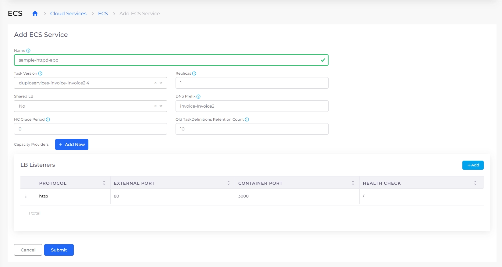

# ECS Services and Load Balancers

## Prerequisites

Before you create an ECS Service and Load Balancer, you must create a [Task Definition](../../../aws-user-guide/aws-services/containers/ecs-containers-and-task-definitions.md) to run the Service. You can define multiple containers in your Task Definition.

## Adding an ECS Service and Load Balancer Listener


For an end-to-end example of deploying an application using an ECS Service, see the [AWS Quick Start Tutorial](../../quick-start/) and choose the [Creating an ECS Service](../../quick-start/quick-start-ecs-services/) option.


Tasks run until an error occurs or a user terminates the Task in the ECS Cluster.

1. Navigate to **Cloud Services** -> **ECS**.
2. In the **Task Definitions** tab, select the Task Definition Family Name. This is the [Task Definition **Name** that you created ](../../../aws-user-guide/aws-services/containers/ecs-containers-and-task-definitions.md)prepended by a unique nholuongut identifier. &#x20;
3. In the **Service Details** tab, click the **Configure ECS Service** link. The **Add ECS Service** page displays.
4. In the **Name** field, enter the Service name.
5.  In the **LB Listeners** area, click **Add**. The **Add Load Balancer Listener** pane displays.\

    

    <figure><figcaption>
<strong>Add Load Balancer Listener</strong> pane for an ECS Service
</figcaption></figure>

    

6. From the **Select Type** list box, select **Application LB**.
7. In the **Container Port** field, enter a container port number.
8. In the **External Port** field, enter an external port number.
9. From the **Visibility** list box, select an option.
10. In the **Heath Check** field, enter a path (such as **/**) to specify the location of Kubernetes Health Check logs.
11. From the **Backend Protocol** list box, select **HTTP**.
12. From the **Protocol Policy** list box, select **HTTP1**.
13. Select other options as needed and click **Add**.
14. On the **Add ECS Service** page, click **Submit**.&#x20;

In the **Service Details** tab, information about the Service and Load Balancer you created is displayed.

<figure><figcaption>
Add ECS Service page
</figcaption></figure>

Verify that the Service and Load Balancer configuration details in the Service Details tab are correct.&#x20;

<figure><figcaption>
<strong>Service Details</strong> tab displaying Service and Load Balancer configuration details
</figcaption></figure>
