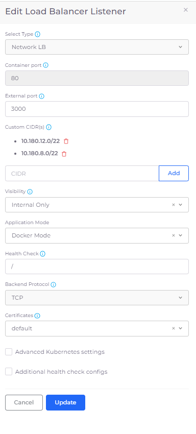
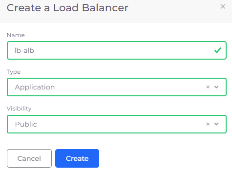
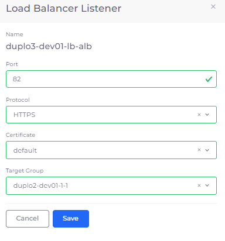
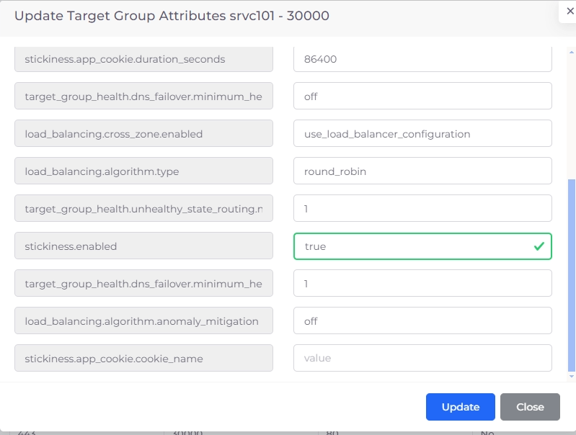
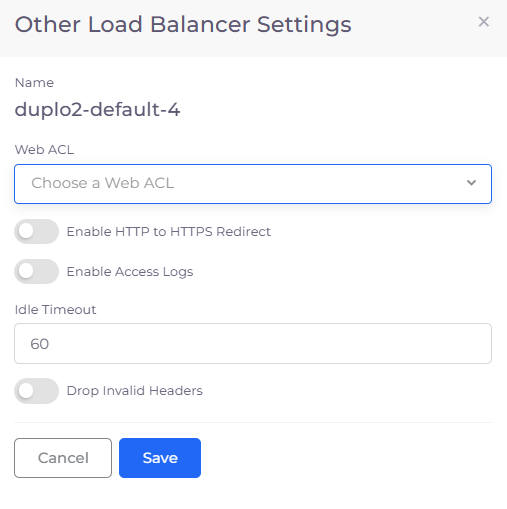

# EKS Load Balancers

## Creating an EKS Ingress

If you need to create an Ingress Load Balancer, refer to the [EKS Ingress](../../../kubernetes-overview/ingress-loadbalancer/adding-ingress.md) page in the nholuongut Kubernetes User Guide.&#x20;

## Adding a Load Balancer Listener


For an end-to-end example of deploying an application using an EKS Service, see the [AWS Quick Start Tutorial](../../quick-start/) and choose the [Creating an EKS Service](../../quick-start/quick-start-eks-services/) option.


1. In the nholuongut Portal, navigate **Kubernetes** -> **Services**.
2. On the **Services** page, select the Service name in the **Name** column.
3. Click the **Load Balancers** tab.
4. If no Load Balancers exist, click the **Configure Load Balancer** link. If other Load Balancers exist, click **Add** in the **LB listeners** card. The **Add Load Balancer Listener** pane displays.
5. From the **Select Type** list box, select a Load Balancer Listener type based on your Load Balancer.
6.  Complete other fields as required and click **Add** to add the Load Balancer Listener.\

    
<figure><figcaption>
<strong>Add Load Balancer Listener</strong> pane
</figcaption></figure>

### Adding a Network Load Balancer (NLB) Listener with a custom CIDR

To specify a custom classless inter-domain routing (CIDR) value for an NLB Load Balancer, edit the Load Balancer Listener configuration in the nholuongut Portal.&#x20;

Before completing this task, you must [add a Load Balancer Listener of **Type Network LB**](eks-load-balancers.md#adding-a-load-balancer-listener).

1. In the nholuongut Portal, navigate to **Kubernetes** -> **Services**.
2. On the **Services** page, select the Service name in the **Name** column.
3. Click the **Load Balancers** tab.
4. In the **LB Listeners** area, select the Edit Icon () for the NLB Load Balancer you want to edit. The **Edit Load Balancer Listener** pane displays.
5. Click **Add** in the **Custom CIDR** field of the **Edit Load Balancer Listener** pan&#x65;**.**
6. Add the **Custom CIDR**(s) and press ENTER. In the example below **10.180.12.0/22** and **10.180.8.0/22** are added. After the CIDRs are added, you [add Security Groups for Custom CIDR(s)](eks-load-balancers.md#adding-security-groups-for-custom-cidrs).

<figure><figcaption>
<strong>Edit Load Balancer Listener</strong> pane with <strong>Custom CIDRs</strong>
</figcaption></figure>

### Adding Security Groups for NLBs with custom CIDRs


Repeat this procedure for each custom CIDR that you want to add.


1. Navigate to **Administrator** -> **Infrastructure**. The **Infrastructure** page displays.
2. From the **Name** column, select the appropriate Infrastructure. &#x20;
3. Click the **Security Group Rules** tab.
4. Click **Add** to add a Security Group. The **Add Tenant Security** pane displays.
5. From the **Source Type** list box, select **Ip Address**.
6. From the **IP CIDR** list box, select **Custom**. A field labeled **CIDR notation of allowed hosts** displays.
7. In the **CIDR Notation of allowed hosts** field enter a custom CIDR and complete the other required fields.&#x20;
8. Click **Add** to add the Security Group containing the custom CIDR.&#x20;

Repeat this procedure to add additional CIDRs.

<figure><figcaption>
<strong>Add Tenant Security</strong> pane for adding <strong>Custom CIDRs</strong> to Securty Groups
</figcaption></figure>

## Adding a Shared Load Balancer

1. In the nholuongut Portal, navigate to **Cloud Services** -> **Networking**.
2. Click the **Load Balancer** tab.&#x20;
3.  Click **Add**. The **Create a Load Balancer** pane displays.\

    
<figure><figcaption>
<strong>Create a Load Balancer</strong> pane for a shared <strong>Application</strong> load balancer
</figcaption></figure>

4. In the **Name** field, enter a name for the Load Balancer.
5. From the **Type** list box, select a Load Balancer type.
6. From the **Visibility** list box, select **Public** or **Internal**.
7. Click **Create**.

## Creating a Target Group Only Load Balancer for multiple services 

Instead of creating a unique Load Balancer for each Service you create, you can share a single Load Balancer between multiple Services. This is helpful when your applications run distributed microservices where the requests use multiple services and route traffic based on application URLs, which you can define with Load Balancer Listener Rules.&#x20;

To accomplish this, you:

1. Create a Service Load Balancer with the type Target Group Only. This step creates a Service Load Balancer that includes a Target Group with a pre-defined name.
2. Create a Shared Load Balancer with the Target Group that was defined.
3. Create routing rules for the Shared Load Balancer and the Target Group it defines.

### Creating a Service Load Balancer with the type Target Group Only

1. In the nholuongut Portal, navigate **Kubernetes -> Services**.
2. On the **Services** page, select the Service name in the **Name** column.
3. Click the **Load Balancers** tab.
4. If no Load Balancers exist, click the **Configure Load Balancer** link. If other Load Balancers exist, click **Add** in the **LB listeners** card. The **Add Load Balancer Listener** pane displays.
5. From the **Select Type** list box, select **Target Group Only**.
6. You can create a Load Balancer Listener with a type of **Target Group** **Only** for Docker Mode or  **Native** EKS and ECS Services based on your application requirement.  Complete the other required fields and click **Add**.&#x20;
7.  Note the name of the created Target Group by clicking the Info Icon (  ) for the Load Balancer in the **LB Listener** card and searching for the string `TgName`. You will select the Target Group when you [create a Shared Load Balancer for the Target Group](eks-load-balancers.md#creating-a-shared-load-balancer-for-the-target-group).\

    
<figure><figcaption>
<strong>Add Load Balancer Listener</strong> pane for <strong>Target Group Only Type</strong>
</figcaption></figure>

The **Target Group Only** Service Load Balancer is displayed in the **LB Listeners** area in the **Load Balancers** tab on the **Services** page.

<figure><figcaption>
<strong>Load Balancers</strong> tab
</figcaption></figure>

### Creating a Shared Load Balancer for the Target Group

[Add a Shared Load Balancer](eks-load-balancers.md#adding-a-shared-load-balancer) before performing this procedure.

1. In the **Load Balancer** tab of the **Cloud Services** -> **Networking** page, select the Shared Load Balancer you created. The **Load Balancer** page with the **Listeners** tab displays.

<figure><figcaption>
<strong>Networking</strong> page displaying Shared Application Load Balancer
</figcaption></figure>

<figure><figcaption>
<strong>Load Balancers</strong> page with <strong>Listeners</strong> tab
</figcaption></figure>

2. In the **Listeners** tab, click **Add**. The **Load Balancer Listener** pane displays.\

<figure><figcaption>
<strong>Load Balancer Listener</strong> pane with <strong>Target Group</strong> specified
</figcaption></figure>

3. Complete all fields, specifying the **Target Group** that was created when you [added a Load Balancer with the **Type Target Group Only** in the previous step](eks-load-balancers.md#creating-a-service-load-balancer-with-the-type-target-group-only).
4. Click **Save**. The Shared Load Balancer for the Target Group displays in the **Listeners** tab.

<figure><figcaption>
Shared Load Balancer for the Target Group
</figcaption></figure>

### Adding Routing Rules to the Shared Load Balancer

[Create a Shared Load Balancer for the Target Group](eks-load-balancers.md#creating-a-shared-load-balancer-for-the-target-group) before performing this procedure.


Rules are not supported for Network Load Balancers (NLBs).


1.  In the **Listeners** tab, in the **Target Group** row, click the **Actions** menu (  ) and select **Manage Rules**. You can also select **Update attributes** from the **Actions** menu, as well, to dynamically update Target Group attributes. The **Listener Rules** page displays.\

    <figure><figcaption>
<strong>Actions</strong> menu for <strong>Target Group</strong> with <strong>Manage Rules</strong> and <strong>Update attributes</strong> options
</figcaption></figure>
2. Click **Add**. The **Add LB Listener rule** page displays.
3.  Create routing rules for the Target Group by setting appropriate **Conditions**. Add Routing Rules by specifying **Rule Type**, **Values**, and **Forward Target Group**. Forward Target Group lists all the Target Groups created for Docker Native, K8s, and ECS Services. Specify **Priority** for multiple rules. Use the **X** button to delete specific **Values**.\

    <figure><figcaption>
<strong>Add LB Listener</strong> rule page
</figcaption></figure>
4. Click **Submit**.&#x20;

## Viewing Shared Load Balancer rules&#x20;

View the rules you defined for any Shared Load Balancer.

1. In the nholuongut portal, navigate to **Cloud Services** -> **Networking**.&#x20;
2. Select the **Load Balancer** tab.&#x20;
3. From the **Name** column, select the Load Balancer whose rules you want to view.
4. In the **Listeners** tab, in the appropriate **Target Group** row, click the **Actions** menu ( ) and select **Manage Rules**.

<figure><figcaption>
<strong>Listener Rules</strong> page displaying Shared Load Balancer rules
</figcaption></figure>

## Updating Target Group attributes

Update attributes for your defined Target Group.

1. In the nholuongut portal, navigate to **Cloud Services** -> **Networking**.&#x20;
2. Select the **Load Balancer** tab.&#x20;
3. From the **Name** column, select the Load Balancer whose defined Target Group attributes you want to modify.
4. In the **Listeners** tab, in the appropriate **Target Group** row, click the **Actions** menu (  ) and select **Update Target Group attributes**.

<figure><figcaption>
The <strong>LB Listener</strong> menu with the <strong>Update Target Group attributes</strong> option highlighted. 
</figcaption></figure>

5. The **Update Target Group Attributes** pane displays.&#x20;

<figure><figcaption>
The <strong>Update Target Group Attributes</strong> pane
</figcaption></figure>

5. &#x20;Find the attribute you want to update in the **Attribute** column and update the associated value in the **Value** column.&#x20;
6. Click **Update** to save the changes.&#x20;

### Updating Target Group Attributes to enable stickiness&#x20;

To enable stickiness, complete steps 1-5 for [Updating Target Group Attributes](eks-load-balancers.md#updating-target-group-attributes) above. On the **Update Target Group Attributes** pane, in the **Value** field for **stickiness.enabled**, enter **true**. Update additional stickiness attributes, if needed. Click **Update** to save the changes.&#x20;

<figure><figcaption>
The <strong>Update Target Group Attributes</strong> pane configured to enable stickiness. 
</figcaption></figure>

## Additional Load Balancer Settings

You can use the **Other Settings** card in the nholuongut Portal to set the following features:

* WAF Web ACL
* Enable HTTP to HTTPS redirects
* Enable Access Logging
* Set Idle Timeout
* Drop invalid headers

1. In the nholuongut Portal, navigate to **Kubernetes** -> **Services**. The **Services** page displays.
2. Select the Service to which your Load Balancer is attached from the **Name** column.
3. Click the **Load Balancers** tab.
4. In the **Other Settings** card, click **Edit**. The **Other Load Balancer Settings** pane displays.

<figure><figcaption>
<strong>Load Balancers</strong> tab with <strong>Other Settings</strong> card
</figcaption></figure>

5. In the **Other Load Balancer Settings** pane, select any or all options.\

<figure><figcaption>
<strong>Other Load Balancer Settings</strong> pane
</figcaption></figure>

6. Click **Save**.

