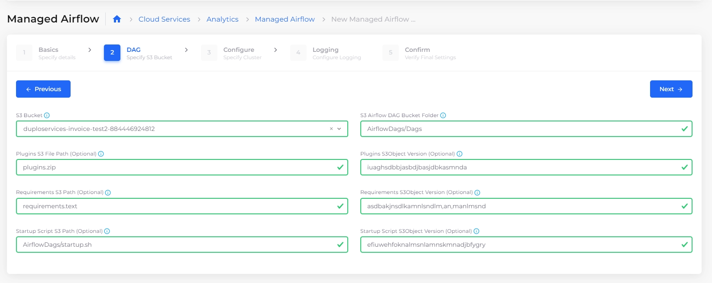

# Managed Airflow

[Amazon Managed Workflows for Apache Airflow (Amazon MWAA)](https://aws.amazon.com/managed-workflows-for-apache-airflow/) orchestrates your workflows using Directed Acyclic Graphs (DAGs) written in Python. You provide MWAA an Amazon S3 bucket where your DAGs, plugins, and Python requirements reside. You can run and monitor your DAGs using the AWS Management Console, a command line interface (CLI), a software development kit (SDK), or the Apache Airflow user interface (UI).

## Creating an S3 bucket for Managed Airflow

Create a S3 bucket by following the steps [here](s3-bucket.md).

## Uploading DAGs to an S3 **Bucket**

Package and upload your DAG (Directed Acyclic Graph) code to Amazon S3. Amazon MWAA loads the following folders and files into Airflow.

<figure><figcaption>
S3 Objects for Airflow configuration
</figcaption></figure>


Ensure Versioning is enabled for the custom plugins in a `plugins.zip`, the `startup` shell script file  and Python dependencies in a `requirements.txt` on your Amazon S3 bucket.&#x20;


Refer to the[ Amazon documentation ](https://docs.aws.amazon.com/mwaa/latest/userguide/working-dags.html)on DAGs for more details.

## Configuring the Managed Airflow Environment

1. In the nholuongut Portal, navigate to **Cloud Services** -> **Analytics.**
2. Click the **Airflow** tab.
3. Click **Add**. The **New Managed Airflow Environment** wizard displays.
4. Provide the required information, such as Airflow Environment Name, Airflow Version, S3 bucket, and DAGs folder location by navigating through the wizard. You can also enable Logging for Managed Airflow.

<figure><figcaption>
The <strong>New Managed Airflow Environment</strong> wizard 
</figcaption></figure>


If you specify `plugins.zip`, `requirements.txt`, and `startup` script while setting up the Airflow Environment, you must provide the S3 Version ID of these files (for example, `lSHNqFtO5Z7_6K6YfGpKnpyjqP2JTvSf`). If the Version ID is blank, the default reference is to the latest Version ID of the files specified from S3 Bucket.


## **Viewing the Managed Airflow Environment**

After setup, view the Managed Airflow Environment from the nholuongut Portal, using the **Airflow** tab. You can view the Airflow Environment in the AWS Console by clicking the **WebserverURL**.

<figure><figcaption>
<strong>Airflow</strong> tab containing details of the Managed Airflow Environment
</figcaption></figure>
