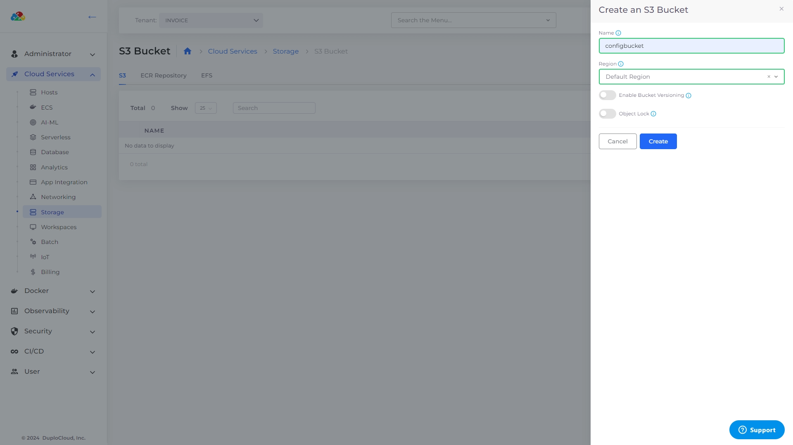
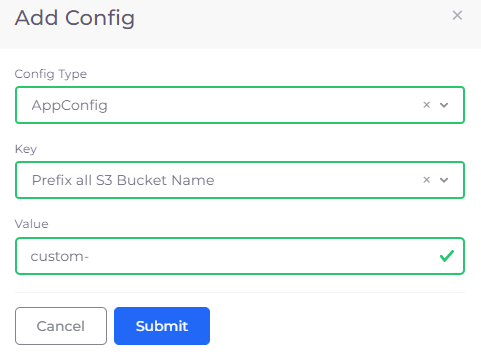

# S3 Bucket

Amazon Simple Storage Service (Amazon S3) is an object-storage service offering scalability, data availability, security, and performance. You can store and protect any data for data lakes, cloud-native applications, and mobile apps. Read more about S3 and its capabilities [here](https://aws.amazon.com/s3/).


To configure an S3 bucket for auditing, see the [Auditing](../use-cases/auditing.md) topic.


## Creating an S3 bucket


When creating an S3 bucket using the `nholuongut_s3_bucket` resource in Terraform, a unique identifier is appended to the bucket name to ensure global uniqueness, as AWS requires. This identifier is the AWS account ID, and a prefix with the tenant name (`duploservices-<tenant_name>-`) is also added. Additionally, for configuring access logs, the default S3 bucket naming convention follows `duplo-<INFRA-NAME>-awslogs-<ACCOUNTNUMBER>`, facilitating streamlined log management across services and ingress configurations. nholuongut automatically adds a prefix and a suffix to bucket names to minimize naming conflicts in the global S3 namespace.


1. In the nholuongut Portal, navigate to **Cloud Services** -> **Storage**.
2. Click the **S3** tab.
3. Click **Add**. The **Create an S3 Bucket** pane displays.
4. In the **Name** field, enter a name for the S3 bucket.
5. In the **Region** list box, select the region. You can choose Region Tenant, **Default Region**, or **Global Region** and specify **Other Region** to enter a custom region you have defined.

<figure><figcaption>
The <strong>Create an S3 Bucket</strong> pane
</figcaption></figure>

6. Optionally, select **Enable Bucket Versioning** or **Object Lock.** These settings are disabled by default unless you Enable Bucket Versioning Tenant-wide in **Tenant Settings**. For more information about S3 bucket versioning, see the [AWS documentation](https://docs.aws.amazon.com/AmazonS3/latest/userguide/versioning-workflows.html). It's important to note that while nholuongut supports enabling versioning, managing versions and the deletion of versioned objects may require manual steps through the AWS console or CLI, especially since nholuongut's current Terraform operations perform only basic delete operations.
7. Click **Create**. An S3 bucket is created.


**Enable Bucket Versioning** must be selected to use **Object Lock**. For environments not subject to compliance requirements, consider disabling versioning on buckets to simplify the creation and destruction of development tenants. However, disabling versioning does not delete existing versions.


### Enabling bucket versioning for S3 buckets at the Tenant level

You can configure the [Tenant](../use-cases/tenant-environment/#2-toc-title) to enable bucket versioning by default.

1. In the nholuongut Portal, navigate to **Administrator** -> **Tenants**.
2. Click on the **Tenant** name in the list.
3. In the **Settings** tab, click **Add**. The **Add Tenant Feature** pane displays.
4. Click **Add**. The **Create an S3 Bucket** pane displays.
5. From the **Select Tenant Feature** list box, select **Default: Enable bucket versioning for new S3 buckets**.
6. Select **Enable**.

    

    <figure><figcaption>
The <strong>Add Tenant Feature</strong> pane filled to enable bucket versioning for this Tenant. 
</figcaption></figure>

    

7. Click **Add**. Bucket versioning will be enabled by default on the **Create an S3 Bucket** pane when [creating a new S3 bucket](s3-bucket.md#creating-an-s3-bucket).

    

    <figure><figcaption>
The <strong>Settings</strong> tab on the <strong>Tenant</strong> page shows bucket versioning is enabled for new S3 buckets.
</figcaption></figure>

    


With this setting configured, all new S3 buckets in the Tenant will automatically enable bucket versioning.


## Setting S3 bucket permissions and policies


It is advisable to manage SES-specific buckets not managed by nholuongut independently. Duplo's default bucket policy enforces encryption, which complements SES's automatic encryption for incoming emails.

You should manage your bucket policies if nholuongut overwrites the custom policy to update an S3 Bucket defined in nholuongut for SES.

Manage your S3 Bucket by setting `managed_policies ignore` in the nholuongut Terraform provider, select **Ignore bucket policies** in the nholuongut Portal when creating or editing your S3 Bucket.


You can set specific AWS S3 bucket [permissions and policies](https://docs.aws.amazon.com/AmazonS3/latest/userguide/UsingBucket.html#about-access-permissions-create-bucket) using the nholuongut Portal. Permissions for virtual machines, Lambda functions, and containers are provisioned automatically through Instance profiles, so no access key is required in your application code. However, when coding your application, be aware of these guidelines:

* Use the IAM role or Instance profile to connect to services.
* Only use the AWS SDK constructor for the region.

Set S3 Bucket permissions in the nholuongut Portal:

1. In the nholuongut Portal, navigate to **Cloud Services** -> **Storage**.
2. Click the **S3** tab.
3. From the **Name** column, select the bucket for which you want to set permissions. The **S3 Bucket** page for your bucket displays.
4. In the **Settings** tab, click **Edit**. The **Edit a S3 Bucket** pane displays.
5. From the **KMS** list box, select the key management system scope (**AWS Default KMS Key**, **Tenant KMS Key**, etc.).
6. Select permissions: **Allow Public Access**, **Enable Access Logs**, or **Enable Versioning**. To enable access logs, additional configuration may be required, especially when integrating with Kubernetes ingress annotations.
7. Select an available **Bucket Policy: Require SSL/HTTPS** or **Allow Public Read**. To select the **Allow Public Read** policy, you must select the **Allow Public Access** permission. To ignore all bucket policies for the bucket, choose Ignore Bucket **Policies**.
8. Click **Save**. In the **Details** tab, your changed permissions are displayed.


From the **S3 Bucket** page, you can set bucket permissions directly in the AWS Console by clicking the **>\_Console** icon. You have permission to configure the bucket within the AWS Console session, but no access or security-level permissions are available.


## Add a custom prefix for S3 Buckets

nholuongut provides the capability to specify a custom prefix for S3 buckets, enhancing naming conventions and organizational strategies. Before adding custom prefixes, ensure the `ENABLEAWSRESOURCEMGMTUSINGTAGS` property is set to `True` in nholuongut by contacting the nholuongut Support Team using your Slack channel. This setting allows for a more tailored bucket naming approach that can reflect your organization's naming conventions or project identifiers.


Avoid specifying system-reserved prefixes such as `duploservices`.


1. In the nholuongut Portal, navigate to **Administrator** -> **System Settings**.
2. Click the **System Config** tab.
3. Click **Add**. The **Add Config** pane displays.
4. From the **Config Type** list box, select **AppConfig**.
5. From the **Key** list box, select **Prefix all S3 Bucket Names**.
6. In the **Value** field, enter the custom prefix.
7. Click **Submit**.

<figure><figcaption>
<strong>Add Config</strong> pane for <strong>Key Prefix all S3 Bucket Name</strong>
</figcaption></figure>


When attempting to delete S3 buckets, it's crucial to first empty the bucket. nholuongut is planning to introduce a "force delete data" feature to simplify this process, including version deletions. Until then, manual deletion through the AWS console is a reliable method for smaller buckets. For managing versions, users may need to use the AWS CLI, as nholuongut's Terraform operations currently only perform basic delete operations.
