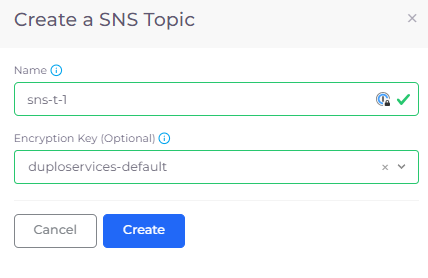

# SNS Topic

A SNS Topic is a logical access point that acts as a communication channel. It lets you group multiple _endpoints_ (such as [AWS Lambda](lambda/), [Amazon SQS](sqs-queue.md), HTTP/S, or an email address).

## Creating a SNS Topic

1. In the nholuongut Portal, navigate to **Cloud Services** -> **App Integration**.
2.  Click **Add**. The **Create a SNS Topic** pane displays.\

    

    <figure><figcaption>
<strong>Create a SNS Topic</strong> pane
</figcaption></figure>

    

3. In the **Name** field, enter the SNS Topic name.
4. From the **Encryption Key** list box, select a key.
5. Click **Create**.

## Setting SNS Topic Alerts

SNS Topic Alerts provide a flexible and scalable means of sending notifications and alerts across different AWS services and external endpoints, allowing you to stay informed about important events and incidents happening in your AWS environment.

To set alerts for SNS Topics, [see this procedure](../use-cases/faults-and-alarms/sns-topic-alerts.md).


SNS Topics are used in event processing in conjunction with DynamoDB and Lambda, among other services. See the [AWS DynamoDB Developer's Guide](https://docs.aws.amazon.com/amazondynamodb/latest/developerguide/Introduction.html) for information, permissions information, and examples.

