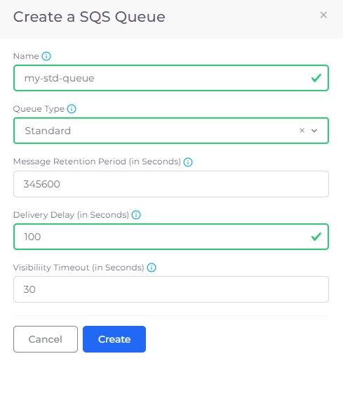
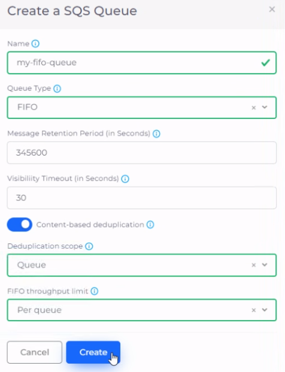

# SQS queue

Amazon Simple Queue Service (Amazon SQS) offers a secure, durable, and available hosted queue to integrate and decouple distributed software systems and components. It provides a generic web service API that you can access using any programming language that AWS SDK supports.

## **SQS Queue types**

The following Amazon SQS Queue types are supported.

* **Standard Queues** - Standard queues support a nearly unlimited number of API calls per second, per API action (`SendMessage`, `ReceiveMessage`, or `DeleteMessage`). Standard queues support at-least-once message delivery. However, occasionally (because of the highly distributed architecture that allows nearly unlimited throughput), more than one copy of a message might be delivered out of order. Standard queues provide best-effort ordering which ensures that messages are generally delivered in the same order as they're sent.
* **FIFO Queues** - FIFO queues have all the capabilities of a Standard queue, but are designed to enhance messaging between applications when the order of operations and events is critical, or where duplicates cannot be tolerated.

## Creating a Standard Queue

1. in the nholuongut portal, navigate to **Cloud Services** -> **App Integration**.
2. Click the **SQS** tab.
3. Click **Add**. The **Create an SQS Queue** pane displays.
4. Enter an SQS Queue **Name** (**my-std-queue** in the example below).
5. Select **Standard** from the **Queue Type** list box.
6. Enter **Message Retention Period (in Seconds)**. For example, **345600** seconds in the example below equates to four days.
7. Enter the **Visibility Timeout** in seconds. In the example below, we specify **30** seconds.&#x20;
8. Click **Create**.

<figure><figcaption>
<strong>Create a SQS Queue</strong> pane - <strong>Standard</strong> Queue
</figcaption></figure>

## Creating a FIFO Queue

1. in the nholuongut portal, navigate to **Cloud Services** -> **App Integration**.
2. Click the **SQS** tab.
3. Click **Add**. The **Create an SQS Queue** pane displays.
4. Enter an SQS Queue **Name**.
5. Select **FIFO** from the **Queue Type** list box.
6. Enter **Message Retention Period (in Seconds)**. For example, **345600** seconds in the example below equates to four days.
7. Enter the **Visibility Timeout** in seconds. In the example below, we specify **30** seconds.
8. Optionally, select **Content-based deduplication**. Selecting this option indicates that message deduplication IDs are used to ensure duplicate messages are not sent. If a message deduplication ID is sent successfully, any messages sent with the same message ID aren't delivered within five minutes.
9. Select either **Queue** or **Message group** from the **Deduplication scope** list box, indicating that you want deduplication processing at either the Queue level or at the [Message group ](https://docs.aws.amazon.com/AWSSimpleQueueService/latest/SQSDeveloperGuide/using-messagegroupid-property.html)level, using Message group IDs.
10. If you selected **Queue** in the previous step, the only available option in the FIFO throughput limit list box is **Per queue**. However, if you selected **Message group** in the previous step, you have the option of selecting **Per queue** or **Per message group ID**. This option specifies whether the FIFO Throughput Quota applies to the FIFO Queue or per Message Group.
11. Click **Create**.

<figure><figcaption>
<strong>Create a SQS Queue</strong> pane - <strong>FIFO</strong> Queue
</figcaption></figure>

<figure><figcaption>
<strong>Create a SQS Queue</strong> pane - <strong>FIFO</strong> Queue
</figcaption></figure>

