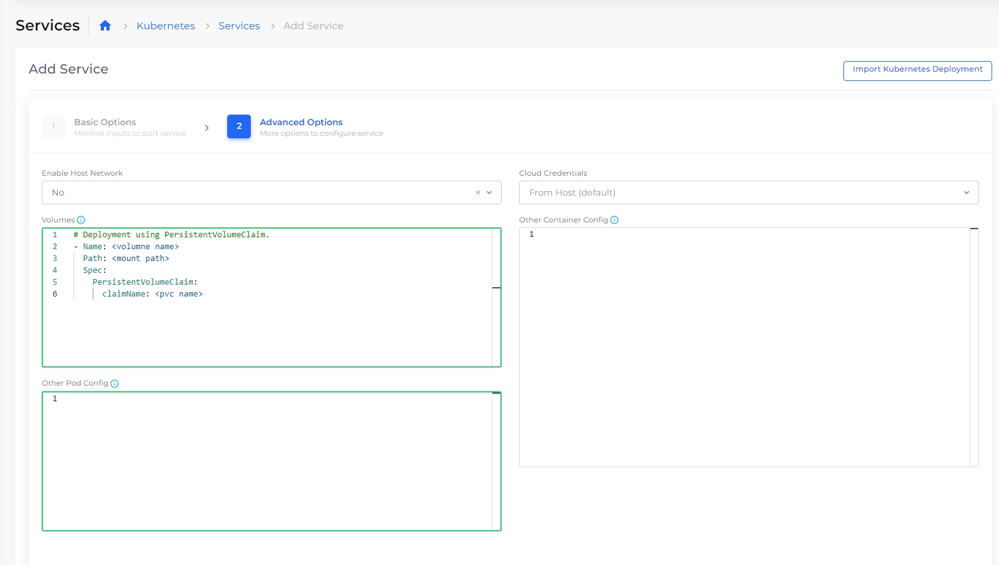

# Storage Class and PVCs

### **Step 1:** Create an Amazon EFS &#x20;

&#x20;Refer to steps [here](../../../aws-user-guide/aws-services/elastic-file-system-efs/)

### Step 2:  Create Storage Class with EFS Parameter

Navigate to  **Kubernetes** -> **Storage** -> **Storage Class**

Configure EFS parameter created at Step1 by clicking on EFS Parameter.

.png>)

### Step 3: Create Persistent Volume (PVC) using Storage Class

Here, we are configuring Kubernetes to use Storage Class created in Step 2 above, to create a Persistent Volume with 10Gi of storage capacity and ReadWriteMany access mode.

.png>)


if you use K8s and PVCs to autoscale your storage groups and run out of space, simply adding new storage volumes may not resolve the issue. Instead, you must increase the size of the existing PVCs to accommodate your storage needs.

For guidance on how to perform volume expansion in Kubernetes, refer to the following resources:

* [Increasing Disk Size in a StatefulSet](https://serverfault.com/questions/955293/how-to-increase-disk-size-in-a-stateful-set)
* [Expanding Persistent Volume Claims in Kubernetes](https://kubernetes.io/docs/concepts/storage/persistent-volumes/#expanding-persistent-volumes-claims)
* [Expanding Kubernetes Persistent Volumes on EKS](https://www.jeffgeerling.com/blog/2019/expanding-k8s-pvs-eks-on-aws)


### Step 4:  Mount PVC to the POD Deployment

Configure below in **Volumes** to create your application deployment using this PVC.&#x20;


```
# Deployment using PersistentVolumeClaim. 
- Name: <volumne name>
  Path: <mount path>
  Spec:
    PersistentVolumeClaim:
      claimName: <pvc name>
```


<figure><figcaption><p>Services Page</p></figcaption></figure>
