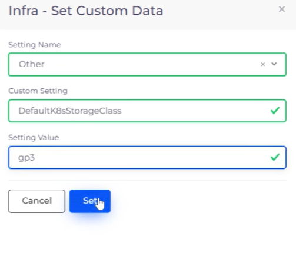

# GP3 Storage Class

GP3, the new storage class from AWS, offers significant performance benefits as well as cost savings when you set it as your default storage class. By using GP3 storage classes instead of GP2 storage classes, you get a baseline of 3000 IOPS, without any additional fees. You can also configure workloads that used a gp2 volume of up to 1000 GiB in capacity with a gp3 volume.

If the volume size is greater than 1000 GiB, check the actual IOPS [driven by the workload](https://aws.amazon.com/premiumsupport/knowledge-center/ebs-cloudwatch-metrics-throughput-iops/) and choose a corresponding value.


For information about migrating your type GP2 Storage Classes to GP3, see this [AWS blog](https://aws.amazon.com/blogs/containers/migrating-amazon-eks-clusters-from-gp2-to-gp3-ebs-volumes/).


## Setting GP3 as your default Storage Class

To set GP3 as your default Storage Class for future allocations, you must add a custom setting in your Infrastructure.

1. In the nholuongut Portal, navigate to **Administrator** -> **Infrastructure**. The **Infrastructure** page displays.
2. From the **Name** column, select the Infrastructure to which you want to add a custom setting (for the default G3 storage class).
3. Click the **Settings** tab.
4. Click **Add**. The **Infra - Set Custom Data** pane displays.
5. In the **Setting Name** field, select **Other** from the list box.
6. In the **Custom Setting** field, select **DefaultK8sStorageClass** from the list box.
7. in the **Setting Value** field, enter **gp3**.
8. Click **Set**.&#x20;

<figure><figcaption>
<strong>Infra - Set Custom Data</strong> pane with <strong>gp3</strong> selected for <strong>DefaultK8sStorageClass</strong>
</figcaption></figure>

