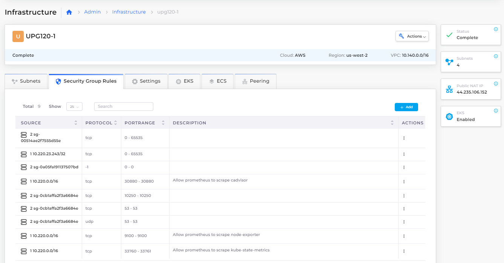
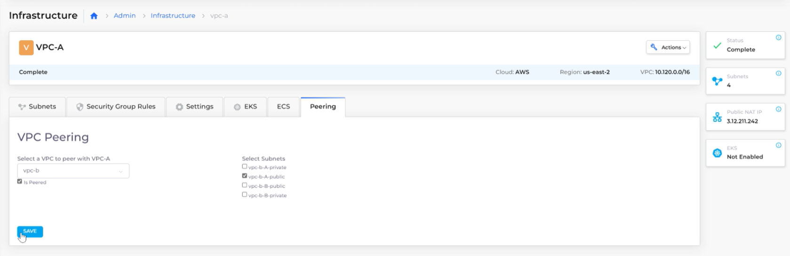
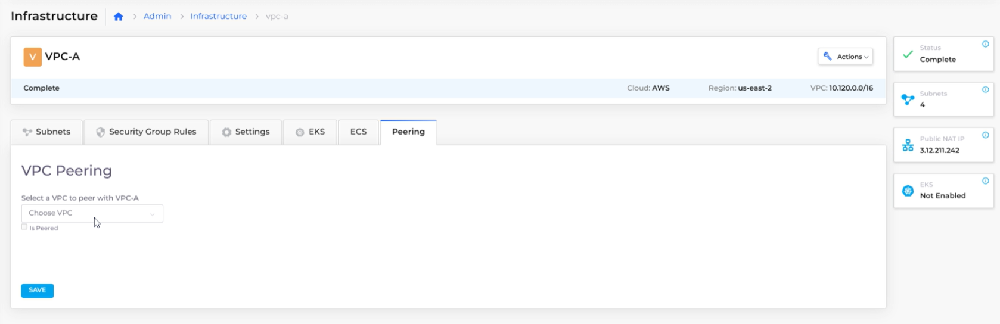
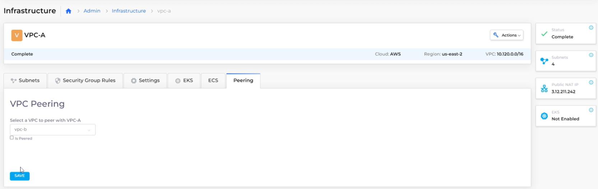

# Virtual Private Cloud (VPC) Peering

VPC [peering ](https://en.wikipedia.org/wiki/Peering)is a networking connection between two VPCs enabling traffic to be routed between them. When you use VPC peering, instances in the VPCs communicate with each other as if they are in the same network. The VPCs can be in different regions (also known as Inter-Region VPC peering connections).

VPC peering facilitates the transfer of data. For example, if you have more than one AWS account, you can peer the VPCs across those accounts and create a file-sharing network.&#x20;

This procedure describes how to peer two VPCs, using subnet routes, and how to manage the peering connections and routes. For detailed steps on setting up VPC peering in Duplo, refer to the [Duplo documentation](https://docs.nholuongut.com/docs/overview/aws-services/virtual-private-cloud-vpc-peering).

## Enable and peer VPCs

Enable VPCs for peering:&#x20;

We will be referring following steps to peer 2 VPCs **VPC-A** and **VPC-B**.

1. In the nholuongut Portal, navigate to **Administrator** -> **Infrastructure**. The **Infrastructure** page displays. In this example, the Infrastructures are named **VPC-A** and **VPC-B**.
2. From the **Name** column, select the first Infrastructure (**VPC-A**) for which to enable peering. **VPC-A** and its defined subnet routes are displayed.
3.  Click the **Peering** tab and the **VPC Peering** page displays.\

    <figure><figcaption>
<strong>VPC Peering</strong> page for Infrastructure <strong>VPC-A</strong>
</figcaption></figure>

4. From the **Choose VPC** list box, select a VPC that you want to peer with **VPC-A**. In this example, we select **VPC-B**.
5. Select the **Is Peered** checkbox.&#x20;
6.  Click **Save**. \

    <figure><figcaption>
Saving <strong>VPC-A</strong> and <strong>VPC-B</strong> peering association
</figcaption></figure>

7. Click on **Peer again**.
8. Follow similar from the above-listed steps 2 to 6 for **VPC-B** Infrastructure.

## Select subnet routes for VPC peering

Now that your two VPCs (**VPC-A** and **VPC-B**) are connected, define the subnet routes that the VPCs use for communication.&#x20;

To begin, on the VPC Peering page for the first VPC that you set up (**VPC-A**), click **Peer again**. The **Infrastructure** page displays.

1. Select the Infrastructure (**VPC-A**) containing the first VPC that you [enabled ](virtual-private-cloud-vpc-peering.md#enable-and-associate-vpcs-for-peering)for peering.&#x20;
2. Click the **Peering** tab and the **VPC Peering** page displays.
3. Select the **Choose VPC** list box. The second VPC (**VPC-B**) displays in the list box and the **Is Peered** checkbox is selected, indicating that you previously connected the first VPC (**VPC-A**)  with the second VPC (**VPC-B**) for peering.&#x20;
4.  Select the subnet routes that you want to define for VPC peering communication between the two VPCs (**VPC-A** and **VPC-B**). In this example, we select the checkboxes for subnet routes **vpc-B-a-private** and **vpc-B-a-public**. \

    <figure><figcaption>
Defining subnet routes for use by VPC-A and VPC-B
</figcaption></figure>

5. Click **Save**.&#x20;

Click **Peer again** and repeat the numbered procedure above to peer the **VPC-B** Infrastructure.

## Verify peering between associated VPCs

Confirm that your two VPCs are enabled for peering, are connected with each other, and have subnet routes defined for communication.

1. In the nholuongut Portal, navigate to **Administrator** -> **Infrastructure**. The **Infrastructure** page displays.
2. Select one of the Infrastructures containing a VPC that you previously [enabled ](virtual-private-cloud-vpc-peering.md#enable-and-associate-vpcs-for-peering)for peering and for which you defined [subnet routes](virtual-private-cloud-vpc-peering.md#select-subnets-to-use-vpc-peering). In this example, we select **VPC-A**.
3. Click the **Peering** tab and the **VPC Peering** page displays.
4.  Select the **Choose VPC** list box to confirm that **VPC-B** is peered with **VPC-A** and uses the subnet routes you defined. The name of the second VPC (**VPC-B**) displays in the list box and the **Is Peered** checkbox is selected. The subnet routes that you selected are displayed as checked.\

    <figure><figcaption>
Verifying <strong>VPC-A</strong> is peered with <strong>VPC-B</strong> and subnet routes are defined.
</figcaption></figure>

5. Click **Save**.&#x20;

## Configure Security Group rules for Tenant VPC zones

To maintain accessibility, add Security Group rules for Tenant VPC zones:

1. In the nholuongut Portal, navigate to **Administrator** -> **Infrastructure**.
2. Select the Infrastructure from the **Name** column.
3.  Click the **Security Group Rules** tab. \

    <figure><figcaption>
<strong>Security Group Rules</strong> tab on Infrastructure screen
</figcaption></figure>

4.  Click **Add**. The **Add Tenant Security** pane opens.\

    

    <figure><figcaption>
<strong>Add Tenant Security</strong> pane
</figcaption></figure>

    

5. Define the rule for your **Port Range** and click **Add**.

## Delete subnet routes for peered VPCs

Delete subnet routes that you defined for VPC peer-to-peer communication:

1. In the nholuongut Portal, navigate to **Administrator** -> **Infrastructure**. The **Infrastructure** page displays.
2. Select one of the Infrastructures containing a VPC that you previously [enabled ](virtual-private-cloud-vpc-peering.md#enable-and-associate-vpcs-for-peering)for peering and for which you defined [subnet routes](virtual-private-cloud-vpc-peering.md#select-subnets-to-use-vpc-peering). Continuing the example above, in this case, we select **VPC-A**.
3.  Click the **Peering** tab. The **VPC Peering** page displays for **VPC-A**.\

    <figure><figcaption>
<strong>VPC Peering</strong> page for Infrastructure <strong>VPC-A</strong>
</figcaption></figure>

4. Select the **Choose VPC** list box. The peered VPC (**VPC-B**) displays and the **Is Peered** checkbox is selected along with the associated subnet routes defined for communication.
5.  Clear the checkboxes of the subnet routes you want to remove in the **Select Subnets** column. Using the **CTRL** key, you can select multiple checkboxes and clear them with a single click. In this example, we remove the subnet route **vpc-b-A-private** by clearing its checkbox.\

    <figure><figcaption>
Deleting the <strong>vpc-b-A-private</strong> subnet route from the <strong>VPC-A</strong>/<strong>VPC-B</strong> peering connection
</figcaption></figure>

6. Click **Save**. The subnet route **vpc-b-A-private** has been removed for **VPC-A**/**VPC-B** peering.&#x20;
7. Optionally, confirm the deletion by [verifying peering between associated PVCs](virtual-private-cloud-vpc-peering.md#verify-peering-between-associated-vpcs).

## Delete peered VPCs

Delete the peering connection between VPCs:

1. In the nholuongut Portal, navigate to **Administrator** -> **Infrastructure**. The **Infrastructure** page displays.
2. Select one of the Infrastructures containing a VPC that you previously [enabled ](virtual-private-cloud-vpc-peering.md#enable-and-associate-vpcs-for-peering)for peering and for which you defined [subnet routes](virtual-private-cloud-vpc-peering.md#select-subnets-to-use-vpc-peering). Continuing the example above, in this case, we select **VPC-A**.
3.  Click the **Peering** tab. The **VPC Peering** page displays for **VPC-A**.\

    <figure><figcaption>
Click the <strong>Peering</strong> tab. The <strong>VPC Peering</strong> page displays for <strong>VPC-A</strong>.
</figcaption></figure>

4. Select the **Choose VPC** list box. The peered VPC (**VPC-B**) displays and the **Is Peered** checkbox is selected along with the associated subnet routes defined for communication.
5.  Clear the **Is Peered** checkbox. \

    <figure><figcaption>
After the <strong>Is Peered</strong> checkbox is cleared, the <strong>VPC-A</strong>/<strong>VPC-B</strong> peering connection is deleted when you click <strong>Save</strong>.
</figcaption></figure>

6. Click **Save**. The **Select Subnets** list no longer displays and the peering connection between **VPC-A** and **VPC-B** has been removed.
7. Optionally, confirm the deletion by [verifying peering between associated VPCs](virtual-private-cloud-vpc-peering.md#verify-peering-between-associated-vpcs).