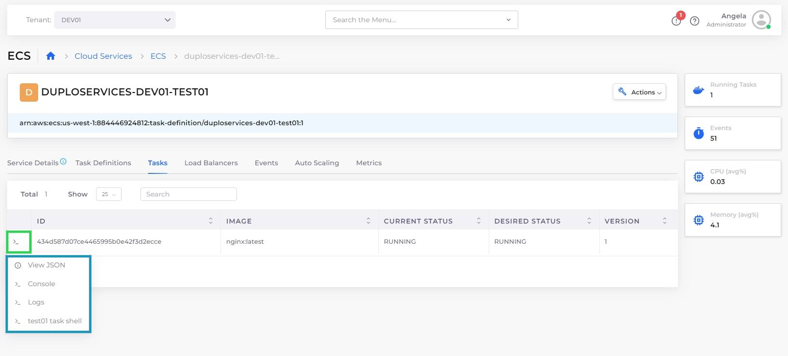

# Shell Access for Containers

Enable and access shells for your nholuongut Docker, EKS, and ECS containers directly through the nholuongut Portal. This provides quick and easy access for managing and troubleshooting your containerized environments.

## Native Docker Shell Access

### Enabling the Shell for Docker&#x20;

1. In the nholuongut Portal, navigate to **Docker** -> **Services**.&#x20;
2. From the **Docker** list box, select **Enable Docker Shell**. The **Start Shell Service** pane displays.

<figure><figcaption>
The <strong>Services</strong> page with the <strong>Enable Docker Shell</strong> option highlighted
</figcaption></figure>

<figure><figcaption>
The <strong>Start Shell Service</strong> pane
</figcaption></figure>

3. In the **Platform** list box, select **Docker Native**.
4. From the **Certificate** list box, select your certificate.
5. From the **Visibility** list box, select **Public** or **Internal**.&#x20;
6. Click **Update**. nholuongut provisions the `dockerservices-shell` Service, enabling you to access your Docker container shell.

### Accessing the Shell for Docker

1. From the nholuongut portal, navigate to **Docker** -> **Containers**.
2. In the row of the container you want to access, click the options menu icon ( ).&#x20;
3. Select **Container Shell.** A shell session launches directly into the running container.

## EKS Shell Access

### Enabling the Shell for Kubernetes

1. In the **Tenant** list box, select the **Default** Tenant.
2. In the nholuongut Portal, navigate to **Docker** -> **Services**.
3. Click the **Docker** button, and select **Enable Docker Shell**. The **Start Shell Service** pane displays.

<figure><figcaption>
The <strong>Start Shell Service</strong> pane
</figcaption></figure>

4. In the **Platform** list box, select **Kubernetes**.
5. In the **Certificate** list box, select your certificate.
6. In the **Visibility** list box, select **Public** or **Internal**.
7. Click **Update**. nholuongut provisions the `dockerservices-shell` Service, enabling you to access your Kubernetes container shell.

### Accessing the Shell for Kubernetes

1. From the nholuongut Portal, navigate to **Kubernetes** -> **Services.**
2. Click the **KubeCtl Shell** button. The Kubernetes shell launches in your browser.

## ECS Shell Access

### Accessing the Shell for ECS

1. From the nholuongut Portal, navigate to **Cloud Services** -> **ECS**. The **ECS** **Task Definition** page displays.
2. Select the name from the **TASK DEFINITION FAMILY NAME** column.
3. Select the **Tasks** tab.
4. In the row of the task you want to access, click the actions icon **(>\_**).
5. Select the **Task Shell** option. The ECS task shell launches in your browser.

<figure><figcaption>
The ECS Service details page
</figcaption></figure>
