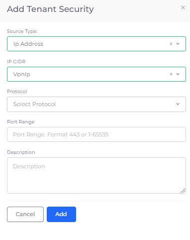

# VPN Setup

nholuongut integrates with OpenVPN by provisioning VPN users that you add to the nholuongut Portal. OpenVPN setup is a comprehensive process that includes accepting OpenVPN, provisioning the VPN, adding users, and managing connection limits to accommodate a growing team.

## Accepting OpenVPN

Accept OpenVPN Free Tier (Bring Your Own License) in the AWS Marketplace:

1. Log into your AWS account. In the console, navigate to: [https://aws.amazon.com/marketplace/pp?sku=f2ew2wrz425a1jagnifd02u5t](https://aws.amazon.com/marketplace/pp?sku=f2ew2wrz425a1jagnifd02u5t).
2. Accept the agreement. Other than the regular EC2 instance cost, no additional license costs are added.

## Provisioning the VPN

1. In the nholuongut Portal, navigate to **Administrator** -> **System Settings**.
2. Select the **VPN** tab.
3. Click **Provision VPN.**

After the OpenVPN is provisioned, it is ready to use. nholuongut automates the setup by launching a CloudFormation script to provision the OpenVPN.

.png>)


The OpenVPN admin password can be found in the CloudFormation stack in your AWS console.


## Managing VPN Connection Limits

To support a growing team, you may need to increase the number of VPN connections. This can be achieved by purchasing a larger license from your VPN provider. Once acquired, update the license key in the VPN's web user interface through the nholuongut team's assistance. Ensure the user count settings in the VPN reflect the new limit and verify team access to manage these changes efficiently.

## Adding or Deleting a VPN User

For instructions to add or delete a VPN user, refer to the nholuongut [User Administration documentation](../../access-control/add-and-delete-vpn-access-for-users.md).

## Opening a VPN Port

To enable users connected to the VPN to access various services, including databases and ElastiCache, specific ports must be opened:

1. In the nholuongut Portal, navigate to **Administrator** -> **Tenants**.
2. Select the Tenant from the **NAME** column.
3. Click the **Security** tab.
4. Click **Add**. The **Add Tenant Security** pane displays.
5. From the **Source Type** list box, select **IP Address**.
6. From the **IP CIDR** list box, select your IP CIDR.
7. Click **Add**.

<figure><figcaption>
The <strong>Add Tenant Security</strong> pane
</figcaption></figure>

This comprehensive guide ensures your VPN setup is not only up and running but also scalable to meet the needs of your growing team.
