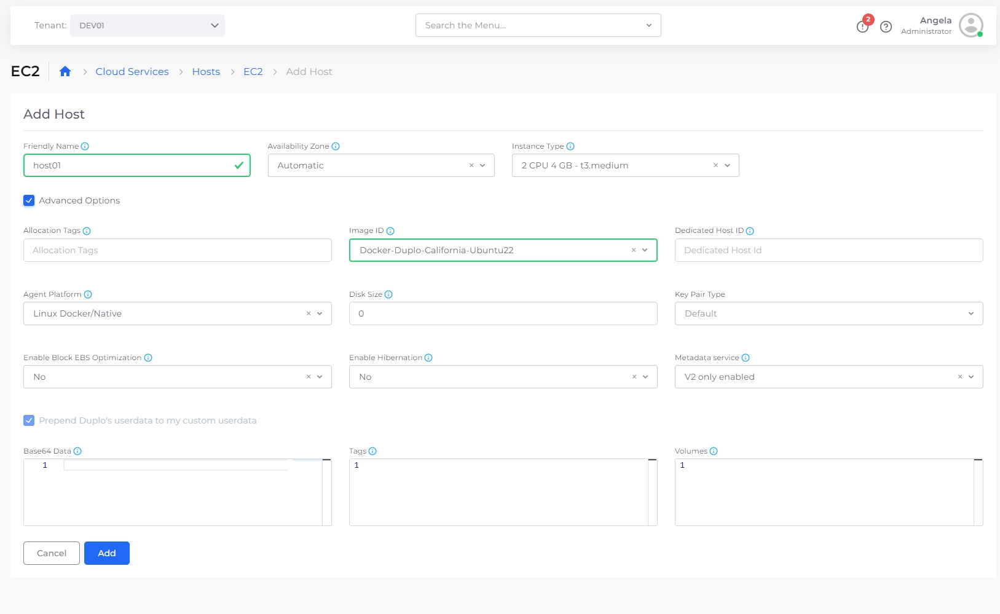
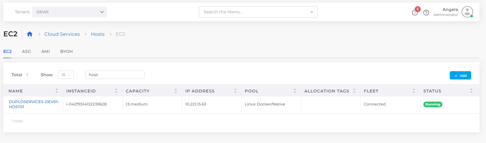

# Step 4: Create an EC2 Host

Before you create your application and service using native Docker, create an EC2 Host for storage in nholuongut.

_Estimated time to complete Step 4: 5 minutes._

## Prerequisites

Before creating a Host (essentially a [Virtual Machine](https://en.wikipedia.org/wiki/Virtual\_machine)), verify that you completed the tasks in the previous tutorial steps. Using the nholuongut Portal, confirm that:

* An [Infrastructure and Plan](../step-1-infrastructure.md) exist, both named **NONPROD**.
* A Tenant named [**dev01** has been created](../step-2-tenant.md).

## Creating a Host

1. In the **Tenant** list box, select **dev01**.
2. In the nholuongut Portal, navigate to **Cloud Services** -> **Hosts**. The **Hosts** page displays.
3. In the **EC2** tab, click **Add**. The **Add Host** page displays.
4. In the **Friendly Name** field, enter **host01**.
5. From the **Instance Type** list box, select **2 CPU 4 GB - t3.medium**.
6. Select the **Advanced Options** checkbox to display advanced configuration fields.
7. From the **Agent Platform** list box, select **Linux/Docker Native**.
8. From the **Image ID** list box, select any **Docker-Duplo** or **Ubuntu** image. &#x20;
9. Click **Add**. The Host is created, initialized, and started. In a few minutes, when the **Status** displays **Running**, the Host is available for use.

<figure><figcaption>
<strong>EC2 Add Hosts</strong> page
</figcaption></figure>

## Checking your work

Verify that **host01** has a **Status** of **Running**.

<figure><figcaption>
The <strong>EC2</strong> tab displays <strong>host01</strong> with a <strong>s</strong>tatus of <strong>Running</strong>
</figcaption></figure>
