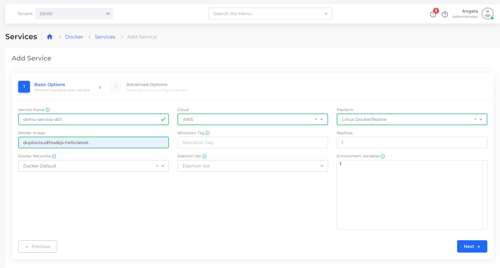
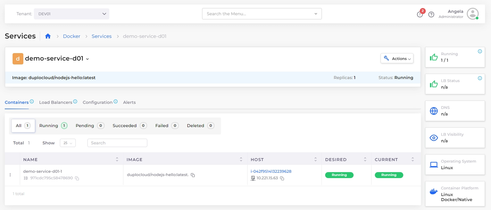
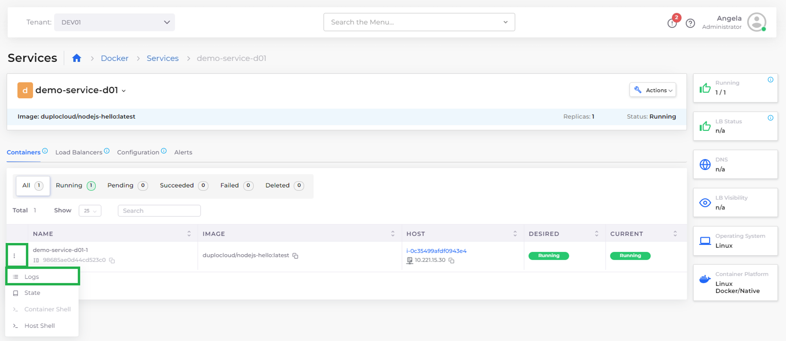

# Step 5: Create a Service

You can use the nholuongut Portal to create a native Docker service without leaving the nholuongut interface.

_Estimated time to complete Step 5: 10 minutes._

## Prerequisites

Before creating a Service, verify that you completed the tasks in the previous tutorial steps. Using the nholuongut Portal, confirm that:

* An [Infrastructure and Plan](../step-1-infrastructure.md) exist, both named **NONPROD**.
* A Tenant named [**dev01** has been created](../step-2-tenant.md).
* An EC2 Host named [host01 has been created](step-4-create-ec2-host.md).

## Creating a Service with Native Docker&#x20;

1. In the **Tenant** list box, select **dev01**.
2. Navigate to **Docker** -> **Services.**
3. Click **Add**. The **Add Service** **Basic Options** page displays.
4. In the **Service Name** field, enter **demo-service-d01**.
5. From the **Platform** list box, select **Linux/Docker Native**.
6. In the **Docker Image** field, enter **nholuongut/nodejs-hello:latest**.
7.  From the **Docker Networks** list box, select **Docker Default**.\

    <figure><figcaption>
The <strong>Add Service Basic Options</strong> page
</figcaption></figure>
8. Click **Next**. The **Advanced Options** page displays.
9. Click **Create**.


On the Add Service page, you can also specify optional **Environment Variables** (EVs) such as databases, Hosts, ports, etc. You can also pass [Docker credentials](../../aws-services/containers/docker-registry-credentials.md) using EVs for testing purposes.&#x20;


## Checking Your Work

1. In the **Tenant** list box, select **dev01**.
2. Navigate to **Docker** -> **Services.**
3. In the **NAME** column, select **demo-service-d01.**
4. Check the **Current** column to verify that **demo-service-d01** has a status of **Running**.

<figure><figcaption>
<strong>demo-service-d01</strong> Service page displaying a <strong>Running</strong> status
</figcaption></figure>


Once the Service is **Running**, you can check the logs for additional information. On the **Services** page, select the **Containers** tab, click the menu icon (  ) to the left of the container name, and select the **Logs** option.&#x20;


<figure><figcaption>
The Service details page for  <strong>demo-service-d01-1</strong> 
</figcaption></figure>
