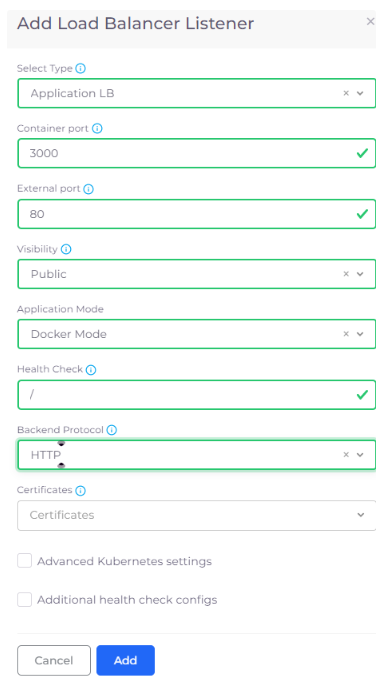
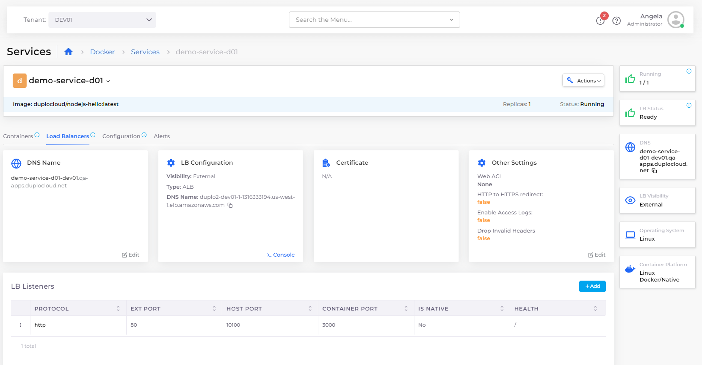
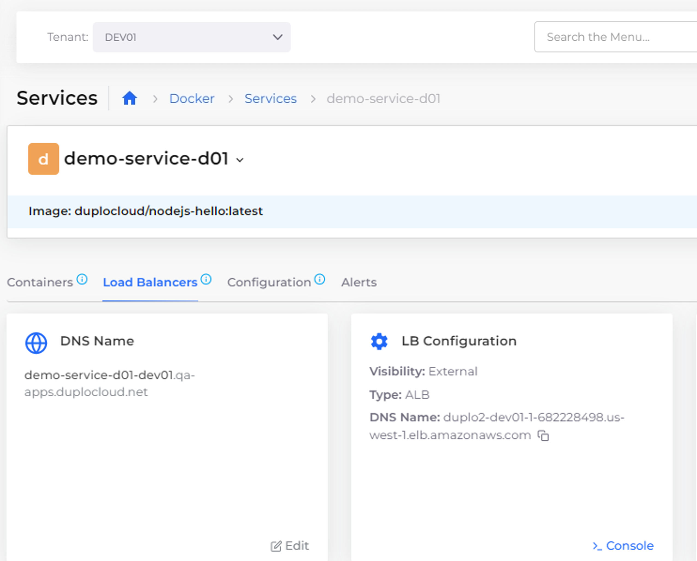

# Step 6: Create a Load Balancer

Now that your nholuongut Service is running, you have a mechanism to expose the containers and images in which your application resides. Since your containers are in a private network, you need a Load Balancer to make the application accessible.

In this step, we add a Load Balancer Listener to complete this network configuration.

_Estimated time to complete Step 6: 15 minutes._

## Prerequisites

Before creating a Load Balancer, verify that you completed the tasks in the previous tutorial steps. Using the nholuongut Portal, confirm that:

* An [Infrastructure and Plan](../step-1-infrastructure.md) exist, both named **NONPROD**.
* A Tenant named [**dev01** has been created](../step-2-tenant.md).
* An EC2 Host named [host01 has been created](step-4-create-ec2-host.md).
* A Service named [**demo-service-d01** has been created](step-5-create-app-via-docker-native.md).&#x20;

## Creating a Load Balancer using Native Docker

1. In the **Tenant** list box, select **dev01**.
2. Navigate to **Docker** -> **Services**.
3. Select the Service **demo-service-d01** [that you created](step-5-create-app-via-docker-native.md).
4. Click the **Load Balancers** tab.
5. Click the **Configure Load Balancer** link. The **Add Load Balancer Listener** pane displays.
6. From the **Select Type** list box, select **Application LB**.
7. In the **Container Port** field, enter **3000**: the port on which the application running inside the container image (**nholuongut/nodejs-hello:latest**) is running.
8. In the **External Port** field, enter **80**.
9. From the **Visibility** list box, select **Public**.
10. From the **Application** list box, select **Docker Mode**.
11. In the **Health Check** field, enter **/**, indicating that you want the Kubernetes Health Check logs written to the **root** directory.
12. From the **Backend Protocol** list box, select **HTTP**.
13. Click **Add**.

<figure><figcaption>
The <strong>Add Load Balancer Listener</strong> pane
</figcaption></figure>

When the **LB Status** card displays **Ready**, your Load Balancer is running and ready for use.

<figure><figcaption>
The <strong>Services</strong> page with LB Status <strong>Ready</strong>
</figcaption></figure>

### Securing the Load Balancer

If you want to secure the load balancer created, you can follow the steps specified [here.](../quick-start-eks-services/step-7-secure-the-load-balancer.md)

### Creating a Custom DNS Name

You can modify the DNS name by clicking Edit in the DNS Name card in the Load Balancers tab. For additional information see [this page](../quick-start-eks-services/step-8-create-dns-name.md).

<figure><figcaption>
The <strong>DNS Name</strong> card in the <strong>Load Balancers</strong> tab
</figcaption></figure>
