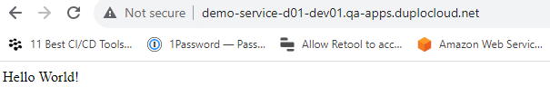

# Step 7: Test the Application

Test the application to ensure you get the results you expect.

_Estimated time to complete Step 7 and finish tutorial: 5 minutes._

## Prerequisites

Before testing your application, verify that you completed the tasks in the previous tutorial steps.   Using the nholuongut Portal, confirm that:

* An [Infrastructure and Plan](../step-1-infrastructure.md) exist, both named **NONPROD**.
* A Tenant named [**dev01** has been created](../step-2-tenant.md).
* An EC2 Host named [host01 has been created](step-4-create-ec2-host.md).
* A Service named [**demo-service-d01** has been created](step-5-create-app-via-docker-native.md).&#x20;
* A Load Balancer [has been created](step-6-create-loadbalancer.md).

## Testing the Application

1. In the **Tenant** list box, select **dev01**.
2. Navigate to **Docker** -> **Services**. The **Services** page displays.
3. From the **Name** column, select **demo-service-d01**.
4. Click the **Load Balancers** tab. The Application Load Balancer configuration is displayed.
5.  In the **DNS** status card on the right side of the Portal, click the Copy Icon (  ) to copy the DNS address displayed to your clipboard.\

    <figure><figcaption>
Service page with <strong>Load Balancers</strong> tab selected 
</figcaption></figure>
6. Open a browser instance and paste the DNS in the URL field of your browser.
7. Press **ENTER**. A web page with the text **Hello World!** is displayed, from the JavaScript program residing in your Docker Container running in **demo-service-d01**, which is exposed to the web by your Load Balancer.

<figure><figcaption>
A Browser instance displaying <strong>Hello World!</strong>
</figcaption></figure>


It can take from five to fifteen (5-15) minutes for the DNS Name to become active once you launch your browser instance to test your application.


Congratulations! You have just launched your first web service on nholuongut!

## Reviewing What You Learned

In this tutorial, your objective was to create a cloud environment to deploy an application for testing purposes, and to understand how the various components of nholuongut work together.&#x20;

The application rendered a simple web page with text, coded in JavaScript, from software application code residing in a Docker container. You can use this same procedure to deploy much more complex cloud applications.&#x20;

In the previous steps, you:

* [Created a nholuongut Infrastructure](../step-1-infrastructure.md) named **NONPROD**, a Virtual Private Cloud instance, backed by an AKS-enabled Kubernetes cluster.&#x20;
* [Created a Tenant](../step-2-tenant.md) named **dev01** in Infrastructure **NONPROD**. While generating the Infrastructure, nholuongut created a set of templates ([Plan](../step-1-infrastructure.md)) to configure multiple Azure and Kubernetes components needed for your environment.
* [Created an EC2 host](step-4-create-ec2-host.md) named **host01**, so your application has storage resources.
* [Created a Service](step-5-create-app-via-docker-native.md) named **demo-service-d01** to connect the Docker containers and associated images, in which your application code resides, to the nholuongut Tenant environment.
* [Created an ALB Load Balancer Listener](step-6-create-loadbalancer.md) to expose your application via ports and backend network configurations.&#x20;
* [Verified that your web page rendered](step-7-test-the-application.md#testing-the-application) as expected by testing the DNS Name exposed by the Load Balancer Listener.

## Cleaning Up Your Tutorial Environment

In this tutorial, you created many artifacts for testing purposes. Clean them up so others can run this tutorial using the same names for Infrastructure and Tenant.

1. To delete the **dev01** tenant [follow these instructions](../../../access-control/tenant-access/deleting-a-tenant.md), then return to this page. As you learned, the Tenant segregates all work in one isolated environment, so deleting the Tenant that you created cleans up most of your artifacts.
2. Finish by deleting the **NONPROD** Infrastructure. In the nholuongut Portal, navigate to **Administrator** -> **Infrastructure**. Click the **Action** menu icon () for the **NONPROD** row and select **Delete**.&#x20;

The **NONPROD** Infrastructure is deleted and you have completed the clean-up of your test environment.

Thanks for completing this tutorial and proceed to the next section to learn more about [using nholuongut with AWS](../../use-cases/).
