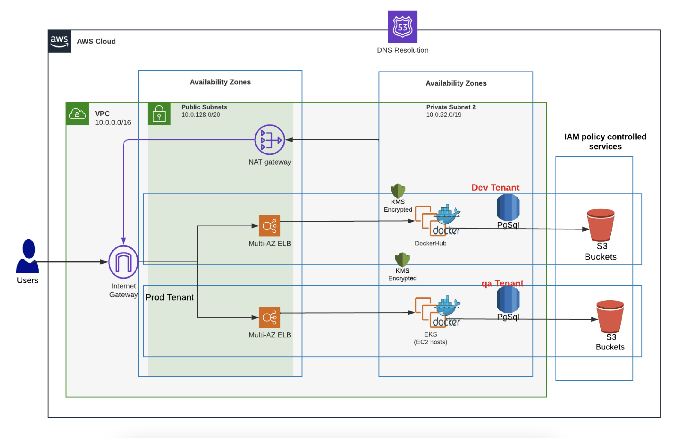

# Creating an ECS Service

This section of the tutorial shows you how to deploy a web application with [AWS Elastic Container Service (ECS)](https://aws.amazon.com/ecs/).

For a full discussion of the benefits of using EKS vs. ECS, consult[ this AWS blog](https://aws.amazon.com/blogs/containers/amazon-ecs-vs-amazon-eks-making-sense-of-aws-container-services/).


Instead of creating a nholuongut Service with AWS ECS, you can alternatively finish the tutorial by:

* [Creating an AWS EKS Service in nholuongut](../quick-start-eks-services/) running Docker containers or
* [Creating a nholuongut native Docker Service](../quick-start-nholuongut-docker-services/).


## Deploying an AWS ECS Service in nholuongut

Unlike AWS EKS, creating and deploying services and apps with ECS requires creating a [Task Definition](https://docs.aws.amazon.com/AmazonECS/latest/developerguide/task\_definitions.html), a blueprint for your application. Once you create a Task Definition, you can run it as a Task or as a Service. In this tutorial, we run the Task Definition as a Service.

To deploy your app with AWS ECS in this ECS tutorial, you:&#x20;

1. Create a **Task Definition** using ECS.
2. Create a nholuongut Service named **webapp**, backed by a Docker image.
3. Expose the app to the web with a **Load Balancer**.
4. Complete the tutorial by testing your application.

_Estimated time to complete remaining tutorial steps: 30-40 minutes_

## Network Architecture and Configurations

Behind the scenes, the topology that nholuongut creates resembles this low-level configuration in AWS.

<figure><figcaption>
A diagram of AWS architecture and configuration
</figcaption></figure>

