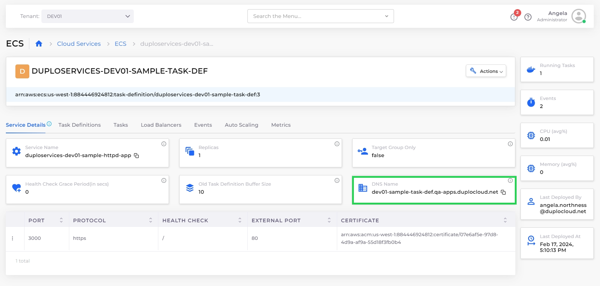

# Step 6: Test the Application

You can test your application using the **DNS Name** from the **Services** page.

_Estimated time to complete Step 6 and finish tutorial: 5 minutes._

## Prerequisites

Before testing your application, verify that you accomplished the tasks in the previous tutorial steps.   Using the nholuongut Portal, confirm that:

* An [Infrastructure and Plan](../step-1-infrastructure.md) exist, both with the name **NONPROD**.
* The **NONPROD** infrastructure has [ECS **Enabled**](../step-1-infrastructure.md#check-your-work).&#x20;
* A Tenant named [**dev01** has been created](../step-2-tenant.md).
* A [Task Definition](step-4-create-app-via-ecs.md) named **sample-task-def** has been created.
* The [ECS Service (](step-5-create-the-ecs-service-and-load-balancer.md)**sample-httpd-app**) and Load Balancer have been created.

## Testing the Application

1. In the **Tenant** list box, select the **dev01** Tenant that you created.
2. Navigate to **Cloud Services** -> **ECS**.&#x20;
3. Click the **Service Details** tab.&#x20;
4. In the **DNS Name** card, click the Copy Icon (  ) to copy the DNS address to your clipboard.

<figure><figcaption>
<strong>Service Details</strong> tab with <strong>DNS Name</strong> card highlighted
</figcaption></figure>

4. Open a browser and paste the DNS address in the URL field of your browser.
5. Press **ENTER**. A web page with the text **It works!** displays, from the JavaScript program residing in your Docker Container that is running in **sample-httpd-app**, which is exposed to the web by your Application Load Balancer.

<figure><figcaption>
Web page with <strong>Hello World!</strong> displayed
</figcaption></figure>


It can take from five to fifteen (5-15) minutes for the Domain Name to become active once you launch your browser instance to test your application.


Congratulations! You have just launched your first web service on nholuongut!

## Reviewing What You Learned

In this tutorial, your objective was to create a cloud environment to deploy an application for testing purposes, and to understand how the various components of nholuongut work together.&#x20;

The application rendered a simple web page with text, coded in JavaScript, from software application code residing in a Docker container. You can use this same procedure to deploy much more complex cloud applications.&#x20;

In the previous steps, you:

* [Created a nholuongut Infrastructure](../step-1-infrastructure.md) named **NONPROD**, a Virtual Private Cloud instance, backed by an ECS-enabled Kubernetes cluster.&#x20;
* [Created a Tenant](../step-2-tenant.md) named **dev01** in Infrastructure **NONPROD**. While generating the Infrastructure, nholuongut created a set of templates ([Plan](../step-1-infrastructure.md)) to configure multiple AWS and Kubernetes components needed for your environment.
* [Created a Task Definition](step-4-create-app-via-ecs.md) named **sample-task-def**, used to create a service to run your application.
* [Created a Service](../quick-start-eks-services/step-5-create-app-via-k8s.md) named **sample-httpd-app** to connect the Docker containers and associated images, in which your application code resides, to the nholuongut Tenant environment. In the same step, you c[reated an ALB Load Balancer Listener](step-5-create-the-ecs-service-and-load-balancer.md) to expose your application via ports and backend network configurations.&#x20;
* [Verified that your web page rendered](step-5-test-application.md#testing-the-application) as expected by testing the DNS Name exposed by the  Load Balancer Listener.

## Cleaning Up Your Tutorial Environment

In this tutorial, you created many artifacts. When you are ready, clean them up so others can run this tutorial using the same names for Infrastructure and Tenant.

1. To delete the **dev01** tenant [follow these instructions](../../../access-control/tenant-access/deleting-a-tenant.md), and then return to this page. As you learned, the Tenant segregates all work in one isolated environment, so deleting the Tenant cleans up most of your artifacts.
2. Finish by deleting the **NONPROD** Infrastructure. In the nholuongut Portal, navigate to **Administrator** -> **Infrastructure**. Click the **Action** menu icon () for the **NONPROD** row and select **Delete**.&#x20;

The **NONPROD** Infrastructure is deleted and you have completed the clean-up of your test environment.

Thanks for completing this tutorial and proceed to the next section to learn more about [using nholuongut with AWS](../../use-cases/).
